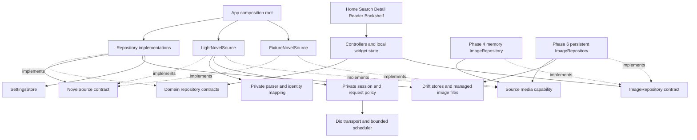

# Shiori Task Plan

> 2026-09-08 iOS 状态：Mac / Xcode 已可用；正式入口在 iPhone 17 Pro / iOS 26.2 模拟器完成 Debug 构建、安装和启动。**IOS-001 = PARTIAL，IOS-002..006 = NOT_STARTED；完整 iOS 验收未通过。** 当前证据与待项见 [IOS-001 报告](validation/ios-001.md)。带 2026-09-06/07 日期的执行记录与规划自检保留历史结论，不能将其中 `DEFERRED_NO_MAC` 当作当前环境状态。

规划日期：2026-09-06；定向修订：Android Current Track + Deferred iOS Runtime Track。执行更新：2026-09-07，NET-001 / NET-002 / MEDIA-001 已按顺序完成，完整 112 项测试与 Android 组合探针 PASS；按用户指定完成 READER-001 / READER-002，默认左右翻页并保留上下滚动，双模式实验与正式单章 Reader 已交付；SRC-001..004 / CORE-001..004 已完成，Phase 0 技术 Gate = GO / PASS，当前结果见第 35–36 节。本文是个人开发项目的主任务契约，正文使用中文，章节与 Task ID 保持稳定，便于 Coding Agent 按 ID 执行。

规划修订阶段（历史记录）：仅完善本文件并做 Self Review，基于完整的 41 节 / 59 Task 原计划，当时仓库为 Greenfield，未执行开发任务。后续用户已授权本次 SRC-001 / CORE-001 执行；除这两个任务的明确交付记录外，目录树、模型、配置值和测试命令仍为后续设计，不代表已实现。

证据约定：**DECIDED** 是本项目的设计决定；**PROPOSED** 是需要对应任务验证的建议；**UNKNOWN / NEEDS VERIFICATION** 表示没有实证。技术资料查阅日期为 2026-09-06，package 支持声明不等于本项目双端实测通过。所有源站事实必须由 Phase 0 的日期、请求和响应证据支持。

## 1. Project Overview

Shiori（栞）是 Android / iOS 轻小说客户端，支持在线阅读和本地 TXT / EPUB 导入。最小业务闭环是发现或搜索小说，或导入本地书籍，查看详情及卷章节目录、原生阅读、加入本地书架、保存并恢复阅读进度；在线书籍利用已有缓存离线继续阅读，本地导入书籍通过应用托管文件完整离线阅读。

**范围更新（2026-09-07，用户授权纳入规划）**：本地 TXT 与无 DRM 的流式 EPUB 纳入 MVP，新增 LOCAL-001..005。后续执行更新：LOCAL-001..005 已完成；LOCAL-005 的真机与 iOS Files 剩余验收边界见 [记录](validation/local-005.md)。复用现有双模式阅读器、目录、书架和进度，不依赖生产网站可用；不自动开始后续任务。

首个生产 Source 是用户指定的 [LightNovel.fun](https://www.lightnovel.fun/)。SRC-001 / SRC-002 已观察访客首页，以及样本小说的搜索、详情、四卷目录、正文和浏览器图片解码，并独立验证核心 HTTP 协议，证据见 [源站调查](source/lightnovel.md)。自动化链路、会话寿命、异常覆盖和使用许可仍有待项，生产接入 Gate 未通过。未来 Source 通过同一业务边界接入；第一版不实现第二个生产 Source。

## 2. Product Goals

- 让“找到一本书并继续读”成为稳定、低干扰的主要路径；Reader 的阅读体验优先于页面数量。
- 源站改变时，能定位到 Search / Detail / Catalog / Chapter / Media / Session 中具体失效环节，主要修改 Source Adapter 恢复。
- 书架和进度属于本地用户数据，与源站在线状态、缓存淘汰解耦。
- 保留 Windows + Flutter + MuMu 开发流程，以至少一台 Android ARM64 真机验收；macOS / Xcode 已支持 iOS Simulator 验证，iPhone 与签名验收条件分别补齐。
- 保持单个 Flutter 应用、少量有明确用途的契约；后续 Agent 能根据一个 Task 的输入、输出和测试完成工作。
- 界面从当前阶段起支持中文和英文，文案集中管理并考虑不同语言的长度；默认跟随系统，未支持的语言回退英文。小说标题、正文等源内容不属于界面翻译范围。

优先级：阅读体验 → Source 维护性 → 双端稳定性 → 开发效率 → 调试效率 → 可测试性 → 性能 → 架构形式。性能不能低于可读门槛，但不以提前优化牺牲前面的目标。

## 3. Non-Goals

MVP 不包含 LightNovel 账号、登录书架同步、评论及发布、论坛、点赞、社交、Shiori 账号、云同步、后端服务、推荐算法、AI 推荐、TTS、PDF / Manga 阅读器、DRM 解密、固定版式 EPUB、EPUB 脚本 / 音视频播放及复杂样式完整还原、纸张卷曲翻页动画、Flutter Web、Windows / macOS Desktop、多生产在线 Source、全站抓取、镜像、大规模下载、复杂下载任务中心。

下载当前卷、图片全屏查看、自定义字体、Ruby 精细排版、应用内亮度调节可作为后续需求，不能隐含进入 MVP。系统亮度继续由系统控制。没有源站首页数据时不补造排行榜或推荐算法；没有公开访问权限时不补造登录或绕过机制。

## 4. Supported Platforms

**环境状态（2026-09-08）**：Windows / Android 验证记录保留；当前 Mac、Xcode 与 iOS Simulator 已可用，已完成模拟器 Debug 构建和启动 smoke。iPhone 调试设备、签名与发布环境未确认，不能由模拟器通过推断已具备。后续任务按实际设备与验收范围安排。

| Platform | Target | Implementation / Compatibility | Local Development | Runtime / Device Validation | Release Candidate |
| --- | --- | --- | --- | --- | --- |
| Android | YES | Implementation：YES（当前可执行范围） | YES：Windows → Flutter → MuMu / Android Studio Emulator / Android device | YES（可安排执行）；最终必须至少一台 ARM64 手机 | YES（当前可交付范围） |
| iOS | YES，正式目标 | 兼容性审查及本次 Simulator Debug 构建 PASS | YES：macOS + Xcode | Simulator launch PASS；完整 runtime PARTIAL；iPhone NOT_RUN | NOT_RUN；签名环境未确认 |
| Windows | NO | 仅 Development Host | 宿主可用 | 不开发 Windows App | 无 |
| macOS | NO | iOS Development Host 已可用 | YES（开发宿主） | 不开发 macOS App | 无 |

YES 指环境能力或计划范围，**不表示代码已实现、测试已通过或候选包已生成**；已执行 Task 的证据单独记录。MuMu PASS 只证明该模拟器行为，不能替代 Android Device PASS。

iOS **Level A — Compatibility** 是当前共享代码 DoD：Pure Dart Domain / Source 逻辑，跨平台网络 / 路径 / Drift，Native Flutter Reader，所有核心依赖有 iOS 文档支持；无 Android-only 核心 API / Widget / back 假设，无无理由 Platform.isAndroid 分叉。平台行为封装在 presentation / platform boundary。结果只记 Design / Code Compatibility，不宣称 runtime verified。

iOS **Level B — Runtime Validation** 归 IOS-001..006：Xcode / 原生依赖最终构建、Simulator、iPhone、TLS / Cookie / SQLite / filesystem、SafeArea / swipe-back、lifecycle / memory / performance、签名和安装。当前 IOS-001 部分完成，其他任务尚未启动。模拟器 smoke 只覆盖本次记录的运行项；可选 macOS CI 也只增加所记录的编译证据。

**DECIDED（CORE-001，2026-09-06）**：沿用并固定已安装 Flutter 3.38.4 stable / Dart 3.10.3，项目最低系统为 Android API 24、iOS 15.0；当前仅有 Flutter SDK 运行期依赖。锁定版本的 SDK 源码 / 模板证据和后续构建结果见 [开发基线](development.md)。此前 Flutter 3.47.2 官方资料只是规划快照，不代表本项目版本；每次新增插件仍须重查 OS 交集。[Flutter 平台支持](https://docs.flutter.dev/reference/supported-platforms)

项目分别记录 ANDROID_MVP_DONE 与 CROSS_PLATFORM_MOBILE_MVP_DONE。后者当前为 NOT_COMPLETE（IOS-001 部分通过，其余 iOS 验收与真机 / 签名仍待完成）；它不阻止前者独立达成。**Android MVP Ready 不代表 iOS Ready。**

## 5. MVP Scope

UI 共同规划见 [应用 UI 规范](app.md#ui-规范)：保留 Material 3 交互基础，暖纸 / 封面 / 安静排版；书架作为默认首页，书架 / 发现双入口，搜索 / 设置为次级页面。UI-001 先交付 Theme Lab，UI-002 再实施阅读视觉与偏好拆分。UI-001 已交付开发专用样板；正式视觉扩散仍按各任务执行。

| 功能 | 必须交付的行为 | 降级与边界 |
| --- | --- | --- |
| Home / Discover | 默认书架首页，书架 / 发现根导航，搜索 / 导入 / 设置入口；发现展示源名与已验证分区 | supportsDiscover=false 时发现保留搜索及书源说明，不请求假分区；本地书架不依赖在线源 |
| Search | 输入 keyword 后点击 Search 或键盘 Search / Enter 才请求；支持时加载更多；Loading / Empty / Error | 输入与停止输入均不自动请求；取消 / generation 防旧响应；分页失败保留已加载结果 |
| Detail | 标题、封面、作者、简介、标签、连载状态等有证据字段；加入书架、开始 / 继续阅读 | 缺失字段隐藏或标“未知”；封面失败不阻止正文 |
| Catalog | 卷及章节、卷折叠、当前章标识、章节跳转 | 保留源顺序；无卷、无标题、番外、重复编号均可表达 |
| Reader | Native ContentBlock 渲染、默认左右翻页 / 可选上下滚动、插图、标题、前后章、目录、进度及恢复 | 切章独立加载；图片失败只影响该图；章节失败可重试 / 返回 / 读缓存 |
| Local Import | 应用内选文件，或其他应用通过“打开方式 / 分享至 Shiori”导入 TXT / 无 DRM 流式 EPUB；托管副本、元数据、目录、插图、书架与继续阅读 | TXT 编码预览与选择；EPUB 基础语义排版；导入取消 / 失败不留半本书；本地书不受在线缓存清理影响 |
| Reader Settings | 默认左右翻页 / 可选上下滚动、字号、行高、段间距、左右边距、阅读亮 / 暗 / 跟随系统、纸白 / 暖纸 / 夜间预览、Chrome 显隐 | 应用外观与阅读配色拆分；UI-002 迁移，设置改变保留语义位置；不加系统亮度插件 |
| Bookshelf | 添加、移除、本地列表、封面标题、最近阅读、继续阅读 | 加入书架不下载全书；移除只移除书架项，不隐式清除进度和缓存 |
| History / Progress | 每本书最后章节、顺序快照、阅读位置、最后时间；最近阅读入口 | 不是事件日志；未加入书架的小说也保存进度 |
| Cache / Offline | 详情、目录、正文、已成功加载插图的本地复用；缓存状态与清理 | 缓存仍在时可离线读；未下载图显示占位；容量淘汰不承诺永久离线 |
| Diagnostics | 可定位失败阶段、请求数量、缓存命中、脱敏 debug 信息 | 默认不上传日志；Release 无调试入口 |

本节是最终移动端产品范围；当前可验收交付为 Android，同一功能的 iOS runtime 按专项验收；已通过的启动 smoke 不覆盖全部功能。Phase 4 图片仅保证在线 / memory 显示，Phase 6 才承诺仍在磁盘的图文冷启动离线。

本地导入使用独立于在线缓存的持久文件所有权：选择文件 → 复制到应用私有暂存区 → 解析 / 校验 → 提交托管书籍与索引 → 加入书架。不得只持久化外部路径或临时 URI；导入成功后移动原文件不影响阅读。应用内只记录可重定位的相对资源路径。本地文件不进入在线 TTL / LRU，不因“清除缓存”被删除；“移出书架”与“删除本地书籍文件”是两个明确动作，删除需说明进度保留策略，不能影响其他书籍。卸载应用会移除托管数据，首版不承诺云备份或恢复。

本地适配器输出同一 Catalog / ChapterContent，并通过 Repository 和 ImageRepository 边界提供内容；文件、ZIP、编码、HTML 解析不进入 Reader。LOCAL-001 先审查身份、媒体与存储契约；需要变更时同步 domain / contracts 文档、codec、迁移及消费者，不能假称现有 SourceMedia 已覆盖本地图片。相同文件重复导入应复用已有书籍；同名不同文件不覆盖旧进度。EPUB 阅读顺序取 spine，目录取 nav / NCX，目录片段定位到语义块；TXT 无可识别章节时保留整篇，不能按页号制造章节身份。

不把没有更多结果、接口未提供首页能力、受限内容和 Parser 失败混成同一 Empty State。

## 6. Technical Stack

以下版本仅是只读查询快照，**不能直接据此修改 pubspec**。CORE-001 锁定 Flutter / Dart；对应实现任务加入必要 dependency 并提交应用 lockfile。原生插件每次新增或升级，当前要求 Android build / 相关 runtime smoke + iOS Level A compatibility review；可选 macOS CI 只记 compile 结果，iOS runtime 分项归 iOS Track。

| 技术 / 决策 | Purpose / 使用位置 / 理由 | Android | iOS | Native dependency | 长期风险及更简单替代 |
| --- | --- | --- | --- | --- | --- |
| Flutter + Dart：采用 | 单一移动 UI、Native Reader、领域逻辑与测试 | 官方支持；需 APK / ARM 验证 | DOCUMENTED_SUPPORTED / NOT_RUNTIME_VERIFIED；官方支持；需 Xcode、模拟器与签名真机 | Flutter engine 和平台工具链 | SDK 升级改变平台下限；锁 stable 工具链。替代为双端原生开发，维护成本更高，不采用 |
| GetX：限定采用稳定 4.x；当前锁定 4.7.3 | presentation Controller / 小范围状态订阅；构造器显式注入服务 | package 声明支持 | DOCUMENTED_SUPPORTED / NOT_RUNTIME_VERIFIED；package 声明支持 | 包本身无额外 Native 插件 | 界面国际化采用 Flutter SDK gen-l10n / ARB；不扩展为服务定位或 GetX 路由。最简单状态管理替代是 ChangeNotifier / ValueNotifier；不同时引入另一套状态框架。[GetX](https://pub.dev/packages/get) |
| Dio：采用；查阅为 5.11.1 | data/network；超时、取消、拦截器、字节响应和受控重试 | Dart IO adapter | DOCUMENTED_SUPPORTED / NOT_RUNTIME_VERIFIED；Dart IO adapter，验证 HTTPS | 默认无额外平台插件，使用系统网络 / TLS | interceptors 顺序、重试重复提交；锁版本测试。替代 `http` 更小，但需自行补齐控制能力。[Dio](https://pub.dev/packages/dio) |
| cookie_jar：条件采用；4.0.9 | Source 私有会话存储；仅 Phase 0 证明必要才启用持久化 | Dart 文件 / IO 可用 | DOCUMENTED_SUPPORTED / NOT_RUNTIME_VERIFIED；Dart 文件 / IO 可用 | 本体无；目录依赖 path_provider | 明文文件、过期和损坏；内存 CookieJar 更简单。不要照抄示例的忽略过期设置。[cookie_jar](https://pub.dev/packages/cookie_jar) |
| dio_cookie_manager：条件采用；3.5.0 | 挂到 Source 专属 Dio，不挂全局共享秘密客户端 | package 支持 | DOCUMENTED_SUPPORTED / NOT_RUNTIME_VERIFIED；package 支持 | 本体无 | 与 Dio / cookie_jar 版本耦合；重定向 Cookie 要单独测试。若不需 Cookie，整个依赖删除，不手写第二套 cookie 解析。[说明](https://pub.dev/packages/dio_cookie_manager) |
| Drift + sqlite3：采用；2.32.1 / 3.5.2（DB-001 兼容锁定） | 本地用户数据、事务、缓存索引、迁移；后台 isolate | native SQLite，真机与 MuMu ABI 验证 | DOCUMENTED_SUPPORTED / NOT_RUNTIME_VERIFIED；device / simulator ABI 均须验证 | FFI SQLite 二进制与 build hooks | 代码生成、迁移、原生打包；替代 sqflite 较直接但类型 / 迁移需自己维护。Drift 的收益符合本项目，不再加通用 ORM 层。[Drift](https://pub.dev/packages/drift)、[sqlite3](https://pub.dev/packages/sqlite3) |
| drift_dev + build_runner：采用独立 dev-only 工具包（2.32.1 / 2.10.5） | schema 和类型生成、迁移测试资产 | 宿主构建工具，不进运行期 | DOCUMENTED_SUPPORTED / NOT_RUNTIME_VERIFIED；同左，Mac 复现生成 | 不额外引入手机 Native runtime | 生成器 / analyzer 版本耦合；替代手写 SQL，反而增加本地模型维护量。[drift_dev](https://pub.dev/packages/drift_dev)、[build_runner](https://pub.dev/packages/build_runner) |
| SharedPreferencesAsync：采用；包 2.5.5 | ReaderSettings 和简单 UI 偏好，通过 SettingsStore 包装 | 原生 preferences / DataStore 实现 | DOCUMENTED_SUPPORTED / NOT_RUNTIME_VERIFIED；原生 UserDefaults 实现 | 有平台实现 | 不是关键数据的持久保证，不能保存书架 / 进度 / Session；较简单替代是已有 Drift 的一行 settings。[官方说明](https://pub.dev/packages/shared_preferences) |
| html：采用；0.15.7 | lightnovel/parser；HTML5 DOM 分析，不执行 JS | 纯 Dart | DOCUMENTED_SUPPORTED / NOT_RUNTIME_VERIFIED；纯 Dart | 无 | 容错解析不代表语义正确；JSON 接口稳定时直接用 dart:convert，不能用正则替代整页 HTML Parser。[html](https://pub.dev/packages/html) |
| crypto：采用，限内容摘要用途 | blockKey / contentRevision / 缓存文件 checksum 的稳定 SHA-256 | 纯 Dart | DOCUMENTED_SUPPORTED / NOT_RUNTIME_VERIFIED；纯 Dart | 无 | 正规化输入变更会使摘要变化，须版本化；不用于破解源站签名。替代远端 revision 仅在可靠可用时采用；Dart hashCode 不作为持久身份。[crypto](https://pub.dev/packages/crypto) |
| path_provider + path：采用 | AppPaths 与跨平台文件拼接 | Application Support / Cache 可用 | DOCUMENTED_SUPPORTED / NOT_RUNTIME_VERIFIED；同类目录可用，实际绝对路径不同 | path_provider 有平台实现；path 纯 Dart | 容器路径变化、备份策略；替代硬编码路径不接受。[path_provider](https://pub.dev/packages/path_provider) |
| 图片：分阶段 ImageRepository | Phase 4 MEDIA-001：SourceMedia → 受限 network / memory bytes → Flutter Image；Phase 6 CACHE-003 才加文件持久化 | Android codec / 取消 / 内存按阶段实测 | DOCUMENTED_SUPPORTED / NOT_RUNTIME_VERIFIED；保持相同契约 | Phase 4 复用 Dio / Flutter，不新增 Native 插件 | 早期不做磁盘 / LRU / quota / orphan；Phase 6 再比较托管小实现与成熟包封装；Reader 不因实现增强改业务代码 |
| cached_network_image / flutter_cache_manager：暂不加入，备选 | 若默认图片方案维护成本超过收益，可封装于 ImageRepository 后替换 | package 支持 | DOCUMENTED_SUPPORTED / NOT_RUNTIME_VERIFIED；package 支持 | 间接 path_provider / sqflite 等 | 默认临时目录、对象数不等于字节上限、可能另开 HTTP 栈；4.0.0 有 SDK / material_ui 变化。替代就是上一行的有限实现。不可仅因常用就直接散落 UI。[包](https://pub.dev/packages/cached_network_image)、[变更](https://pub.dev/packages/cached_network_image/changelog)、[缓存行为](https://pub.dev/packages/flutter_cache_manager) |

Drift 官方推荐新项目用 native / FFI，当前 sqlite3 3.x 可自动打包 SQLite；不要机械添加历史教程中的 `sqlite3_flutter_libs`。采用 `NativeDatabase.createInBackground`，DB 创建与目录选择统一封装，Android runtime 以 DB-001 / ANDROID-002 为准；iOS 文档兼容当前审查，实际 SQLite / ABI 验证延期 IOS-001。[平台说明](https://drift.simonbinder.eu/platforms/)、[后台 isolate](https://drift.simonbinder.eu/platforms/vm/)

**当前 iOS package 状态统一为 DOCUMENTED_SUPPORTED / NOT_RUNTIME_VERIFIED**。表中的“支持 / 可用 / 共用”只表达官方文档和架构适配；尚无本项目 iOS build / simulator / device / release 证据。采纳每个核心依赖前必须记录：Android 声明、iOS 声明、维护状态、iOS 最低版本与 SDK 交集、CocoaPods / SwiftPM / Native framework / build hooks 依赖、已知 iOS limitations、出处和日期。当前跑 Android smoke；本次 iOS Simulator Debug 链接已通过，后续依赖变更仍需复验相关构建与运行；CI 可用时单列编译证据。Android-only 包不能进入核心路径；仅可存在于完全可替换、关闭后不损核心功能的 optional Android adapter，并说明 iOS 等价策略。

不预装 connectivity、brightness、permission_handler、WebView、Freezed、json_serializable、后台任务或 DI 生成器。网络可达性从实际请求判断；简单不可变 Dart 模型与局部序列化足够。若后续必要新增包，Task 必须补齐本表相同的兼容、维护与替代分析。

## 7. Architecture

这是逻辑依赖图，实线表示调用或使用契约，虚线表示实现。数据以纯 Dart Domain 对象返回；图不表示要为每一框创建一个 package。



Domain 包含业务模型、少量稳定契约和错误类型；presentation 只依赖这些契约。data 实现 Repository / Source / 存储，基础网络不认识 LightNovel。app 是唯一把具体实现组装起来的地方。无 UseCase 层、无每层同形对象互拷贝、无插件系统、无 Source 脚本引擎。

## 8. Architecture Decisions

| ID | Decision / 状态 | Rationale / 复核触发 |
| --- | --- | --- |
| ADR-01 | DECIDED：Flutter Native、ContentBlock、单章垂直滚动 | 控制排版、位置与离线行为；不加载源站页面或执行脚本 |
| ADR-02 | DECIDED：Source Adapter + sourceId / opaque ID | 未来第二源不修改 Reader / 书架 / 搜索组件；不做跨源同书合并 |
| ADR-03 | DECIDED：保留 NovelSource、Repository、ImageRepository 等有收益边界 | 仅这些边界需要替换 / Fake；不为所有类创建接口 |
| ADR-04 | DECIDED：GetX 用于局部状态管理；界面翻译使用 Flutter gen-l10n / ARB；路由使用 Flutter Navigator 和平台 PageRoute | 2026-09-07 按用户最终选择迁移至官方 gen-l10n：中英文 ARB 生成类型安全的 AppLocalizations，Flutter Localizations 驱动语言更新，SDK delegates 负责标准控件本地化。DI 仍在 composition root 显式组装，禁止 Get.find 服务定位；细节见 [应用规范](app.md) |
| ADR-05 | DECIDED：Drift 保存用户数据与缓存索引，偏好用简单 KV | 数据事务和迁移值得使用 Drift；业务真相不放 SharedPreferences |
| ADR-06 | DECIDED：Reader 持久位置以 block + fraction 为主 | 像素 offset 随字体、宽度、图片变动失效；像素仅作同布局优化 |
| ADR-07 | DECIDED：原生 pivot 双模式视口；默认左右翻页，可选上下滚动 | 2026-09-07 按用户选择调整；READER-001 的原生 Sliver + 局部 TextPainter 分页实验通过，共享语义锚点，不预排前文、不存页码；见 [实验与验收](decisions/reader-viewport.md) |
| ADR-08 | DECIDED：Source 内部惰性 ensureSession，不要求 App 启动联网 | 离线启动不被 Session 初始化阻塞；具体会话规则等 Phase 0 |
| ADR-09 | DECIDED：图片通过 opaque MediaRef 和私有请求解析 | UI 不应为 Image.network 拼 Referer；Source 变更不能拖着 Reader 改动 |
| ADR-10 | DECIDED：Phase 4 最小 network / memory ImageRepository；Phase 6 才加持久缓存 | MEDIA-001 不依赖 CACHE-003；Reader 永远消费同一契约，Phase 6 不要求修改其业务代码 |
| ADR-11 | DECIDED：Phase 1 仅存储基线 / 快照 / 非破坏迁移政策，DB-003 后移 Phase 8 | 当前开发库可显式 reset，正式用户库不可破坏性升级；Source / Reader 不等待完整 migration harness |
| ADR-12 | DECIDED：默认测试完全离线，真实 Source 测试显式 opt-in | 网站不稳定不能让所有 UI / DB 开发停摆；opt-in 不能变成忽略源失效的借口 |
| ADR-13 | DECIDED：Android MVP 独立完成；iOS Level A 必审，Level B 单独按证据验收 | 2026-09-08 Mac / Simulator 已可用，IOS-001 PARTIAL；iPhone / 签名未确认。IOS-001..006 不属于 Android Phase Hard Gate |
| ADR-14 | DECIDED：Search 仅显式提交 | 输入停止不发请求；仍取消旧请求、保护 generation、管理分页竞态，减少第三方请求 |
| ADR-15 | DECIDED：语义 Paragraph 不为性能拆分；RenderChunk 只在 presentation | chunk 不入 Domain / serialization / revision / blockKey / 长期进度；renderer 优化不改变正文身份 |
| ADR-16 | PROPOSED：CI-003 可选 macOS compile track | 按需编译有提前暴露链接问题的价值；成本 / runner 未确认，不阻塞 Android，compile PASS 不等于 runtime PASS |

## 9. Directory Structure

下列是建议终态；文件在对应 Task 中按需创建，不一次生成空壳。视觉规范与主题落点另见 [应用 UI 规范](app.md#ui-规范)。

```text
docs/
  TASK_PLAN.md
  app.md                          # 应用装配、UI 规范与多语言约定
  source/lightnovel.md             # Phase 0 实证、请求表、失效定位手册
  development.md                  # 固定工具链、Android / MuMu、离线测试命令
  validation/                     # Android 证据；未来 deferred iOS runtime / 可选 compile 证据
  decisions/reader-viewport.md     # 有实验收益的决策记录，不为所有小决定建 ADR 文件
lib/
  main.dart                       # production composition
  main_dev.dart                   # 独立 debug 入口，不给 release 引入 fixture assets
  app/                            # bootstrap、routes、theme、依赖组装
  domain/
    models/                       # identity、novel、catalog、content、progress、settings
    contracts/                    # novel_source、repositories、source_media
    errors/                       # AppFailure / Result
  data/
    network/                      # transport、scheduler、retry、request context
    sources/
      source_registry.dart        # 简单 sourceId 到实例的映射
      lightnovel/                 # 唯一容纳站点常量、URL、请求格式、session、parser 的目录
    repositories/                 # 在线 / 缓存读取策略，返回领域对象
    local/
      database/                   # Drift schema、DAOs、migration snapshots
      files/                      # AppPaths、atomic file storage
      settings/                   # SettingsStore
    media/                        # Phase 4 network / memory；Phase 6 持久缓存
  features/
    home/
    search/
    novel_detail/                 # detail + catalog controller / screen
    reader/                       # viewport、瞬态 RenderChunk、renderer、settings、semantic position
    bookshelf/
    history/
    settings/                     # 缓存清理与偏好入口
  shared/                         # 少量状态组件、SourceImage、AppLogger；不是杂物目录
  dev/                            # fixture source、场景生成器、debug menu
test/
  domain/
  data/                           # network、repository、db、parser、media
  widgets/
  fixtures/lightnovel/             # 脱敏 HTML / JSON、manifest、expected
  support/                        # fake clock、fake source、synthetic media
integration_test/                 # fixture 驱动的手机离线端到端；真实 live 子目录单独执行
tools/source_probe/               # Phase 0 独立 opt-in 调查工具；不依赖主 Flutter 工程
.github/workflows/                # offline CI、Android；可选独立 macOS compile
android/
ios/                              # 保留目标配置；当前不宣称构建或 runtime 已验证
pubspec.yaml                      # Phase 1 才创建
```

Source 的响应私有 DTO 只有在同一响应需要多处复用、字段校验确有收益时才创建；通常 Parser 直接输出 Domain。Drift row / 缓存 JSON 的序列化留在 data/local，不给 Domain 引入数据库注解。

## 10. Dependency Rules

| 模块 | 可以依赖 | 禁止依赖 |
| --- | --- | --- |
| domain | Dart 标准库、纯值类型；内容摘要 helper 可依赖纯 Dart crypto | Flutter、GetX、Dio、Drift、html、lightnovel 常量、Map 形式站点扩展包 |
| features / Controllers | domain contracts、shared UI、Flutter / GetX | DioException、SQL row、Cookie、HTML selector、站点 URL 拼接、Get.find 隐藏服务依赖 |
| repositories | domain、NovelSource / SourceMedia、local、通用 policy | 在 repository 写 LightNovel 端点 / selector；反向依赖 Controller |
| lightnovel | domain、network、私有 parser/session/identity；确需 locator 持久化时注入 Source 私有存储契约 | Reader Widget、直接访问书架 / progress 表、UI 操作、GetX |
| network | Dio、通用配置 / limiter / logging | 小说业务、站点常量；只接受 Source 传入的私有 request policy |
| local / media | domain、Drift / filesystem；media 通过 SourceMedia 请求 | 从本地缓存类直接拼站点地址；缓存清理删除用户进度 |
| app | 所有需组装的具体实现 | 携带站点请求实现；release 引入 dev fixture 注册 |

URL 即 ID 的 Source 可以把 URL 当作不透明字符串，但调用方只能比较 / 传递，不能解读、拼接、显示或记录其中的站点规则。禁止把 `headers`、`security_key`、`rawHtml`、`dynamic extra` 加进通用模型逃避边界。站点事实文档、fixture 和 Source 专属测试不受“不能出现站点字符串”的静态检查误伤。

Shared code 禁止无理由 Platform.isAndroid 分叉；Domain 不假设 Android back，平台行为留在 presentation / platform boundary。LightNovelSource 保持 Pure Dart + Dio + html，不用 Android 网络、WebView 或 Android CookieManager。若正常合法访问确实必须平台 WebView，须先更新 ADR、Risk、OQ-14 和 iOS impact；不得直接引入 Android-only Source，Reader 仍保持 Native。

## 11. Domain Model

模型是不可变值；集合对外只读。所有顺序从源站目录顺序归一，不以章节名或阿拉伯数字重新排序。可选信息必须可空 / unknown，不生成假作者和假更新时间。

blockKey / contentRevision 的摘要由共享纯 Dart helper 按固定字段顺序、UTF-8、明确 normalization version 计算 SHA-256；同内容同版本必须跨进程相同，不使用运行时 hashCode。blockKey 排除显示字号 / 屏宽，重复内容加同章 occurrence；Image 的稳定 MediaRef 纳入摘要，session 临时参数不纳入。CORE-002 固化 helper 与 golden 输入输出；源 parser 和 fixture 复用，但站点文本清理仍留在 Source。缓存文件 checksum 可复用摘要算法，不能把文件 checksum 误当语义 contentRevision。

CORE-002 已实现 [领域模型与 v1 输入规范](domain.md)：只归一 CRLF / CR 为 LF，保留 Unicode 与语义空白；固定 JSON 数组顺序，拒绝 map / 浮点摘要输入及孤立 surrogate。ChapterContent 统一分配 occurrence；contentRevision 包含标题和有序 blockKey；可后发现的图片尺寸不参与语义摘要。Catalog 拒绝重复身份 / 错误归属 / 非连续 ordinal，不代替 Source 去重。ReaderSettings 选择显式范围验证而非静默 clamp；正文和设置的序列化校验各自版本，缓存 envelope 留给存储任务。

| 模型 | 最小字段与职责 | 不变量 / 取舍 |
| --- | --- | --- |
| SourceId | 稳定 app 内部字符串；本源固定 `lightnovel`（SRC-004） | 域名变化不改 SourceId；调查 fixture 的 `lightnovel.fun` 候选标签不是正式领域键；删除 Source 不删除本地书架 |
| NovelKey | sourceId + opaque novelId | 组合键；不同 Source 的同名 / 同 ID 小说互不覆盖 |
| ChapterKey | NovelKey + opaque chapterId | 不假设章节 ID 在全站唯一；URL / 数字都存字符串 |
| NovelSummary | key、title、cover MediaRef?、authors 字符串列表 | 搜索 / 首页 / 书架快照复用；不另设重复的 Novel entity |
| NovelDetail | summary、plain-text synopsis、tags、status、可选 sourceUpdatedAt | 作者 / 标签 MVP 用 String 列表，无作者页 / 标签 ID 则不独立建 Author / Tag 类型；简介不是 HTML |
| Catalog | novelKey、ordered volumes、revision | revision 为顺序及身份摘要；提供 flatChapters 视图，不双重存两份可修改数据 |
| Volume | opaque groupId、title?、isSynthetic、ordered chapters | 无卷归为一个 synthetic group；缺名展示“未命名卷”；groupId 不必是真实远端卷 ID |
| Chapter | key、title、ordinal、volumeGroupId | ordinal 是当次目录的零基顺序快照，不是身份；特典和非标准编号不丢失 |
| ChapterContent | key、title、blocks、contentRevision | contentRevision 基于规范化内容；抓取时间 / cache codec / parserVersion 属于缓存 envelope |
| ContentBlock | Paragraph、Image、Heading、Divider | 每块有稳定 blockKey（内容摘要 + 同章重复 occurrence）；不是全站实体 ID |
| MediaRef | sourceId、opaque mediaId | 不含 Header / token；源实现可从 mediaId 推导私有定位信息；需跨重启可解析 |
| ImageBlock | MediaRef、可选 width / height、alt / caption | caption 是简单文本；尺寸可未知；不能因尺寸缺失丢图 |
| ParagraphBlock | text、alignment（start / center）、leadingIndent、可选简单 text runs | 文本为主；少量 bold / italic 等 runs 仅 Phase 0 证明需要才启用 |
| BookshelfEntry | NovelSummary snapshot、addedAt | 是否收藏独立于是否读过、缓存是否存在 |
| ReadingProgress | NovelKey、ChapterKey、chapterOrdinalSnapshot、catalogRevision、ReaderPosition、completed、lastReadAt | 每本书一条当前进度；保留 title / cover 快照供离线最近阅读 |
| ReaderPosition | contentRevision、blockKey、blockIndex、blockFraction、chapterFraction、optional pixelOffset / layoutKey | fraction 归一到 0..1，非 NaN；pixel 不是主要恢复依据 |
| ReaderSettings | schemaVersion、fontSize、lineHeight、paragraphSpacing、horizontalPadding、themeMode | 数值验证 / clamp；不把 Flutter ThemeData 或系统亮度放 Domain |

中文正文规范：解码 HTML entity，保留 Unicode 标点、全角字符、日文和段内必要换行；过滤脚本、导航与广告等有证据的非正文节点。`<br>` 连续关系需 fixture 证明；普通空行归为段间距，有语义的额外空行可用空 text 的 Paragraph 表达（连续数量上限由实证规则确定），不另建 Spacer AST。不无条件 trim 掉章节节奏，也不把源站布局空白全复制；仅空白 Paragraph 不能算有效正文。用布局首行缩进表达已识别缩进，避免既保留全角缩进又叠加两字符缩进。未识别的普通可见文本应保留，未知正文结构返回诊断，不能“解析成功但空白”。

Quote / Center 优先用 Paragraph 样式，Caption 归 Image；Link MVP 仅保留可见文字，不执行跳转；Ruby 如实存在，先可读降级为正文加括注，若影响含义则列为 Source gate 待解决项。不要无证据建立嵌套 RichText AST。源站一个语义段落始终对应一个 ParagraphBlock，即使极长也不为 Renderer 性能切碎。需要拆分时由 Reader presentation 创建瞬态 RenderChunk，规则见第 18 节；不得改变 semantic blockKey / contentRevision 或持久位置身份。

## 12. NovelSource Abstraction

CORE-003 已在 `lib/domain/contracts/` 固化纯 Dart 签名，[接口与所有权规范](contracts.md) 为后续实现输入；当前只有契约及测试 fake，没有生产 Source / Repository。SRC-004 已确认现有模型边界可承载观察内容，具体交接见[Gate 审查](source/lightnovel.md#src-004source-可行性-gate-与契约审查)。初始 Ruby 保留基字加括注、强调保留文字，不据此新增复杂 AST 或站点字段。Source 操作全部异步，接受只读 CancellationToken；所有模型、失败与分页 cursor 都是纯 Dart。

| Operation | 输入 | 输出 / 语义 |
| --- | --- | --- |
| descriptor | 无 | sourceId、展示名、supportsDiscover、supportsSearchPaging 等少量能力 |
| discover | cancellation | `Result<List<DiscoverSection>>`；分区是 label + NovelSummary[]；无能力时明确 unsupported，不虚构空成功 |
| search | query、opaque cursor?、cancellation | `Result<SearchPage>`：items、nextCursor?；首页 cursor 为空，null nextCursor 表示结束 |
| getNovelDetail | NovelKey、cancellation | Result<NovelDetail> |
| getCatalog | NovelKey、cancellation | Result<Catalog>；Source 内聚合多个必要响应，不向 UI 暴露 endpoint 数 |
| getChapter | ChapterKey、cancellation | Result<ChapterContent>；无目录也能解析已持久化 ChapterKey |

Pagination cursor 由 Source 编解码、绑定规范化查询和 Source；UI 只回传，不自增 page、计算 offset 或从 items 数量猜 hasMore。无分页源第一次返回 nextCursor=null。检测重复 cursor、跨页重复 ID、服务器返回同一页；可诊断终止，不能 Load More 无限循环。

Source 的 `ensureSession` 为内部实现细节；App 不依赖强制 `initialize`。只给诊断 / 手动恢复保留受限 resetSession 能力，不把 cookies 状态暴露业务界面。

附属 **SourceMedia** 契约由同一 Source 实例实现：输入 MediaRef 和取消上下文，输出受限字节流及标准媒体信息或 AppFailure；实际 URL / Referer / Cookie / 重定向在 Source 内解析。Phase 4 的 ImageRepository 消费受限流为短期 memory bytes，不写磁盘；Phase 6 实现增强后才读写持久缓存。UI 始终只获得同一契约下的内存 / 本地媒体结果。Source 不负责图片文件、数据库或 Widget。MediaRef 若不能通过 ID 自行恢复，SRC-010 可在 Source 专属定位存储中保存**不含 secret**的 locator；更新 / 失效策略仍归 Source，不将其扩散成所有领域对象的 extension map。含临时签名或会话参数的 URL 不能直接成为持久 ID；须映射成稳定 ID，临时参数留在会话内。若无法建立稳定映射，记入 OQ-04，不能声称离线身份已可靠。

NovelRepository 暴露 search/discover 与 detail/catalog/chapter 加载、缓存读取模式；本地 LibraryRepository 管书架 / 最近阅读 / progress；ImageRepository 管媒体。Repository 返回 `Result<LoadResult<T>>`，LoadResult 带 origin(memory/local/remote)、isStale、fetchedAt 和可选 refreshFailure，不把陈旧成功改写为全屏失败。查询类可直接返回 Result<SearchPage>。UI 是否允许离线只依赖本地状态，不依赖某个网站名。

CORE-003 固定补充：NovelRepository 的 detailUpdates / catalogUpdates / chapterUpdates 是按 Key 的无初始事件广播流，订阅本身无 IO，调用方先订阅再 load，刷新发布新 Result；取消一个消费者不取消其他消费者。SourceMedia.openMedia 交付单消费者受限 SourceMediaBody，失败是终止 Result 事件；ImageRepository.load 交付独立 MediaLease（MemoryMedia / LocalMedia、persistence、persistenceFailure），消费者 finally close，Phase 4 不要求磁盘。LibraryRepository.beginProgressSession 生成每本书的持久代次，saveProgress 接受独立 ProgressWriteStamp(generation,sequence)，旧写返回 false；clearHistory 使旧代次失效，事务与重启实现归 DB-002。所有具体签名和预期失败语义见 contracts.md。

## 13. LightNovelSource Design

`lightnovel/` 内预计分为 source（编排）、requests（方法 / URL / 编码）、session、identity、parser（search/detail/catalog/chapter/media）。仅按复杂度拆文件，不创建空层。

**已验证基线（SRC-004 审查，2026-09-07）**：`https://www.lightnovel.fun` 的五类 POST JSON（Search / Detail / Volumes / Chapters / Chapter），路径、输入与成功 Header 组合见[源调查已验证表](source/lightnovel.md)。样本 book 31607 / volume 44117 / chapter 309555 的纯 Dart 图文链路通过；搜索请求 0 起算 / 响应 1 起算，目录 1 起算，正文使用 body_snapshot；首张图来自 api.lightnovel.fun，当次 JPEG 可解码。站点没有因此成为带稳定性承诺的契约依赖。

**保留 UNKNOWN**：全站匿名边界、公开规则与分发许可、Header 逐项必要性、会话 / m/t 生命周期、MediaRef 跨重启恢复、真实异常 schema、catalog 多页、搜索末页、首页 / auth-session / taxonomy / get-chapter-paragraphs 的完整协议。仅观察到资源 URL 的操作不进入已验证表；初始 `supportsDiscover=false`，discover 返回 unsupported；ensureSession 采用已验证路径的 no-op 基线，不主动增加 Cookie 包或会话请求。生产 parser 不照搬 probe 的固定样本 ID、单页断言或“正文必须同时有图”条件。

JSON 若在当前普通浏览器行为中稳定存在可优先使用；HTML fallback 只在 Phase 0 验证其等价内容和权限后启用。禁止盲试一串历史接口、失败后用备用入口绕过限制、把公开第三方源码当作当下事实。源站真正依赖 JS / challenge 且无法通过正常可用访问方式完成时，记录阻断；不临时把 Reader 换成 WebView 来掩盖数据获取不可行。

## 14. Phase 0 Source Investigation

**SRC-001..004 已完成，Phase 0 技术 Gate = GO / PASS（2026-09-07）。** SRC-002 的浏览器工具仅提供 UI / 资源 URL，核心 payload 与 JSON 由独立无凭据 HTTP 检查验证；SRC-003 两轮各 6 次、共 12 / 30 次串行 HTTP 尝试证明独立 Dart 正文与图片解码链路。SRC-004 复核报告、15 项 fixture 哈希与秘密字段，新增源站 HTTP 为 0。GO 允许按依赖开发生产 Source，不替代 SRC-010 的媒体跨重启、TEST-001 的生产链路或 RELEASE-001 的发布许可审查；未关闭 OQ 的责任与影响见第 34 节及[Gate 记录](source/lightnovel.md)。

### 调查流程与停止条件

1. SRC-001：阅读站点公开访问说明，普通浏览器匿名进入；记录时间、跳转和可访问边界。遇登录、收费、验证码、WAF、访问拒绝，停止该路径并写明限制；不存在绕过任务。
2. SRC-002：Browser Network 观察一次代表性搜索及后续访问。记录每个操作的 method、base/path、query/body 字段名与脱敏示例、必要 Header 及证据、响应 MIME / 编码 / schema、重定向、错误形态。每个“必要参数”应有观察依据；不通过反复刷请求进行限流压力测试。
3. 检查搜索第一页 / 下一页 / 无结果；选一本多卷、有插图小说，再以少量代表样本检查无卷、缺标题或番外（若站点找不到，标覆盖缺口并用合成 fixture 补 Domain 测试，不能伪造站点观察）。图片真正下载并验证可解码，不能只断言有 URL。
4. Session 分别记录干净会话、普通重复访问、重启所需信息、自然失效观察；有时效项无法在调查窗口观察就保留 UNKNOWN。记录 security_key 等名称是否实际出现、作用是否可确认，不解析或破解访问控制签名。
5. SRC-003：创建独立 `tools/source_probe/` Dart 调查测试包，不依赖主 Flutter 工程。最小可复现解析 / 断言仅服务证据，不视为生产 Parser；后续 Source Core 根据正式契约重写 / 提取经 review 的规则。工具默认禁止 live，需要明确开关，单流串行，最大 30 个 HTTP 尝试（含 redirect/retry），超预算即停并记录，不自动追加小说。
6. SRC-004：审查证据完整性、fixture 脱敏、架构适配、准入结论。更新本计划决策与 UNKNOWN；没有完成文本和图片链路时不得标 Phase 0 PASS。可以记录 BLOCKED，并继续与 Source 无关的独立任务。

### 必须交付的证据

`docs/source/lightnovel.md` 至少包含：最后验证日期 / 时区、环境、最终 Base URL、访问限制、Session 创建与生命周期、请求顺序表、已验证 Endpoint、脱敏 Request / Response、分页终止规则、Novel / Volume / Chapter / Media ID Mapping、Parser 输入根节点 / 字段依据、图片域名及访问策略、编码、HTML fallback 是否验证、已知问题、限流**观察**、失败分类、重跑命令和预算、fixture manifest、待验证项及 Go / Blocked / No-Go 结论。

`test/fixtures/lightnovel/` 保存少量有必要的 HTML / JSON 和 expected 领域结果；manifest 标 operation、capture date、脱敏方法、parser expectation、真实样本或合成样本、可提交依据。删除 Cookie / Set-Cookie 值、token、security_key、身份信息、URL secret query；需保留结构的秘密使用无效占位符。原始 HAR 不提交；只保留诊断需要的最小内容，不建立完整小说语料库。图片 fixture 用自行生成或明确可使用的图；源站图片解码结果可作为 live 证据而不提交原图。

### 明确验收

显式启用的自动化调查测试完成 `search("玩乐关系") → 正确小说 → detail → catalog → chapter → 非空正文 → 至少一张正文插图可解码`。若该书不可用，可修改测试查询，但必须记录替代书选择、身份断言和原因，不能任取搜索首项；无图章节可选择同书有图章节。正常路径默认无额外重试，记录实际请求数。纯离线 fixture 校验可重复通过；live 报告分 Search / Detail / Catalog / Chapter / Media 阶段，网络故障不归为 Parser regression。Phase 0 只证明当次访问；Android App 链路由 TEST-001 及后续真机验证，iOS runtime 延期 IOS-002，不阻塞当前 Source gate。

## 15. Network Architecture

统一的是 Transport 配置和策略实现，不是所有 Source 共用一个带 Cookie 的 Dio 单例。每个 Source 由工厂创建客户端，Source 提供私有域名 / Header policy；请求限制器跨元数据和图片共享。Fixture 不经过真实 transport。

**DECIDED 初始客户端预算（NET-001 / NET-002 已实现并以离线测试验证）**（均为本项目保守值，不是网站限制事实）：connect 10s、send 10s、receive 20s；图片 receive 30s；前台逻辑操作总 deadline 45s。重试、队列等待、重定向和会话恢复共享 deadline，超过即给可操作失败。HTML / JSON 响应解压后上限 8 MiB，单图传输上限 20 MiB；超限不截断成“成功正文”，需报 unsupported / tooLarge 并在实证后调整。

- 全局最多 2 个在途 HTTP 请求；每 Source 同时最多 2 个；后台预取最多 1 个且给前台让位。请求启动间隔初值每 Source 500ms；多个 image host 也共享该 Source 预算，不以分域规避。取消过期查询 / 离屏未开始请求；排队上限 20，丢弃过期后台请求。
- 超时、临时连接错误、502 / 503 / 504：仅明确可安全重复的读操作，最多额外重试 1 次（通常总计 2 次）。backoff 500ms + 0..250ms jitter，注入 clock / random 测试。语义未知的 POST 即使是搜索也不自动重放，等 Phase 0 确认。
- 其余 4xx、解析失败、权限 / Session 逻辑错误、取消、明确 429 / rate-limit 页面不进入通用自动重试。429 解析合法 Retry-After，冻结后台流量，到期前 UI 不发送重试；未给时间初值冷却 60s，只允许冷却后用户主动再试。
- 会话恢复独立于 transport retry：仅在 Phase 0 有明确“匿名 Session 过期”证据时一次重新初始化及一次重放，且该操作不再叠加 transport retry；禁止把每个 403 都当过期。所有底层调用仍受总 deadline / scheduler 限制。
- User-Agent 使用普通、诚实的客户端标识；如果正常公开 Web 请求确需特定格式，记录必要性并在 Source 设置，不能以轮换 UA / 代理逃避封禁。Header、Referer、body 和编码方案不在通用网络层硬编码。
- 默认不盲目自动跟随跨域跳转。至多 5 次、检测循环、逐跳保存允许的 Cookie；只向符合 origin / cookie policy 的目标发送凭证，移除不应转发的 Authorization 等秘密，拒绝 HTTPS 降级与未验证媒体 host。redirect method 规则按 HTTP 与当前实证实现并测试。CookieManager 官方单独提醒 redirect 需显式处理。[说明](https://pub.dev/packages/dio_cookie_manager)
- 以 bytes 接收需解析的内容，Source 按已证实 Content-Type / charset 处理；MIME 不符 / JSON 变登录 HTML 首先判访问失败，不能绕进正文 Parser。无证据不增加 GBK 编码库。
- 不启用会输出完整请求体 / Header 的默认 LogInterceptor。requestId → sourceId → operation → status / duration / retry / cache / parserStage 的结构化事件由 AppLogger 输出。

## 16. Session / Cookie Strategy

已确认的是可用的技术能力，而非站点要求：CookieJar 可管理内存 Cookie，PersistCookieJar 支持文件持久化。[package 文档](https://pub.dev/packages/cookie_jar) **是否需 Cookie、是否需持久化、token 生命周期仍是 UNKNOWN，归 SRC-001..004。**

设计状态：uninitialized → preparing → ready；过期证据 → refreshing → ready / failed；禁止访问 → accessRestricted。无会话源 preparing 直接成功。以一个共享 Future 合并并发 ensureSession，不能让 Search、封面、Chapter 各自初始化。页面先读本地，不等 session ready 才展示书架。

若需要持久化：`ApplicationSupport/shiori/sessions/<sourceId>/` 是目录语义，实际路径由 AppPaths 获取；创建可写目录，尊重 expires（ignoreExpires=false），无到期时间 Cookie 的跨重启策略须实证确认。升级路径保持 namespace，版本无法读取 / 文件损坏时仅清理当前 Source session 并重新初始化一次，不动 DB / 书架。token 优先仅在内存，不为了缓存方便写 Domain / 普通偏好。

目录属于 App 私有空间；文件持久化不是加密。匿名 secret 仍要保护并排除日志和不必要系统备份；未来若有更敏感身份数据，重新评估 secure storage，当前不先引入账号基础设施。当前用 Windows fake / Android 测试重启、自然到期、损坏、并发初始化、跳转 Cookie 和图片同会话；正式 Android 升级在后期验证。iOS 对应 runtime 全部保留在 IOS-002 / IOS-005，不作为当前硬前置。无法确认访问权限时停止重试并显示限制。

## 17. Parser Architecture

Parser 输入为已完成编码处理的响应数据和 Source 私有解析上下文，输出 Domain 或 ParseFailure；不发网络、不写 DB、不读 GetX 状态。按 operation 分离纯函数；公共文本清理只能在 Source 内复用有证据的规则，禁止全局“万能网站 parser”。

失败事件至少包含 sourceId、operation、parserStage、parserVersion、fixture/schema fingerprint、缺失的字段类别、requestId。只记录字段名或节点数量等摘要，不打印原始 HTML / 正文 / secret 值。必需结构缺失应失败，选填作者 / 标签缺失应保留可读结果并给 debug warning；有正常无结果证据时才能返回空 SearchPage。

测试是 `fixture → parser → expected Domain + invariants`：正常 / 空 / 缺少字段、破坏 selector、登录页伪装 200、非 JSON、编码、无卷、多卷、重复章节号、番外、图片相对地址、lazy src、缺尺寸、空段落、特殊字符。只支持实证的 lazy image 属性，不把所有 data-* 都猜一遍。Catalog 合并保持顺序且去除相同 ChapterKey 的重复链接；同 ID 内容冲突需诊断，不能静默覆盖。

Source 改版修复流程：阶段化 live 报告定位 → 获取最小合规新 fixture → 写失败回归 → 修改该 Source parser/request → 升 parser / codec 兼容策略 → 离线测试 → 单流 live smoke → Android 受影响路径验证 + iOS compatibility review（运行证据延期）。新 parser 不能用空内容覆盖已有可读缓存。

## 18. Reader Architecture

### 18.1 渲染与状态

`ChapterKey → NovelRepository → ChapterContent → immutable ContentBlock[] → viewport / block widgets`。章级状态是 loading / ready / error，ready 可有 stale / refreshFailure / image 局部失败；正文和 Chrome 分开订阅。scroll event 不修改整章 Rx，不让整屏 Obx rebuild。ReaderController 负责加载 / 取消 / 章切换，布局位置由 viewport 管理，进度策略是纯 Dart tracker，落盘由 LibraryRepository 编排；不再另造一个同职责的 ProgressRepository。

用户已确认默认左右翻页，同时保留上下滚动。分页采用横向 pivot SliverFixedExtentList + PageScrollPhysics，只排版当前位置及邻页，不计算全章总页数；上下滚动用 `CustomScrollView + SliverList.builder` 逐块构建；ListView.builder 适合普通页面，但同样没有免费提供任意未知高度 index 跳转。禁止 SingleChildScrollView + 整章 Column、一个巨型 Text 或为全部块创建 GlobalKey。字体设置改变可重建当前布局；已读 cache / progress 对象不随每帧重新序列化。Flutter 官方建议懒构建和局部控制 rebuild。[性能指南](https://docs.flutter.dev/perf/best-practices)

**语义与渲染分离**：ParagraphBlock 保留完整语义段落。性能需要时，presentation 使用 RenderChunk（semanticBlockKey、该段内字符区间、临时布局信息）懒构建；它不进入 Domain、不持久化、不进入 ChapterContent serialization、不参与 contentRevision、不改变 semantic blockKey，也不能作为 ReadingProgress 长期 anchor。更改字体 / 屏宽 / chunk 算法只能使布局失效，正文与缓存 revision 必须不变。READER-001 验证极长单段的 chunk→语义位置映射及可访问顺序，READER-002 集成渲染；未测出收益时普通段落无需 chunk。

### 18.2 深位置恢复的可执行方案与验证门槛

纯像素 offset 不稳定，`ensureVisible` 也只能针对已构建元素。**READER-001 已通过 fixture 验证**以目标块为 pivot 的原生 viewport（[验收记录](decisions/reader-viewport.md)）：前半部分 SliverList 逆向生长，后半从目标块正向生长，用 CustomScrollView.center 让目标无需先布局全部前文即可进入视口；数据的语义顺序不改变。文本先按语义段的字符比例映射到当前 RenderChunk / 文本行，图像在测到高度后应用高度比例；前后内容仍能连续滚动，并测试首尾边界和 accessibility 顺序。官方 center 示例仅提供双向增长机制；本项目恢复结论另以 READER-001 实测为依据。[CustomScrollView](https://api.flutter.dev/flutter/widgets/CustomScrollView-class.html)

RenderChunk 仅保留所属 semanticBlockKey 与段内字符起止；可按安全 Unicode / 标点边界在 presentation 切分。持久 fraction 来自完整语义段字符偏移，恢复时由同段字符偏移定位当前 chunk，字号 / 切分变化重新生成映射；不要求先测出整段总高度。只观察视口及少量缓冲内渲染单元的 geometry，转换后记录首个可见语义正文块；不扫描全部 RenderObject。更改字号 / 横竖屏 / 图片布局前捕获 anchor，下一稳定帧恢复。若原生方案在固定 fixture 验收中失败，READER-001 比较一个仍维护、双端支持的 indexed-scroll 依赖并更新 ADR-07 / dependency 表；不得扩展成自制排版引擎，也不得退回“只保存 offset”冒充完整恢复。后续 Reader 定位任务依赖该 gate。

### 18.3 内容与图片

Paragraph → 普通段按段 Text / 必要时 Text.rich，极长段可由 presentation 的 RenderChunk 映射成多个惰性 Widget；Heading → 可访问标题文本；Divider → 分隔元素；Image → SourceImage(MediaRef)，内部调用 ImageRepository。标题不混入正文块索引；caption 和 image 布局视为同块。明确 empty body 是真实图片章还是解析失败，合法纯图片章节可以阅读。

可见及邻近图片懒加载，placeholder、失败和 retry 的几何尺寸保持一致；有尺寸先保留比例。未知尺寸先用有上限的占位框，解码后保存实际比例并保持阅读 anchor；对远在视口外的尺寸更新可延后。按显示宽度 × DPR 限制 decodeWidth，并结合图像高度限制目标解码总像素（初始 400 万像素；极端尺寸报局部 tooLarge 或缩略降级，由 READER-003 / TEST-003 验证），不能仅凭传输文件大小控制 RAM；不把每张原图常驻 Rx / bytes 列表。缓存写入失败时可短暂从受限内存显示，但不能宣称已离线保存。离线无图有说明，正文和前后章仍可操作。

Phase 4 通过 MEDIA-001 实现 MediaRef → SourceMedia → ImageRepository → 受限 network / memory bytes → Flutter display，只负责正常取图、取消、大小限制、解码、内存生命周期、局部 error / retry。此阶段无 persistent image cache、LRU、磁盘 quota、checksum、atomic write 或 orphan recovery，不声明离线图片持久化。Phase 6 CACHE-003 增强相同契约，在 composition root 替换实现；Reader、Search、Bookshelf 不因此修改业务代码。上文涉及持久图片写入失败的策略仅 Phase 6 生效。

### 18.4 设置与移动交互

阅读模式默认左右翻页，可选上下滚动；模式改变保留原文字符锚点，READER-004 已增加持久偏好及 codec 迁移：ReaderSettings v2，兼容读取 v1。建议初值：字号 20 logical px（范围 14..32），行高倍数 1.7（1.2..2.4），段间距 12（0..32），左右边距 20（12..48），跟随系统主题。具体默认视觉值由 fixture 评审调整，不属于 API 事实。用 slider 结束或短 debounce 提交持久化；拖动时即时更新可见布局但不每帧写偏好。保留系统文字缩放的可用性，较大字号下控件不溢出。

Reader Chrome 当前功能基线默认可见；UI-002 目标为首次操作提示后稳态默认隐藏，中间区域点按切换，不拦截垂直拖动；显隐保持同一正文布局边界。目录 / 设置打开不意外触发下一章。当前验证 Android SafeArea、状态栏、edge-to-edge / back、横竖屏、大小屏和设备支持的刷新率；iOS swipe-back / scroll physics / SafeArea 等仅做兼容设计，实际测试归 IOS-003 / IOS-004。MVP 不锁死横屏、不抢全屏手势；系统栏状态离开 Reader 要恢复。brightness 指主题明暗，不自动调整硬件亮度。

### 18.5 生命周期与验收

滚动内存更新、节流落盘、后台尽力 flush、切章先保存再提交切换、退出 flush；系统强杀可能没有生命周期回调，不能保证最后一个像素不丢失。[AppLifecycleState](https://api.flutter.dev/flutter/dart-ui/AppLifecycleState.html) 详细持久化与恢复阈值见第 20 节；性能测试矩阵见第 31 节。失败章不能清空上一章的可读状态；快速连续切章通过 request generation 防旧响应覆盖。

## 19. Bookshelf

LibraryRepository 是书架和进度的唯一写入口。添加按 NovelKey 幂等 upsert 标题 / 封面快照，重复点击不生成重复项；阅读更新时间不改变 addedAt。默认按 lastReadAt（无记录用 addedAt）降序，时间相同以稳定键排序。移除书架提供撤销，保留阅读历史和缓存；清除历史是单独明确操作。没有 Source 实例时仍可显示本地信息和可用缓存。

列表订阅 Drift 小范围结果，封面按网格显示尺寸解码。刷新详情不能用缺失字段覆盖已有标题快照。继续阅读先读取 progress，再查本地章 / 目录；无 progress 从目录第一章开始；目录空或章节已删除时显示选择目录入口，不默默跳到另一本书或重置进度。

## 20. Reading Progress

### 保存协议

ReaderPosition 始终锚定首个可见语义 ContentBlock，blockIndex 是语义块索引。为避免极长 Paragraph 分块后依赖尚未测量的整段高度，文本块的 blockFraction 表示可见位置对应字符偏移占该完整语义段落字符数的比例（Unicode code point offset，映射到 Flutter UTF-16 索引由 presentation 处理）；图像块则按越过可读视口顶边的块高度比例。确定性文本偏移不暴露 RenderChunk ID。视口顶边排除 SafeArea / 可见遮挡。chapterFraction 采用 `(blockIndex + blockFraction) / blockCount`，仅表示章内粗略位置，不假装精确字数百分比，也不把 ordinal 当全书已读比例。全部块为空时位置为起点；末尾允许显式 completed 标记，不能以短章无滚动误判未读。

**READER-005 已实现**：滚动内存更新不直接落盘；有变更时每 2s 最多一次写入，停止滚动后 300ms trailing 保存（与周期写合并）；切章、退出、inactive / paused / hidden 尽力 flush。DB 队列按 novel 串行、只保留最新待写值；使用递增 session generation / sequence 防止慢的旧写覆盖新位置。先保存旧章，再提交新章 ready 状态及起始位置；加载失败不提前写新章进度。Controller 手动持有生命周期资源并 dispose；不能依赖 GetX 全局路由自动清理。

进度写失败保留内存最新值并给低干扰“进度暂未保存”状态，恢复后有界重试；正常阅读不能因 DB 写入失败卡住手势。lastReadAt 用 UTC 毫秒，UI 本地格式化；时间戳用于展示，写入新旧以 sequence 为准，避免系统时钟回拨。强杀恢复只能承诺最近成功提交的记录：正常持续滚动目标损失约 2s，DB 错误 / OS 终止时不能保证该上限。

### 恢复顺序

1. 先按 NovelKey + ChapterKey 找章；已缓存时不强制刷新正文，以免正在阅读内容重排。章不存在时仍保留原进度，提供旧缓存 / 目录选择；ordinal 仅用于提示相邻位置，不自动替换身份。
2. contentRevision 相同：blockKey（或其一致的 index）+ fraction；同 layoutKey 的 pixelOffset 只是加速提示，不得覆盖语义 anchor。
3. revision 改变：优先匹配 blockKey；匹配不到以 chapterFraction 映射到新 blocks 并提示“内容更新，已恢复到附近位置”。不采用复杂全文模糊匹配；重复块 key 的稳定性限于确定性 occurrence 规则。
4. 新布局先定位语义块；文本 fraction 转回该段字符偏移，presentation 映射到当前临时 chunk / 文本行；图像待尺寸可用后修正高度比例。布局改变 / 图片完成后只在用户没有主动拖动时校正；恢复期间暂停写进度，成功或明确降级后才恢复 tracker，防止用临时起点覆盖旧记录。

验收目标：相同内容与设置恢复到同一 block，视口内偏差 ≤ 1 行；字号、屏宽变化或未知图尺寸落地后仍显示目标 block、偏差 ≤ 1 个视口；内容更新按上述顺序降级并可诊断。这些是 READER-001 / READER-006 的实验门槛，未实测前不是性能承诺。

## 21. Local Persistence

DB-001 已决定分为 users.sqlite 与 cache.sqlite，由一个 LocalDatabases 所有者管理各自后台连接。结构化用户数据与可淘汰缓存可在同一数据库，但操作和保留策略分离。以下是终态 schema 草案，不生成数据库；DB-001 已固化当前用户数据 / 基本小说记录 v1 与扩展政策，实际实现见 [本地存储](database.md)。image_cache 的 metadata / 文件生命周期由 Phase 6 CACHE-003 才实现，DB-001 不提前生成完整图片缓存 DAO。

| 表 | Primary key / 约束 | 核心列 | 生命周期 |
| --- | --- | --- | --- |
| bookshelf | `(source_id, novel_id)` | summary_json、added_at、updated_at | 仅用户移除；summary codec 独立版本 |
| reading_progress | `(source_id, novel_id)` | chapter_id、chapter_title、novel_summary_json、chapter_ordinal、catalog_revision、content_revision、block_key、block_index、block_fraction、chapter_fraction、completed、pixel_offset?、layout_key?、position_version、last_read_at、updated_at | 每书最后位置；fraction CHECK 0..1，index 非负 |
| novel_cache | `(source_id, novel_id)` | detail_json、codec_version、parser_version、fetched_at、expires_at、last_access_at、byte_size | TTL + LRU；不作用户表 FK 父表 |
| catalog_cache | `(source_id, novel_id)` | catalog_json、revision、codec_version、parser_version、fetched_at、expires_at、last_access_at、byte_size | 保留卷顺序；JSON 避免无查询收益的全量章表 |
| chapter_cache | `(source_id, novel_id, chapter_id)` | content_json、content_revision、codec_version、parser_version、fetched_at、last_access_at、byte_size | 长期复用；只存规范化 blocks，不存 remote HTML |
| image_cache | `(source_id, media_id)` | relative_path UNIQUE、mime、width?、height?、byte_size、checksum、fetched_at、last_access_at、codec_version | 文件单独托管，索引与实际文件核对 |
| source_locators（仅实证需要时） | `(source_id, kind, opaque_id)` | version、locator_payload、updated_at | 私有无 secret 定位数据；类型解释仅在 Source；与相关缓存失效同步 |

每张 cache 表自带 metadata，不再重复建一张存同样时间 / 大小的 cache_metadata；无 download 表。SQL 不按文件名拼远端 ID；relative_path 由本地安全 key 生成，绝对容器路径不入库。用户表不 FK 到可淘汰 cache，也不把删除 Source 当级联删除。为 last_access_at / last_read_at 建实际查询所需索引。用户数据写入事务保持快照与位置一致；章缓存整条原子替换，parse 失败不替换。

AppPaths：DB 与托管正文 / 图片位于 ApplicationSupport 下的分离子目录，临时下载放同文件系统 staging；日志与临时数据放 cache。缓存是可再获取的数据，Android 当前需实测排除不必要备份，iOS 当前按文档设计并把实际排除验证留 IOS-005（DB 中混合缓存会使排除更困难：DB-001 需评估拆为 users.sqlite 与 cache.sqlite 是否比原生备份配置更简单，记录 OQ-08；未解决前不要声称已经排除）。选择拆库时契约不变，跨库不依赖事务，用户数据独立可靠；默认一个 DB 只在当前 Android 备份要求可满足且 iOS 有文档支持的兼容路径时保留；iOS 实际路径 / backup 未测清楚标记，不作为 Android DB-001 的隐含阻塞。

Schema version、缓存 codec version、parser version、source locator version 各自承担不同职责。DB migration 使用 Drift schema snapshots 和迁移测试；用户表不得用 drop/recreate 升级。旧缓存可读则保留；不兼容缓存标失效并按需重取，不能导致书架丢失。损坏 DB 不自动删除重建：保留原文件、停止写入并显示恢复说明；缓存单条损坏可以单条删除 / 重取。磁盘满不能清除用户数据来腾空间。[Drift 迁移文档](https://drift.simonbinder.eu/migrations/)

ReaderSettings 用 SettingsStore + SharedPreferencesAsync，存一个带版本的设置对象；解析失败回退默认并记录脱敏错误。设置不承诺与 progress 的跨存储事务；恢复以当前设置重新定位。存储契约及 codec 在 Phase 1 提前落定，实际缓存策略在 Phase 6 完成。

开发数据库与正式数据库分开：Phase 1 DB-001 必须设置 schemaVersion、保存 schema snapshot、明文规定非破坏迁移以及 user/cache lifetime separation；DB-002 完成必要 CRUD / 错误保护即可。尚未分发且可丢弃的 dev / fixture 数据库允许开发者显式 reset，必须指明已解析的开发路径、标记环境且默认不开启；不得自动清真实用户库，也不得把 reset 机制打进 production。完整旧 schema / corruption / upgrade harness 移至 Phase 8 DB-003，使用实际保留的开发 / RC 快照演练，不虚构历史发布版本。一旦形成受支持候选版本或发布，升级必须非破坏迁移与回归，无法安全迁移就保留数据并报错。

## 22. Cache Strategy

本节磁盘持久化、Drift 图片 metadata、checksum / atomic write、LRU / quota、orphan cleanup 与离线图像全部属于 Phase 6；Phase 4 MEDIA-001 只做受限内存生命周期，不预建文件缓存框架。所有数值为可配置的 **PROPOSED** 起点，CACHE-001 用 fixture / fake clock 固化并记录调整理由，不代表源站缓存政策。

| 数据 | Memory | Local / TTL | Remote / 淘汰 |
| --- | --- | --- | --- |
| Home / Search | 当前查询及少量页面；离开可释放 | MVP 不持久搜索结果 | 主动访问获取；不后台抓首页 |
| Detail | 小型 LRU | 24h，过期仍可读 | cacheFirst 返回本地；显式刷新 / 页面 refresh 行为更新 |
| Catalog | 当前小说目录 | 1h，过期可读 | 打开过期目录可一次后台刷新；更新 ready 数据而不强迫当前 Reader 切章 |
| Chapter | 当前章 + 最多前后两章；约 12 MiB 文本预算 | 无时间硬过期；codec / 内容版本判兼容 | 用户主动刷新可更新；新内容不在滚动中自动替换 |
| Illustration / Cover | Flutter ImageCache 有界，初始约 64 MiB 解码预算 | 文件按 LRU 保留；不以 OS 临时目录实现离线承诺 | 同 key 有新版本证据才重取，失败保留旧文件 |

读取模式统一为 cacheFirst、refresh、cacheOnly。缓存未过期直接返回；过期返回 stale 并按操作规则安排一次去重刷新；refresh 失败保留 stale 并带 refreshFailure。Repository 的 refresh 通知必须通过明确 stream / Controller 后续加载事件契约提供，不能返回 Future 后静默改对象。相同资源 in-flight 去重；一个订阅者取消不杀掉其他仍需的请求。CacheOnly 从内存 / 文件读取，绝不初始化 session、发请求或启动预取。

容量：托管可淘汰数据初始总预算 256 MiB，其中正文 / 元数据约 64 MiB、图片约 192 MiB；超过任一分区触发分区 LRU，回收到目标的 80%。这里按有效 payload / 文件字节统计，SQLite 文件空洞、WAL、staging 和进程内存另计，不把 256 MiB 宣称物理磁盘绝对上限；staging 只允许在途上限，磁盘低空间停止写入，适时 checkpoint / 增量回收，不每次启动 VACUUM。

当前打开章及在用图片在一次阅读会话中暂缓淘汰；结束后解除。最近 progress 所指章优先保留但不永久 pin，超过预算时明确离线状态；书架项不自动缓存全目录正文。访问时间批量 / 节流更新，不能每次 image build 写 SQL。手动清理可按小说或全部缓存，先取消相应预取、递增 cache generation，防止晚响应把用户刚清理的数据写回来；清理不影响书架 / progress / settings。活跃 Reader 可继续内存显示，告知再次打开需网络。

预取按[阅读预取与离线图片设计](reading-prefetch.md)执行：当前文章可见 / 近邻图片优先，空闲时补齐当前文章图片，再准备一个用户选定或有可靠续篇关系的后续文章及插图；单篇是整卷也允许。目录下一项不等于续篇，未知关系不自动按 ordinal 预取，同卷不同译本保持独立；无连锁整系列预取。最多一个后台任务，共享第15节限流及有界会话预算；后台、cacheOnly、限流或明确离线失败停止。整书 / 系列下载单列未来BACKLOG，不属于当前实现。

文件采用受限流式写临时文件 → 验证长度 / MIME / 可解码信息 → 同卷原子 rename → 更新 DB 索引。崩溃可能产生孤儿文件或失效索引：分批维护删除 staging / 孤儿、索引不存在文件时按 cache miss 处理。路径包含性校验、防 ../、checksum / codec 校验由 CACHE-003 测试。读取失败只失效相关项，不清空全部缓存。

## 23. Offline Strategy

“基础离线”定义为：重启 App、无网络，能从书架或最近阅读进入**仍完整保存在本地的章正文**，恢复位置、改变设置、阅读已缓存图，并切换到另一个已缓存章。已缓存正文、图片完整度分别表达；章“可离线读”不等于所有插图齐备。当前未缓存章节显示“尚未缓存”，可回目录 / 已缓存上一章，不显示无限 loading。

离线启动先打开本地库；缓存目录缺失时仍能从 progress 找到当前 ChapterKey，已缓存章从库中可列出，不强依赖在线详情 / catalog。未登录功能不因离线缓存扩大权限范围。应用卸载、用户清理、存储淘汰之后不保证内容存在；不承诺整书永久下载。Phase 6 验收必须包含飞行模式**冷启动**，不能只看在线页面断网后仍在内存。

## 24. Error Handling

CORE-003 已实现小型 AppFailure（kind、operation、retryPolicy、本地 diagnosticId、封闭 FailureContext、可选 UTC retryNotBefore）配合 sealed Result，不为每个异常建复杂层级。原始 cause / stack 只留数据层脱敏诊断，UI 不见异常对象或任意 server message；取消为 Failure(cancelled)，不能作为 stale refreshFailure。重试资格由类型限制，实际预算 / 冷却和异常映射归 NET-001..002；接口不依赖 Dio。

| Kind | 典型触发 | UI 行为 / 重试 |
| --- | --- | --- |
| network / timeout | DNS、连接失败 / deadline | 有缓存读缓存；无缓存 Retry / Back；有限自动重试见第 15 节 |
| sourceUnavailable | 可识别服务故障、部分 5xx | 缓存 + 稍后重试；不当成 Empty |
| session / accessRestricted | 确认失效、登录要求、challenge / 访问限制 | 仅证实过期走一次恢复；访问限制说明并停止，不展示绕过入口 |
| parse | 必需字段 / 正文结构变化 | 显示源结构可能变化、返回 / 读缓存；用户重试不自动循环 |
| notFound | 404 或明确已删除资源 | 旧缓存或目录选择；保留 progress |
| rateLimited | 429 或已证实限流响应 | 冷却提示、禁后台、遵守 Retry-After；不自动刷 |
| database | 用户库读写 / migration 失败 | 保留数据、提示本地存储问题；禁破坏性“修复” |
| cache | 文件丢失、坏 codec、写满 | 单项重取或网络可读降级；明确未保存离线 |
| unsupported / tooLarge | 未支持的能力 / 有界资源超限 | 隐藏不支持首页区，正文则给原因和返回，不假成功 |
| cancelled | 新查询、离开页 | 安静结束；不能覆盖当前结果为错误 |

HTTP 200 不等于成功，登录 HTML 不能被识别为小说正文；网络异常并不能准确证明“设备已断网”，文案使用“无法连接，请检查网络”，除非有可靠离线状态证据。

## 25. Logging / Diagnostics

AppLogger 统一事件字段：timestamp、level、requestId、sourceId、operation、httpStatus、durationMs、parserStage / version、cacheHit / miss / stale、failureKind、attempt、字节数量。默认白名单，不打印整 URL（opaque ID 也可能为 URL）、query、Header、正文、搜索词、文件私有路径、Cookie / Set-Cookie、token、security_key。异常 message 和嵌套 cause 也需脱敏；禁止只在 Header 拦截器做遮罩。

Debug 可看本地有限 ring buffer（建议 200 条）；Release 仅警告 / 错误摘要，无网络 body，无常驻明细文件，无遥测服务器。若增加导出诊断，只导出摘要并由用户主动触发，MVP 不必实现上传。Parser stage failure counter 足够诊断；不接复杂 observability 平台。NET-001 的测试用秘密哨兵值证明任何日志路径均不泄漏。

## 26. Android Development Workflow

CORE-001 记录固定 Flutter stable / Dart、Android SDK、JDK、Gradle / AGP 的兼容组合；工具链安装问题与 App 功能任务分开记录。ANDROID-001 建立 `flutter doctor -v`、`flutter devices`、`adb devices` 的操作说明，选择唯一 device id 后运行 `flutter run -d <id>`。MuMu ADB 地址 / 端口取自本机设置，**UNKNOWN，不能写死历史常见端口**；优先系统 Android SDK 的 adb，避免 MuMu 附带 adb 多版本抢服务。

日常 fixture 可用 `flutter run -t lib/main_dev.dart -d <id>`，实际源码存在后才执行；热重载用于 UI，插件 / schema 变化需要重启与必要重建。MuMu 验证页面、网络、目录、缓存、导航；涉及 ABI、生命周期、TLS、文件、键盘、安全区域和性能时交叉使用 Android Studio Emulator / ARM64 真机。

Android profile / release 验证 internet permission、HTTPS、系统 back、edge-to-edge、旋转、App 切后台 / 进程终止及数据恢复。MuMu 的网络代理、证书、CPU 虚拟化、刷新率和磁盘不能代表手机；性能结论只以记录型号和 OS 的真机结果为准。不申请外部存储 / 全文件权限用于私有缓存。[Android 开发环境](https://docs.flutter.dev/platform-integration/android/setup)

## 27. iOS Validation Strategy

iOS 正式目标不变，采用 **Level A compatibility review** 与 **Level B runtime validation** 两层。Mac / Simulator 环境已可用，Level B 已有有限启动证据；真机 / 签名环境缺口继续由 OQ-07 跟踪。此节任务不属于当前 Phase 1–9 Hard Gate，不阻塞 Source / Reader / Android 候选包。

### Level A — 当前可完成

每次核心依赖或平台敏感变更记录：package iOS 声明 / minimum OS / native framework 与集成方式 / 已知限制、代码分层与可替换性、纯 Dart tests、Flutter widget tests、Android runtime 结果。共享的 paths、SQLite、HTTP、会话、Reader、navigation 设计不得假设 Android 实现。iOS-specific 配置只按官方支持进行静态审查，未经 Mac 构建不写 VERIFIED。

### iOS Validation Track — Level B

统一保留 IOS-001..005 的身份，并新增 IOS-006 承接原 RELEASE-002 中的 iOS 发布验证。旧 G1..G6 名称只在本表作为迁移索引，退出当前 Phase gate；执行与状态的唯一入口为下列 Task。

| Task | 历史索引（不再是当前 gate） | 验收范围 | 当前 Status |
| --- | --- | --- | --- |
| IOS-001 | G1 | Xcode build、依赖链接 / CocoaPods 或实际集成方式、Simulator、iPhone development install、Drift / preferences / path | PARTIAL |
| IOS-002 | G2 | HTTPS / TLS、redirect、匿名 Cookie / session、图片与 Source 真机链路 | NOT_STARTED |
| IOS-003 | G3 | 搜索键盘、详情目录、SafeArea、swipe-back、navigation / 状态 UI | NOT_STARTED |
| IOS-004 | G4 | Reader 排版 / scroll / rotation、lifecycle / restore、图片内存与性能 | NOT_STARTED |
| IOS-005 | G5 | 离线冷启动、filesystem / cache / backup、migration / corruption、内存压力与完整回归 | NOT_STARTED |
| IOS-006 | G6 | 隐私元信息、Signing、release candidate、真机安装与升级 | NOT_STARTED |

**执行条件**：Mac / Simulator 已可用；按用户指定范围与任务依赖继续执行，并逐项记录 Flutter / Xcode / OS / 设备及工作树版本。模拟器可验证项与 iPhone / 签名项分别追踪；缺真机不抹去已有模拟器证据，也不能自动满足真机验收。当前详细证据见 [IOS-001](validation/ios-001.md)。

IOS-001 已完成本次 Simulator Debug 构建与启动，继续补数据库 / 路径 / 重开及 device；IOS-006 才做发行签名与安装验证。iOS 测试复用共享 fixture / Android 测试场景，补真实系统行为，避免另造一套产品测试。ATS、路径和图片格式若需修复，保持平台边界并回归 Android；不能用全局任意 HTTP 例外掩盖问题。[Flutter iOS 环境](https://docs.flutter.dev/platform-integration/ios/setup)

### Optional Compile Compatibility

CI-003 为独立 OPTIONAL_PROPOSED 任务，见第 30 节。compile PASS 只证明该版本在指定 macOS / Xcode / Flutter / target 上完成所记录的编译阶段；不能勾选本 track 的运行、设备或 release 项。没有 CI 额度 / runner 时保持未启用，Android Phase 正常验收。

## 28. Testing Strategy

测试按风险分层，各功能 Task 交付自己的必要测试，Phase 8 做集成缺口和故障演练，不能把所有测试推迟到最后。

| 层 | 方法 / 核心断言 | 网络 |
| --- | --- | --- |
| Domain | identity 隔离、目录顺序 / 去重、position clamp / 降级、settings 校验 | 无 |
| Parser | 每 operation 独立 fixture → expected；损坏字段与合法空结果区分 | 无 |
| Network / Session | Fake adapter / clock：请求数、重试、重定向、取消、single-flight、日志 secret | 无外网 |
| Repository | Fake Source + Drift in-memory（SQL相关）/ 小型 fake store（策略相关）；TTL、并发去重、stale、错误 | 无 |
| DB | Phase 1：CRUD、临时目录重开、schema snapshot / 非破坏政策；Phase 8 DB-003：旧快照迁移 / corruption harness | 无 |
| Widget | Search 所有状态、Detail 缺字段、Reader 内容 / 图片失败 / 设置 / 恢复 / 手势 | 无 |
| 手机集成 | Fixture 完整闭环、强杀重启、缓存清理与冷启动、平台导航 | 无外网 |
| Live Source | 显式脚本 / 独立 live 目录，查询到图片解码链路，逐阶段报告 | 用户 / 手动 workflow 显式开启、共享请求预算 |

默认 `flutter test` 仅运行 `test/`；live 放 `integration_test/live/` 或调查独立包，命令必须带明确允许外网的配置，未开启就快速 skip / refuse 并说明，不隐式联网。普通 CI 不运行 `integration_test` 整目录；fixture integration 指定文件。测试进程 fake transport 拒绝意外外网请求。图片用合成 PNG 等，不依赖第三方图片域。

源码变更后的首选命令：format 检查、`flutter analyze`、相关 `flutter test <path>`；合并 CI 完整 `flutter test`。原生变更增加 Android build / smoke 与 iOS Level A review；可选 CI-003 只记录编译。开发期 schema 变更按第 21 节显式 reset 或针对性迁移测试，Phase 8 DB-003 建立发布后必须遵守的迁移回归；Source 规则变更补 fixture 和一次 opt-in live smoke。Live 失败应区分访问问题、超时、parser stage，不能机械通过重试掩盖。目录身份 / 缓存 / restore 核心不变量比随意覆盖率百分比更重要。

## 29. Development / Fixture Strategy

FixtureNovelSource 实现正式 NovelSource / SourceMedia，所有图片及延迟可本地控制，场景固定 seed、稳定 ID、可重复生成；不依赖真实 Cookie 或 DNS。它是开发测试数据源，不是第二个生产网站。设计中仅 DEV-001 / DEV-002 持有合成 fixture，Parser fixtures 与 Reader fixtures 分开，不把截取的整章小说作为 UI 测试语料。

场景清单：普通短章、约 10 万中文字 / 2,000 段长章、极端单段、20 张不同尺寸图、单图、图片慢 / 失败 / 未知比例、长标题、空行、标点 / 日文 / 全角缩进、center / emphasis 降级、多卷 / 无卷 / 缺卷名 / 番外、空搜索、分页重复 cursor、章节删除、内容 revision 变化。超出真实预期的大场景属于压力输入，避免影响普通场景启动。

`main_dev.dart` 可直接选择 Reader 场景，另提供纯 fixture 全流程。禁止只靠隐藏按钮保证 Release 安全：production 入口不 import dev registry；合成图片优先生成字节，若用 assets 必须采用独立 dev 资源配置，不能主 pubspec 全量声明后假设 tree shaking 会删资产。DEV-002 与 RELEASE-001 检查实际包中无 fixture / debug route / 测试 secret。业务 Widget 不出现 `if (source == lightnovel)` 或 fixture 特判。

## 30. CI / Build

CI-001 保留简单 GitHub Actions：PR / 主分支固定 Flutter、lockfile 缓存、format、analyze、离线 tests、必要生成代码一致性和过期 job 取消。默认不访问真实源，不自动升级依赖。CI-002 只负责 Linux Android debug build 与合并 / 手动 release build smoke，不包含 Mac 依赖。

**CI-003 — Optional macOS iOS Compile Compatibility，当前 OPTIONAL_PROPOSED。** 无本地 Mac 时，此 job 有提前发现插件链接 / 原生配置不兼容的价值；但 runner 权限、额度和维护成本尚待确认，不能成为 Android required check。本轮推荐保留并在首批 native plugins 稳定后按需启用，不每次 UI commit 执行。

触发建议：manual workflow、重要 milestone、native dependency / pubspec plugin / ios 配置变化、release preparation。按最终锁定 Flutter 版本核对命令，候选为 `flutter build ios --no-codesign` 或 `flutter build ios --simulator --debug`，明确所选 device / simulator target、模式、native dependency 安装和 Xcode SDK。官方 Flutter build_ios 源码具有 codesign / simulator 参数及 macOS 平台约束；这是工具能力证据，本轮没有执行构建。[Flutter build_ios 实现](https://github.com/flutter/flutter/blob/stable/packages/flutter_tools/lib/src/commands/build_ios.dart)

报告记录 commit、Flutter / Dart / Xcode、runner、target、完成阶段、编译日志或工具链失败原因。CI_COMPILE_PASS 不等于 Simulator Runtime PASS；即使编译出 simulator App，也没有启动、交互或证明 Cookie / SafeArea / filesystem / lifecycle / memory。无签名 device build 不等于签名安装、iPhone 验证或 App Store 可发布。CI 发现明确 iOS 不兼容时必须修复或明确记录 Level A review 未通过；CI 未运行 / runner 故障本身不阻塞 Android，不能隐瞒确定缺陷。

GitHub 提供不同 OS / 架构的 hosted runner；可用配置与账单因仓库和方案而异，CI-003 实施时检查，不能在规划里假定免费或自动购买额度。[GitHub hosted runners](https://docs.github.com/en/actions/reference/runners/github-hosted-runners)

真实源 smoke 仅手动、单流、预算内；无定时高频调用。Android Signing 由 RELEASE-002 处理，iOS Signing / 候选包只归 deferred IOS-006；不建商店自动发布。密钥不入仓库 / 普通 artifacts，工作流最小权限，依赖 Action 实施时核对。当前只写计划，不创建 workflow。[Flutter 持续交付](https://docs.flutter.dev/deployment/cd)

## 31. Performance Considerations

| 关注点 | 实现预算 / 测量方式（PROPOSED） | 验收与责任 |
| --- | --- | --- |
| 长章 / Widget | Sliver 懒构建、只观察 viewport；极长段只在 presentation 建 RenderChunk | READER-001 / TEST-003：10 万字 fixture 不全量 build，不阻塞滚动 |
| 帧耗时 | profile、固定真机 / OS / 场景 / 3 次滚动，分别记录 UI / raster p95 | 60Hz 目标各 ≤16.7ms，120Hz 目标各 ≤8.3ms；持续明显卡顿必须修复，未达高刷目标记录原因和 gate 决定 |
| 图片内存 | 按展示宽度与 DPR decode、有界 ImageCache、释放旧章引用 | 20 图反复切章 10 次无 OOM；稳定后第 10 次内存相对第 3 次不持续线性增长，记录峰值和 GC 后值 |
| Source 解析 | 重复利用 response bytes，不复制多份 HTML / blocks；必要时经 profile 决定 isolate | 只有真实 trace 证明主 isolate 卡顿才加解析 isolate，不能默认所有函数 compute |
| Rx / rebuild | Chrome、进度 label、章节状态分开；可见进度展示最多约 4Hz | 纯 scroll 不重建整章树，不按帧序列化正文 |
| 持久化 | 第 20 节 2s 周期 + trailing、DAO 串行；cache access 批量 | 10s 连续 scroll 常规写入 ≤6 次，生命周期额外 flush 单列统计 |
| Search | 显式 Search / Enter 才请求；取消、generation、去重翻页 | 连续输入和停顿零请求；提交后仅显示对应结果；Load More 竞态不重复页 |
| 启动 / 书架 | 本地优先、不等网络 / session、懒解码缩略图 | 参考真机 profile 冷启动目标 2s 内可操作本地书架（已有 500 项），超标用 trace 定位 |
| Cache / prefetch | 全局 2 in-flight、后台 1、磁盘分批维护 | 前台不会被后台图文队列饿死；启动不扫描解码全部图片 |

本节当前性能 gate 仅要求 Android ARM64 真机；iOS 采用同样场景保留在 IOS-004 / IOS-005，不能因缺 Mac 把 TEST-003 标阻塞，也不能把 Android 数值当 iOS 性能。测试记录须给硬件 / OS / build mode / 数据规模 / 观察方式。MuMu 与 debug 模式只能看功能，不能给上述性能 gate 签字。不为个人项目提前搭性能监控平台。缓存字节预算与解码内存预算是两件事，不能用压缩 JPEG 文件大小推断 RAM。

## 32. Security / Privacy / Access Constraints

遵循用户定义的访问边界：只访问正常公开可读内容；不绕登录、付费、验证码、WAF / Cloudflare、访问控制签名，不轮换代理 / 身份规避限制；维护正常匿名 Cookie / 会话参数不等于允许破解它们。遇受限功能停止并记录，不默默增加账号体系。

Parser 不执行脚本、不加载外部 WebView、不跟随正文任意 link。远端内容均不可信，限制响应 / 图片尺寸和解码资源，拒绝非法 URL scheme、路径穿越；媒体 host 由证据配置，跨域不泄漏秘密。只用 App 私有目录、最小网络权限；日志本地且脱敏，无广告 SDK / 账号 / 云上传。

发布前必须核对内容接入许可、网站使用条款、商店要求与第三方许可证，**当前合规 / 商店接受情况 UNKNOWN**；技术上能读取不是获准转载 / 分发的证明。RELEASE-001 记录实际发布渠道及所需声明，不在本计划推断法律结论。发现不允许的分发方式即停止对应发布，不用登录绕过或服务器代理补救。系统备份内的缓存 / session、诊断内容和真机安装所需隐私清单分别审查。

## 33. Risks

概率是规划判断，不是统计预测；负责人用 Task ID 表达。

| Risk | Probability | Impact | Mitigation | Detection |
| --- | --- | --- | --- | --- |
| LightNovel API / DOM change | High | High | Source 隔离、操作分层 parser、最小回归 fixture；SRC-006..009 | TEST-001 阶段化 live 与离线 fixture 差异 |
| Session / security 参数变化 | High | High | 实证后 single-flight、有界恢复；SRC-005 | session 错误分类、干净会话 / 重启 smoke |
| Source 被封 / 公开链路不可达 | Medium | High | Phase 0 先做可行性 gate、遵守访问限制、已有缓存仍可读 | SRC-004 Go / No-Go，429 / 403 / challenge 摘要 |
| Parser 回归静默丢正文 | Medium | High | 必需结构检查、文本图像不变量、坏输入测试 | 各 parser fixture 与旧缓存不覆盖断言 |
| Flutter Reader 长章卡顿 / 内存峰值 | Medium | High | Sliver / 瞬态 RenderChunk、解码上限、局部 Rx；READER-001 | TEST-003 Android ARM64 真机 trace；iOS 差异未来 IOS-004 |
| 深位置恢复受字体 / 图片影响 | High | High | semantic anchor、提前 viewport gate、分级降级 | READER-006 设置变化 / 重启误差矩阵 |
| 图片 host / Referer / 临时 URL 限制 | High | High | SourceMedia 私有解析、稳定 MediaRef、本地持久文件 | SRC-010 干净会话解码、CACHE-004 冷启动离线 |
| iOS runtime defects remain undiscovered for a long period | High | High | Pure Dart core、少量 native 依赖、DOCUMENTED_SUPPORTED review、platform abstraction、可选 CI-003、禁止 Android-only 假设、保留延期 checklist；获得完整环境前不声称 iOS Ready | 未来 macOS / Xcode / iPhone 的 IOS-001..006；CI 只能提前发现编译问题 |
| MuMu 与 ARM Android 不一致 | Medium | Medium | 官方模拟器与 ARM 真机交叉验证 | ANDROID-002 生命周期 / ABI / profile |
| dependency 维护 / SDK 破坏更新 | Medium | Medium | 锁 stable、最少依赖、记录 iOS minimum OS / native integration / limitations；Android build + Level A review | CORE-001 / CI-002；可选 CI-003 提前发现编译问题，实际 iOS runtime 延期 |
| DB migration 丢书架 / progress | Medium | High | schema snapshots、非破坏迁移、用户与缓存解耦 | DB-003 旧版 fixture 升级及失败回滚 |
| cache 损坏 / 文件与索引不一致 | Medium | Medium | 原子写、孤儿回收、单项失效；CACHE-003 | 中断写 / 坏 checksum / missing file 注入 |
| cache 无限增长 / 磁盘耗尽 | Medium | High | 字节预算、LRU、staging 有界、磁盘满降级 | CACHE-001 / TEST-002 超配额与磁盘故障 |
| opaque ID / locator 无法跨重启恢复 | Medium | High | Phase 0 身份规则、拒绝临时 secret 当主键 | SRC-004 / SRC-010 跨 session / 重启映射测试 |
| 清理与晚响应竞态 / 旧进度覆盖 | Medium | High | generation、按 key 串行写、取消预取 | CACHE-004 / READER-005 确定性竞态测试 |
| 日志或 fixture 泄漏 session secret | Medium | High | 白名单、最小 fixture、秘密哨兵自动测试 | NET-001 / SRC-004 日志与提交资产检查 |
| 内容许可 / 商店分发不可行 | Medium | High | 发布前证据评估、不将读取等同授权 | SRC-001 访问说明、RELEASE-001 渠道检查 |
| 源访问必须依赖平台 WebView（目前未证实） | Low | High | 先记录当前行为与权限，更新架构 / iOS impact 后决策；不引入 Android-only WebView / CookieManager，Reader 不变 WebView | SRC-004 / OQ-14 调查证据 |
| 架构和 Task 过度设计拖慢个人开发 | Medium | Medium | 不建 UseCase / 下载系统；稳定少量契约、每任务交付可验行为 | 每 Phase review 新增抽象和本计划依赖变化 |

## 34. Open Questions

所有未验证信息按以下问题组跟踪；后续新增 UNKNOWN 必须指定验证任务。关闭时写日期、证据和结论，不只删 UNKNOWN 标签。

| ID / 状态 | 当前问题 | 验证方式 / 责任 / 阻塞范围 |
| --- | --- | --- |
| OQ-01 PARTIALLY_OBSERVED | 样本书 31607 普通访问及独立 Dart 图文链路通过，SRC-004 技术 GO；全站匿名边界、浏览器完整跳转链、公开规则仍 UNKNOWN | SRC-005 遇限制即停；RELEASE-001 核对规则及发布依据；技术 GO 不外推全站权限 |
| OQ-02 PARTIALLY_OBSERVED | 核心五类 POST / UTF-8 JSON、搜索零起算和目录一起算已验证；Browser payload、辅助操作、失败 schema、catalog 多页及搜索末页仍未知 | SRC-005..009：有标记的合成回归补边界；新操作先有实证，初始 Discover unsupported；投影不是完整 schema，不得直接宣告对应 Parser 完成 |
| OQ-03 PARTIALLY_OBSERVED | SRC-002 的 13 次 HTTP 和 SRC-003 的 12 次 Dart HTTP 均无显式凭据成功；Cookie / token / security_key 一般必要性、寿命及恢复仍 UNKNOWN | SRC-005：no-op 基线，只有证实的自然失效才有界恢复；403 不等于过期，不主动添加 auth-session 或 CookieJar，不跳过会话分支验收 |
| OQ-04 PARTIALLY_OBSERVED | 书 / 卷 / 章 ID 跨 UI / API / Dart 一致；当次 JPEG 可解码。MediaRef 长期定位、m/t 语义、Referer 必要性仍未知，去 query 的 path 也未证实长期稳定 | SRC-010 硬门槛：清空内存并重启后由无 secret 的 MediaRef / locator 恢复；失败则阻塞 SRC-010 / TEST-001，独立 Fixture 工作可继续；不以图片哈希或签名 URL 充当已验证稳定键 |
| OQ-05 PARTIALLY_OBSERVED | p / img / ruby / rt / strong / a、整卷长章与 JPEG 已观察；br / 空行、真实极长段 / 图片章及异常仍缺样本 | SRC-009 明确合成 provenance，验证语义顺序与 Ruby 括注；READER-001 验证长章布局。结构摘要不代替生产 Parser 测试，Domain 不拆语义段 |
| OQ-06 NEEDS VERIFICATION | 原生 pivot viewport 恢复精度、语义顺序、高刷 / 多图性能 | READER-001 实验；不合格再评估维护中的 indexed-scroll 包，阻塞 READER-002 |
| OQ-07 PARTIALLY_RESOLVED | Mac / Xcode / Simulator 已确认并完成启动 smoke；iPhone 与 development / release 签名环境何时可用？ | 2026-09-08 关闭无 Mac 的环境假设；余项影响对应真机 / 发布验收，不阻塞 Android MVP，也不否定已通过的模拟器 smoke |
| OQ-08 PARTIALLY_RESOLVED | DB-001 决定拆分用户 / 缓存库，Android 两代备份 XML 排除 disposable 和开发目录；iOS 文档兼容路径已记录 | Android 完整 backup / restore 于 2026-09-08 按用户决定跳过（NOT_RUN，不阻塞 ANDROID-002 DONE）；iOS 排除属性接入与实测留 IOS-005，专项 NOT_RUN；见 [存储决定](database.md) |
| OQ-09 TECHNICAL_CHOICE_RESOLVED | CACHE-001 / CACHE-003 采用既有媒体协议的有限持久装饰层，256 MiB payload 分区与独立后台额度 | 不新增缓存包；自制图文件 / 故障 / 重开通过，长期实际容量与真机压力仍待设备验证，见 [缓存](cache.md) |
| OQ-10 NEEDS VERIFICATION | 最终 SDK / 插件版本、最低 OS、Native dependencies、iOS limitations、生成器兼容 | CORE-001 / 依赖引入任务：Android build + Level A documented review；CI-003 可选 compile；IOS-001 未来实际链接 / runtime，不阻塞 Android |
| OQ-11 PARTIALLY_OBSERVED | 验收书选择与图文可达子问题 CLOSED：玩乐关系 → 31607 / 44117 / 309555；真实限流规则仍 UNKNOWN | NET-002 / TEST-001 用保守预算并尊重自然 429；不压测；30 次只是客户端政策 |
| OQ-12 PARTIALLY_OBSERVED | SRC-004 现有 fixture / report 脱敏审查通过，仅元数据、结构与自制资产；接入 / 分发许可仍 UNKNOWN。正式 Android applicationId / 渠道 / 签名及 iOS 发布身份未关闭 | RELEASE-001..002 在公开分发前核对规则、许可和正式身份；IOS-006 管 iOS 独有项。secret review 不等于内容授权；新增真实资产另审，不自行发布 |
| OQ-13 UNKNOWN | GitHub macOS runner 的可用权限 / 额度、是否值得启用可选 iOS compile | CI-003 按第 30 节成本和触发策略决策；未启用不阻塞 Android，不把 runner 可用视为已有本地 iOS 环境 |
| OQ-14 PARTIALLY_OBSERVED | 当前独立 Dart 样本无需 WebView；未来访问方式仍可能改变，Android / iOS runtime 未由此证明 | SRC-005 / TEST-001 若出现正常访问必须平台能力的新证据，先更新 ADR / iOS impact 并重开 Gate；禁止 Android-only Source。Android codec 待 TEST-001 / ANDROID-002，iOS 待 IOS-002 |

## 35. Milestones

当前交付路径为 **Android Current Track：Phase 0–9**；另有 Deferred iOS Runtime Track 和 Optional Compile Track。当前 Phase 完成条件是自身功能任务、Android 适用验证、iOS Level A review；不需要 iOS Level B 证据。阶段按依赖可交叉，iOS runtime 不反向连回 Android 任务。

| Phase | 主题 / 当前 Tasks | 当前阶段验收 / Exit Criteria |
| --- | --- | --- |
| 0 | Source Investigation；SRC-001..004 | 日期 / 请求 / ID / session 证据、脱敏 fixture、自动化查询至 Text + Illustration；Go / Blocked / No-Go，完全不要求 Mac |
| 1 | Flutter / Domain / Contracts / Fixture Foundation；CORE-001..004、NET-001..002、DB-001..002、DEV-001..002、ANDROID-001、CI-001 | Android 工程运行、纯领域与契约、Fixture 快捷入口、基本本地 CRUD；schema version / snapshot / 非破坏政策；iOS compatibility review |
| 2 | LightNovel Source Core；SRC-005..010、CORE-005、TEST-001 | 各 parser 离线回归、Android 生产 Source / media 链路和诊断；iOS 文档 / 代码兼容 |
| 3 | Search / Detail / Catalog；HOME-001、SEARCH-001..002、DETAIL-001..002 | Android 显式搜索、分页 / 错误、详情 / 目录、稳定首页降级；真实 Repository 接通，书架 / Reader 动作按后续任务接通 |
| 4 | Reader MVP；MEDIA-001、READER-001..007 | Android + Fixture 与真实文字 / 图片在线阅读；viewport / 语义定位、设置、Chrome、导航、restore；无持久图片缓存前置 |
| 5 | Bookshelf / Progress / Local Import；SHELF-001..002、PROGRESS-001、LOCAL-001..005（001 可提前） | Android 本地书架、TXT / EPUB 导入及目录导航、完整本地离线阅读、继续阅读与进度恢复闭环 |
| 6 | Cache / Offline；CACHE-001..005 | TTL / stale、文件图片持久化、LRU / quota / 清理、飞行模式冷启动、关系感知图文有界预取 |
| 7 | Android Hardening；ANDROID-002、UX-001 | 至少一台 Android ARM64 手机的网络 / TLS / SQLite / filesystem / lifecycle / kill / cache / 图片 / 导航验证；官方模拟器交叉 |
| 8 | Stability / Performance / Regression；DB-003、TEST-002..004、CI-002 | 完整迁移 / corruption harness、竞态故障、Android 真机 profile / 内存 / 长章、默认离线回归、Android 构建通过 |
| 9 | Android Release Candidate；RELEASE-001..003 | Android 许可 / 资产 / 权限审查、签名候选包真机安装及升级、Android MVP Checklist 与维护交接；不自动发布 |
| iOS Track | IOS-001..006 | IOS-001 PARTIAL（Simulator smoke PASS）；IOS-002..006 NOT_STARTED。完整 runtime 与真机 / 发布待验，不影响 Android 独立验收 |
| Optional Compile Track | CI-003 | OPTIONAL_PROPOSED；可用 macOS runner 时记录指定 target 编译结果，不产生 runtime PASS、不作为 Android required check |

历史执行快照（2026-09-07，当前 iOS 状态见第 4 / 27 节）：**Phase 0 PASS（技术 Gate GO）；SRC-001..004 DONE**。Phase 1 中 **CORE-001..004 DONE**：移动工程、领域模型/契约、应用装配、类型化导航、局部 Controller 生命周期及通用状态组件已交付；50 项 Flutter 测试（含多语言补充）、全项目静态分析及 Android Debug build 通过。CORE-004 的安装阻塞已在 DEV-002 解除：复用同一应用壳的新开发包已完成 MuMu 安装、冷启动及返回导航 smoke；iOS Level A PASS，Runtime 全部 DEFERRED_NO_MAC，详见 [CORE-004 验证](app.md)。DEV-001..002 DONE：17 个离线场景、内存仓库、开发菜单和指定场景入口已交付；当前 73 项测试、Android 编译和 MuMu 开发入口运行通过，20 图设备解码已补齐，见 [Fixture 验证](fixtures.md) / [开发入口](dev-entry.md)。READER-001 已通过双模式视口实验，当前 85 项测试及 Android 探针 PASS，见 [ADR-07](decisions/reader-viewport.md)。READER-002 已完成正式单章状态 / 块样式 / Chrome，当前完整测试 91 项通过，见 [Reader 验收](reader.md)。NET-001 / NET-002 / MEDIA-001 已顺序完成，完整测试更新为 112 项及 Android 组合探针 PASS，见 [网络](network.md) / [媒体](media.md)。READER-003 已完成图片展示与局部失败，完整测试 120 项及 Android 图片探针 PASS，见 [Reader](reader.md)。DB-001 / DB-002 已完成，完整测试 127 项及 Android 持久化探针 PASS；READER-004 已交付阅读偏好、v2 迁移与双模式受控重布局（133 项测试 / analyze / Android build PASS，旋转实测待补），见 [Reader](reader.md)；READER-005 已交付位置追踪与有序保存（143 项测试 / analyze / Android build 与新 MuMu 进度落盘验证 PASS），见 [Reader](reader.md)；UI-001 与 READER-006 已按用户顺序完成：候选主题 / 三页样板及位置恢复已交付，155 项完整测试、analyze、Android 恢复探针通过；见 [UI 记录](app.md#ui-规范) / [恢复矩阵](reader.md)。SRC-005 的 DB-002 / NET-002 前置已解除，尚未执行。CI-003 未启用；生产 Source / 完整缓存策略尚未交付；DEV-001 使用独立开发替身，不把它作为生产实现验收。

示例（未来某 Phase 完成后可记录，**不是当前结果**）：Feature Status = DONE；Android Validation = PASS；iOS Compatibility Review = PASS；iOS Runtime Validation = DEFERRED_NO_MAC。这样 Phase 4 可达到 Reader Feature Complete，而 Cross-platform Mobile MVP 仍等待 iOS 验证。

任务粒度复核：保留已有任务 ID，不为凑数删除 Source gate 或交接任务；SRC-004 承担接入 Go / No-Go 决策，RELEASE-003 承担候选包证据交接，各有独立产物。删除重复的当前 iOS gate，将 IOS-001..005 集中延期，新增 IOS-006 分离 iOS 发布；新增 MEDIA-001 分离最小在线图片，CI-003 分离可选编译。DB-003 后移 Phase 8，Release 工程留 Phase 9。当前共 **62 Task = Android Current Track 55 + Deferred iOS 6 + Optional CI 1**。

## 36. Detailed Task Breakdown

### 领取与交付约定

每个 Task 的标题给出唯一 ID / Name；下列 Dependencies 是硬依赖，未列出的 Phase 不是隐藏前置。Input 指向本计划章节和已交付契约；Files 是预期边界，可按实际代码微调，但改变公共契约必须同步本计划和消费者。当前 Android Track Task 未特别标注者为 TODO；IOS-001..006 明确为 DEFERRED_NO_MAC；CI-003 为 OPTIONAL_PROPOSED。按用户指定执行；本轮按用户指定执行 UI-001 → READER-006；UI-002 保持待办；历史任务状态见第 35 节。

Complexity：S 是单一边界内的小功能 / 验证；M 是一个可独立验收的模块行为；L 是风险实验或跨层集成，需要给出清楚的失败停止点，不扩展为整模块重写。执行一次只领取一个 Task。推荐分支 `codex/<task-id>-<short-name>`，先查工作区，保留他人改动；最终提交 / PR 聚焦该 Task，记录测试结果与平台待项，不自行发布。共享文件如 pubspec、composition root、schema 指定单一编辑者，不能因并行领取覆盖对方。

### Phase 0 tasks

#### SRC-001 — 访问边界与调查基线

- Status：DONE（2026-09-06）；[调查记录与验收](source/lightnovel.md)。访客首页可达，规则正文未取得；SRC-002 可从正常访客 UI 入口继续，完整阅读链路 / 许可仍 UNKNOWN，未通过生产 Source Gate。
- Phase：0；Complexity：S。
- Goal：先证明调查可以通过正常匿名访问开展。
- Input：第 13–16、32、34 节，当前普通浏览器；Dependencies：无。
- Scope：检查起始 URL、跳转、公开说明、匿名可达性，记录设备 / 日期 / 请求预算；不探测绕过入口。
- Files / Modules Expected：`docs/source/lightnovel.md`。
- Deliverables：调查环境、已知 / UNKNOWN 表、可继续与需停止的路径清单。
- Acceptance Criteria：每个访问结论有日期和观察证据；受限路径停止；确定 SRC-002 可调查的范围或明确阻断原因。
- Platform Notes：当前用 Windows 浏览器调查；浏览器证据不等同 Android / iOS App runtime。
- Test Requirements：手动访问记录；没有已获准链路时不写伪通过测试。

#### SRC-002 — 请求、身份与最小样本矩阵

- Status：DONE（2026-09-06）；[分层证据与缺口](source/lightnovel.md)、[fixture manifest](../test/fixtures/lightnovel/manifest.json)。目标书搜索 / 四卷十章 / 一项正文与 14 张图浏览器解码有据；13 次独立无凭据 HTTP 检查验证核心 JSON 输入输出。浏览器 payload 未截获，目录多页、异常及会话寿命未测；真实元数据、结构统计、人工转录与合成样本明确区分。SRC-003 / SRC-004 未执行。
- Phase：0；Complexity：M。
- Goal：把搜索至插图的当前实际请求协议变成可审查证据。
- Input：SRC-001 调查基线、第 14 节；用户指定的 gholts/aidoku-source 固定提交参考见 [源站调查文档](source/lightnovel.md)，仅作候选线索，不替代当前网页 / Network 证据；Dependencies：SRC-001。
- Scope：Browser Network 观察搜索 / 翻页 / 详情 / 目录 / 正文 / 图、session、编码和身份；挑代表性多卷及异常样本，采集并立即脱敏。
- Files / Modules Expected：`docs/source/lightnovel.md`、`test/fixtures/lightnovel/`。
- Deliverables：请求顺序表、ID mapping、必要 Header 证据、fixture manifest 和正常 / 缺口矩阵。
- Acceptance Criteria：每个核心 operation 有观测输入输出；真实与合成 fixture 清楚区分；无 secret / 完整 HAR；找不到结构样本明确 UNKNOWN。
- Platform Notes：先浏览器证据，不推断 Android / iOS TLS 或图片一定可用。
- Test Requirements：人工对照网页确认标题 / 卷章顺序 / 正文 / 图；fixture 脱敏检查。

#### SRC-003 — 可重复的 Source 调查链路

- Status：DONE（2026-09-07）；[独立调查包与命令](../tools/source_probe/README.md)、[离线报告](../tools/source_probe/reports/offline-20260907.json)、[最终 live 报告](../tools/source_probe/reports/live-final-20260907.json)。默认零 HTTP；两轮各 6 次、合计 12 / 30 次尝试，全 200，身份 / 正文 / 首张 JPEG 字节与 2048×829 解码通过；第二轮验证新增 JPEG 文件头保护。23 项离线测试、静态分析通过，未创建生产 Source；SRC-004 Gate 和平台 codec 待后续任务。

- Phase：0；Complexity：M。
- Goal：自动化证明搜索到正文和插图的端到端可行性。
- Input：SRC-002 请求证据和 fixtures；Dependencies：SRC-002。
- Scope：独立 Dart 调查包，离线校验和显式 opt-in live；身份断言、分阶段报告、30 次总 HTTP 尝试预算；只写最小调查适配，不创建生产 Source。
- Files / Modules Expected：`tools/source_probe/`（独立 pubspec / README / test）、`docs/source/lightnovel.md`。
- Deliverables：可复跑命令、脱敏结果和失败报告、文本 / 图片字节及解码证明。
- Acceptance Criteria：第 14 节链路通过；替换“玩乐关系”须有理由和身份断言；未启用 live 零网络；预算耗尽停。调查工具验证图像字节 / 解码；Android codec 后续 TEST-001 / ANDROID-002 验证，iOS 延期 IOS-002，不以仅获取 URL 当成功。
- Platform Notes：工具在 Windows 可运行；额外图像解码依赖若必要，仅在调查包评估，不污染主 App。
- Test Requirements：离线 fixture 校验、一次低频 live 完整链路、预算 / disabled 模式测试。

#### SRC-004 — Source 可行性 Gate 与契约审查

- Status：DONE（2026-09-07，审查者 Codex）；**Gate = GO，Phase 0 技术 PASS**。[审查记录、输入指纹、契约交接和待项门槛](source/lightnovel.md#src-004source-可行性-gate-与契约审查)。15 项 fixture 哈希、17 个 JSON 与脱敏检查通过，最终图文报告一致；新增源站 HTTP 为 0。OQ-04 仍是 SRC-010 / TEST-001 硬门槛，内容分发许可待 RELEASE-001；SRC-005 依赖 NET-002 / DB-002，未自动领取。

- Phase：0；Complexity：S。
- Goal：在进入生产接入前明确 Go / Blocked / No-Go。
- Input：SRC-003 报告、第 11–12、34 节；Dependencies：SRC-003。
- Scope：审查访问边界、身份持久性、media、parser 样本、session 待项，必要时更新 Domain / 契约规划。
- Files / Modules Expected：`docs/source/lightnovel.md`、`docs/TASK_PLAN.md`。
- Deliverables：签明日期的 gate 结论、关闭 / 保留的 OQ、Phase 2 明确输入。
- Acceptance Criteria：链路 / 图不可达不标 PASS；未验证 endpoint 不进“已验证”表；未关闭 OQ 有后续责任与影响；独立任务可继续。
- Platform Notes：调查 gate 不依赖 Mac；Android 生产访问留 TEST-001，iOS runtime 延期 IOS-002。
- Test Requirements：重读并核对 SRC-003 结果、fixture secret review；无新疑点不重复请求网站。

### Foundation tasks（可按依赖与 Phase 0 交叉进行）

#### CORE-001 — 移动工程与工具链基线

- Status：DONE（2026-09-06）；由用户指定的并行子 agent 完成，[开发基线与复现命令](development.md)。Flutter 3.38.4 / Dart 3.10.3；lockfile / format / analyze / 1 项 widget smoke PASS；Android debug APK 构建及标准命令复建 PASS，MuMu Android 12 / API 32 安装启动 PASS。iOS Level A review PASS，runtime DEFERRED_NO_MAC；ARM64 真机仍待后续任务。Windows 首次 Gradle 缓存重命名故障及 JDK 选择处理已记录，不能将暖缓存复建通过外推为所有干净 Windows 环境无故障。
- Phase：1；Complexity：M。
- Goal：建立 Android 可运行、保留 iOS target 配置与兼容设计的最小 Flutter 工程。
- Input：第 4、6、9、26–27 节；Dependencies：无。
- Scope：锁定 stable SDK、文档核对 Android / iOS OS 下限、开发包名、两个 mobile targets、lints；已知无 Mac，记录 Android 验证设备安排，不安装 / 构建 iOS 工具链，不预装全部包。
- Files / Modules Expected：主 `pubspec.yaml` / lockfile、`lib/main.dart`、`android/`、`ios/`、`analysis_options.yaml`、`docs/development.md`。
- Deliverables：最小启动工程和固定构建环境说明；已有 README 内容按后续任务范围维护。
- Acceptance Criteria：无 desktop / web target；analyze / test / Android build 可复现；iOS target 保留且 Level A review 有据，runtime 按当次证据分项记录；不需要 IOS-001 或 CI-003 完成。
- Platform Notes：确认所选 Flutter / 插件 OS 交集和 MuMu ABI，未获最终身份时不注册发布包名。
- Test Requirements：工程 smoke、工具链版本记录；不为默认模板堆测试。

#### CORE-002 — 领域值模型与内容规范

- Status：DONE（2026-09-07）；[模型 / 不变量 / 摘要规范与验收](domain.md)、[纯 Dart 示例](../tool/domain_example.dart)。实现身份、详情 / 目录 / 正文、书架 / 进度 / 设置等不可变值模型；固定 v1 SHA-256、occurrence、正文序列化校验。18 项纯 Dart 测试通过，固定向量由独立 .NET SHA-256 计算，两个 Dart 子进程结果一致；静态分析通过。新增 crypto 3.0.7 与 dev-only test 1.26.3，未引入 Native 插件；iOS Level A PASS，runtime DEFERRED_NO_MAC。Flutter 测试入口启动等待已中止，未宣称新增 widget / Android runtime 结果。

- Phase：1；Complexity：M。
- Goal：固化可跨 Source 的 identity、目录与正文模型。
- Input：第 10–11、20 节；Dependencies：CORE-001。
- Scope：不可变 NovelKey / ChapterKey、Summary / Detail、Catalog / Volume / Chapter、blocks / MediaRef、ReaderPosition / Settings、书架进度；确定性顺序及 key 规则，固定正规化输入的纯 Dart 摘要 helper。
- Files / Modules Expected：`lib/domain/models/`、`lib/domain/content_identity.dart`、`test/domain/`。
- Deliverables：值模型及不变量测试；无需 Flutter / SQL / HTML 的使用示例。
- Acceptance Criteria：同 ID 跨源隔离、非标准目录可表达、正文无 raw HTML、fraction 校验；源语义长段仍为一个 ParagraphBlock；Domain 无 RenderChunk / LayoutChunk；无冗余 Author / Tag 类型。
- Platform Notes：纯 Dart，双端共用；不存像素密度或平台字体对象。
- Test Requirements：identity / 顺序 / 重复 block / Unicode / fraction 单测，摘要固定向量跨进程一致；极长语义段不拆 Domain，模拟 renderer 切分策略变化不改变模型、序列化或 contentRevision。

#### CORE-003 — Source / Repository / Error 契约

- Status：DONE（2026-09-07）；[契约、资源所有权与交接](contracts.md)。已固化 NovelSource / SourceMedia / NovelRepository / LibraryRepository / ImageRepository / SettingsStore、Result / LoadResult / AppFailure、CancellationToken、分页 / 刷新通知及进度 write stamp。新增 15 项契约 fake 测试，连同 CORE-002 共 33 项纯 Dart 测试通过；全项目静态分析通过。无新依赖、生产 IO 或 App 注册，iOS Level A PASS，runtime DEFERRED_NO_MAC；NET / DB / MEDIA / DEV 任务未被提前标完成。

- Phase：1；Complexity：M。
- Goal：让 UI / Fixture / 真实 Source 能独立实现同一边界。
- Input：第 7、10、12、24 节与领域类型；Dependencies：CORE-002。
- Scope：NovelSource、SourceMedia、NovelRepository、LibraryRepository、ImageRepository、SettingsStore；Result / LoadResult、取消上下文、分页和刷新通知；少量契约不扩展为每类一接口。
- Files / Modules Expected：`lib/domain/contracts/`、`lib/domain/errors/`、`test/domain/`。
- Deliverables：签名、返回状态与资源所有权约定、fake 最小示例。
- Acceptance Criteria：UI 仅消费 opaque ID / MediaRef；headers / URL policy 不泄漏；同一 ImageRepository contract 可返回 memory / local bytes 与持久性元信息，Phase 4 不要求 disk；cacheOnly 禁网络，失败 / 取消语义不依赖 Dio。
- Platform Notes：契约纯 Dart；图像输出是平台无关 bytes / 本地媒体句柄元数据，Flutter image provider 留 presentation。
- Test Requirements：contract fake 验证取消、分页终止、错误与 stale 表达；静态检查不导入底层包。

#### CORE-004 — App 组装、导航与通用状态

- Status：DONE（2026-09-07）；[应用装配与验证](app.md)。GetX 4.7.3 局部 Controller、显式 DI、类型化 Flutter 平台路由、主题/SafeArea 和通用状态组件已实现；50 项完整 Flutter 测试（含多语言补充）、静态分析及 Android Debug build PASS。新包 runtime smoke 已由 DEV-002 的同一应用壳开发包补齐（MuMu 安装、冷启动、显示及返回导航）；初次只读安装失败保留为历史记录；iOS Level A PASS，Level B DEFERRED_NO_MAC。未实现真实功能页面或生产数据层。
- Phase：1；Complexity：M。
- Goal：建立可替换依赖的应用壳和一致 loading / empty / error。
- Input：第 8、10、24 节；Dependencies：CORE-003。
- Scope：GetX 局部 Controller、构造器 DI、Navigator / 平台 route、主题与安全区域；组件只接受领域错误和动作。
- 后续补充：按用户最终选择接入 Flutter gen-l10n / ARB 中英文翻译，提取标题、状态与操作文案；语言切换和回退规则见 [应用规范](app.md)，不改变领域错误或阅读设置存储契约。
- Files / Modules Expected：`lib/app/`、`lib/shared/`、`test/widgets/app/`。
- Deliverables：composition root、导航参数类型、状态组件和手动 Controller dispose 规则。
- Acceptance Criteria：无 Get.find 服务定位、无 Source 常量；route 可注入 fake；返回后取消订阅和请求；不引入真实页面大实现。
- Platform Notes：保留 iOS swipe-back 与 Android back 验证入口。
- Test Requirements：route push / pop、依赖替换、dispose、不同失败动作的 widget tests。

#### NET-001 — Transport 基础与安全诊断

- Status：DONE（2026-09-07）；[网络实现与验收](network.md)。Dio 5.11.1、Source 私有 policy、字节 / deadline / 取消 / 类型化日志已交付；与 NET-002 / MEDIA-001 合计完整测试 112 项通过，Android 组合探针 PASS；未访问真实 Source，iOS runtime DEFERRED_NO_MAC。

- Phase：1；Complexity：M。
- Goal：统一受限网络请求配置及可安全诊断的失败。
- Input：第 15、24–25 节；Dependencies：CORE-003。
- Scope：Dio 工厂、Source 私有 policy 注入、timeouts / deadline、bytes 上限、取消和 AppLogger；不写站点 Header 值。
- Files / Modules Expected：`lib/data/network/`、`lib/shared/app_logger.dart`、`test/data/network/`。
- Deliverables：transport、AppFailure 映射、白名单日志和 fake adapter。
- Acceptance Criteria：无无限等待 / 超限成功；日志无 URL secrets / Header / body / nested exception secret；取消不显示错误。
- Platform Notes：Dio 纯跨平台 transport；当前 Windows fake / Android 测试与 iOS compatibility review，真实 iOS TLS 延期 IOS-002。
- Test Requirements：超时、取消、MIME / 长度上限、异常映射、秘密哨兵日志测试。

#### NET-002 — 调度、重试与重定向预算

- Status：DONE（2026-09-07）；[预算与验收](network.md)。共享 2 在途 / 1 后台、500ms 同源间隔、有界优先队列、一次 safe-read retry、429 冷却、5 跳 redirect 及总 deadline 已验证；未实现或启用 Source 会话恢复。

- Phase：1；Complexity：M。
- Goal：避免并发、重试与会话恢复造成请求放大。
- Input：第 15 节、NET-001 transport；Dependencies：NET-001。
- Scope：2 在途 / 1 后台、源级间隔、队列有界、priority、去过期请求、safe-read retry、429 冷却、逐跳 policy 和 deadline。
- Files / Modules Expected：`lib/data/network/`、`test/data/network/`。
- Deliverables：共享 scheduler / retry policy，clock / random 可注入。
- Acceptance Criteria：时间与请求次数不超预算；4xx / parse 不自动重试；跨域无凭证泄漏；重定向循环 / 降级被拒；前台不被后台饿死。
- Platform Notes：取消和网络 adapter 双端共用；不按多个图片 host 分拆规避限流。
- Test Requirements：fake clock 断言并发 / retry / Retry-After / queue / redirect method / cancellation；不访问真实站点。

#### DB-001 — Schema、目录与迁移基线

- Status：**DONE（2026-09-07）**；v1 双库 / 背景连接 / snapshots 与本地 Repository / 设置实现已交付；127 项测试、静态分析、Android SQLite / preferences 重开探针 PASS，iOS Runtime DEFERRED_NO_MAC。详见 [存储验收](database.md)。

- Phase：1；Complexity：M。
- Goal：把持久化身份、版本及备份边界定下来。
- Input：第 21、34 节；Dependencies：CORE-002。
- Scope：AppPaths、schemaVersion、v1 schema snapshot / 索引 / background open / codec envelope、明确 user/cache lifetime separation 与非破坏迁移政策；OQ-08 当前决定 Android 路径 / 备份和 iOS 文档兼容，不等待 iOS runtime；完整 harness 留 DB-003。
- Files / Modules Expected：`lib/data/local/database/`、`lib/data/local/files/`、schema snapshots、`docs/development.md`。
- Deliverables：可创建 / 重开数据库、v1 schema snapshot、备份及路径决定、依赖兼容记录。
- Acceptance Criteria：业务键跨源唯一；user tables 不依赖可淘汰 cache FK；不硬编码平台路径；缓存清理无用户库删除路径。
- Platform Notes：Android ABI / paths 在 ANDROID-001 / ANDROID-002 实测；iOS 最低版本、FFI / native integration、路径 abstraction 文档审查，runtime 延期 IOS-001 / IOS-005。
- Test Requirements：内存建表、临时目录重开、约束 / 索引、坏目录 / 不可写错误；不得拿真实用户目录做破坏测试。

#### DB-002 — 本地存取与设置实现

- Status：**DONE（2026-09-07）**；v1 双库 / 背景连接 / snapshots 与本地 Repository / 设置实现已交付；127 项测试、静态分析、Android SQLite / preferences 重开探针 PASS，iOS Runtime DEFERRED_NO_MAC。详见 [存储验收](database.md)。

- Phase：1；Complexity：M。
- Goal：提供用户数据与缓存记录的最小可靠读写能力。
- Input：第 19–21 节、领域 contracts；Dependencies：DB-001、CORE-003。
- Scope：书架 / progress LibraryRepository、基本小说缓存 record stores、SettingsStore / codec、串行 upsert 和原子快照 / 错误映射；不实现图片文件 metadata 生命周期、TTL / LRU 或完整 migration harness。
- Files / Modules Expected：`lib/data/local/`、`lib/data/repositories/library_repository.dart`、`test/data/local/`。
- Deliverables：DAO / Repository、设置版本处理和本地数据测试。
- Acceptance Criteria：重复添加幂等；移除书架保留 progress；再打开还原数据；非法 settings 默认降级；晚写不会回滚进度。
- Platform Notes：SharedPreferencesAsync 不保存核心数据；双端目录通过 AppPaths。
- Test Requirements：CRUD、事务失败、跨源相同 ID、sequence 竞态、设置坏值 / 版本测试。

#### DEV-001 — Fixture Source 与可控媒体

- Status：DONE（2026-09-07）；17 个场景、正式 Source/Media/Repository 替身已交付，原 65 项完整测试及 Android Debug 编译 PASS；DEV-002 时补齐 MuMu 20 图设备解码 PASS；iOS Level A PASS，runtime DEFERRED_NO_MAC。验收明细与补测命令见 [Fixture 规范](fixtures.md)。

- Phase：1；Complexity：M。
- Goal：无需网站即可重复开发搜索 / 目录 / Reader。
- Input：第 29 节和正式契约；Dependencies：CORE-003。
- Scope：FixtureNovelSource / SourceMedia、确定性合成文本 / 图、延迟 / 失败 / 版本变动场景；附带开发专用 fake Repository 实现以不依赖真实 DB / 网络。
- Files / Modules Expected：`lib/dev/`、`test/support/`、`test/domain/fixture_contract_test.dart`。
- Deliverables：完整场景目录、稳定 ID、零外网的源 / repository 替身。
- Acceptance Criteria：第 29 节所有代表场景可选择；真实图片失败可重试模拟；无 Source 特例注入业务 Widget；fixture 内容可合法提交。
- Platform Notes：使用跨端文档支持的合成媒体格式；当前宿主 / Android 解码测试，iOS codec 实測延期，不宣称双端已可解码。
- Test Requirements：契约一致性、稳定 seed、图片解码、分页与故障开关、意外外网拒绝。

#### DEV-002 — Reader 快捷入口与 Release 隔离

- Status：DONE（2026-09-07）；独立 main_dev、17 场景菜单、指定场景启动与数据检查页已交付；73 项测试、静态分析、Android Debug 构建与 MuMu 新包运行 PASS。生产依赖图/route/assets 隔离测试通过；真实 Reader 和发布包审计仍归后续任务。iOS Level A PASS，runtime DEFERRED_NO_MAC。见 [开发入口与验证](dev-entry.md)。

- Phase：1；Complexity：S。
- Goal：日常一键进入指定 Reader 场景，不重复经过搜索。
- Input：第 29 节、应用壳及 fixture；Dependencies：DEV-001、CORE-004。
- Scope：`main_dev.dart`、场景菜单 / 指定场景启动参数、production registry 隔离；Reader 未实现前展示场景数据状态入口，READER-002 接入真实 Reader。
- Files / Modules Expected：`lib/main_dev.dart`、`lib/dev/`、`lib/app/`、`docs/development.md`。
- Deliverables：可运行离线 debug 路径、普通 / dev 构建说明、隔离检查。
- Acceptance Criteria：启动场景不请求网站；production 无 dev imports / route / assets；不依赖隐藏按钮挡 release。
- Platform Notes：同一 dev 入口设计兼容 Android / iOS；当前只在 Android 运行，iOS 激活后复用。
- Test Requirements：入口选择和 production registry tests；发布包实际检查在 RELEASE-001。

#### ANDROID-001 — Windows / MuMu 可复现工作流

- Phase：1；Complexity：S。
- Goal：建立日常 Android 开发与故障交叉验证路径。
- Input：第 26 节、工具链和 DB；Dependencies：CORE-001、DB-002。
- Scope：实测 doctor / adb / devices、MuMu 连接、设备 ID、数据库目录与重启；记录官方模拟器 / ARM 真机可用性。
- Files / Modules Expected：`docs/development.md`、必要的 `android/` 开发配置。
- Deliverables：本机实测步骤与 smoke 报告，不写死猜测端口。
- Acceptance Criteria：APK 能启动 / 重开本地数据；MuMu 与宿主平台区别明确；无 Windows target、无外部存储权限。
- Platform Notes：这是 Android 开发验证，不是 iOS gate 或真机性能报告。
- Test Requirements：MuMu 安装 / 网络 / DB smoke，至少说明 ARM 交叉设备与后续验证安排。

#### CI-001 — 离线质量检查

- Phase：1；Complexity：S。
- Goal：每次变更都能自动检查静态质量和纯离线测试。
- Input：第 28、30 节；Dependencies：CORE-004、DB-002。
- Scope：PR / 主分支 format、analyze、test、必要代码生成一致性、lockfile 缓存、权限最小化。
- Files / Modules Expected：`.github/workflows/check.yml`、`docs/development.md`。
- Deliverables：可运行 workflow 和本地同等命令。
- Acceptance Criteria：默认不请求源站；失败清楚定位；版本固定；不会每次更新依赖；生成物脏差异会失败。
- Platform Notes：Linux runner 宿主 tests；Android 构建归 CI-002，可选 iOS compile 归 CI-003，均不要求本地 Mac。
- Test Requirements：成功 workflow 证据；验证 test 失败能使 job 失败，避免保留故意失败代码。

### Source Core tasks

#### SRC-005 — 生产 Session 与请求编排

- Status：DONE（2026-09-07）；五端点受限 API、no-op 会话、Source 装配骨架和身份基础已交付；新增10项测试，完整187项离线测试 PASS。无 Cookie 存储或未确认过期恢复；业务 Parser 留 SRC-006..009。Android runtime 本轮未执行，iOS runtime DEFERRED_NO_MAC；见 [源实现记录](source/lightnovel.md)。

- Phase：2；Complexity：M。
- Goal：按 Phase 0 实证建立最小私有 Source 客户端。
- Input：`docs/source/lightnovel.md`、第 13、15–16 节；Dependencies：SRC-004、NET-002、DB-002。
- Scope：LightNovelSource composition、惰性 session single-flight、必要 Cookie 目录、私有 request / identity 基础；若实证不需会话，明确 no-op，不引入 cookie 包。
- Files / Modules Expected：`lib/data/sources/lightnovel/`、`test/data/sources/lightnovel/session_test.dart`。
- Deliverables：有证据的请求配置、session 生命周期、脱敏失败映射。
- Acceptance Criteria：App 离线启动不触发 session；最多一次证实过期恢复；403 不盲重试；损坏只清当前源会话。
- Platform Notes：Pure Dart session、Dio / CookieJar 与注入 AppPaths，不用 Android CookieManager；当前 Windows / Android 重启 / redirect tests，iOS 延期 IOS-002。
- Test Requirements：并发初始化、无会话分支、过期 / 损坏、重试总预算、secret 不泄漏。

#### SRC-006 — Discover / Search 解析与分页

- Status：DONE（2026-09-07）；搜索请求 / 解析、有界查询游标及重复页保护已交付；discover 按证据保持 unsupported。新增9项测试，完整196项测试与 analyze PASS；真实源 / Android runtime 本轮未执行，iOS runtime DEFERRED_NO_MAC。见 [搜索验收](source/lightnovel.md)。

- Phase：2；Complexity：M。
- Goal：把已验证首页 / 搜索响应映射为源无关结果。
- Input：Phase 0 Search / Home fixtures、第 12、17 节；Dependencies：SRC-005。
- Scope：search parser / request、opaque cursor、合法空结果、重复页检测；discover 仅映射已验证分区，无能力显式声明。
- Files / Modules Expected：`lib/data/sources/lightnovel/` search / discover、`test/data/sources/lightnovel/`。
- Deliverables：NovelSummary、SearchPage、DiscoverSection 的实现及 fixtures 回归。
- Acceptance Criteria：首 / 后 / 末页与空结果正确；不同 query cursor 不混用；页面结构变化报 ParseError；不猜首页接口。
- Platform Notes：纯解析共用，编码依实证由 source 层处理。
- Test Requirements：正常、空、破坏字段、重复 cursor / ID、取消、首页 unsupported tests。

#### SRC-007 — 小说详情解析

- Status：DONE（2026-09-07）；详情身份 / 标题 / 作者、简介文本、标签及无签名封面引用已实现；新增7项测试，完整203项测试与 analyze PASS。用户授权的1次详情结构补证完成；实际封面加载仍归 SRC-010。iOS runtime DEFERRED_NO_MAC，见 [详情验收](source/lightnovel.md)。

- Phase：2；Complexity：M。
- Goal：稳定输出允许缺字段的 NovelDetail。
- Input：Detail fixtures 与身份规则；Dependencies：SRC-005。
- Scope：detail request / parser、作者 / 标签字符串、简介文本、status unknown、封面 MediaRef。
- Files / Modules Expected：`lib/data/sources/lightnovel/` detail parser、相应 parser tests。
- Deliverables：源私有 detail 适配和必要字段诊断。
- Acceptance Criteria：正确身份 / 标题，缺作者或封面仍成功；简介无网页脚本 / HTML；访问页不误判详情。
- Platform Notes：不输出 Flutter / platform 类型。
- Test Requirements：正常、缺可选字段、缺标题、登录 HTML、错误编码、相对封面定位 fixture。

#### SRC-008 — 卷章节目录与顺序

- Status：DONE（2026-09-07）；已验证卷→章节协议的分页聚合、原顺序、重复身份诊断和稳定 revision 已交付。新增8项测试，完整211项测试与 analyze PASS；无卷有章协议仍未验证，不猜测请求。Android runtime 本轮未执行，iOS runtime DEFERRED_NO_MAC；见 [目录验收](source/lightnovel.md)。

- Phase：2；Complexity：M。
- Goal：提供可导航且身份稳定的 Catalog。
- Input：Catalog fixtures、ID mapping、第 11、17 节；Dependencies：SRC-005。
- Scope：必要多个响应聚合、无卷 synthetic group、缺卷名、番外、稳定 ChapterKey、重复 ID 诊断与目录 revision。
- Files / Modules Expected：`lib/data/sources/lightnovel/` catalog parser、相应 parser tests。
- Deliverables：有序目录、flatChapters 与跨卷导航所需信息。
- Acceptance Criteria：按源顺序而非数字排序；无卷 / 单卷 / 多卷均可用；相同 chapterId 跨小说不冲突；部分响应失败不伪装完整目录。
- Platform Notes：不绑定 UI 展开状态或站点卷 URL。
- Test Requirements：缺名、番外、重复链接、冲突 ID、聚合局部失败和 revision 稳定性测试。

#### SRC-009 — 正文 ContentBlock Parser

- Status：DONE（2026-09-07）；正文请求、snapshot准入、段落 / 图文 / Ruby降级及稳定语义块已交付，新增8项测试，完整219项测试与 analyze PASS。实际图片访问与locator跨重启仍由 SRC-010 验收；Android runtime 本轮未执行，iOS runtime DEFERRED_NO_MAC，见 [正文验收](source/lightnovel.md)。

- Phase：2；Complexity：M。
- Goal：源站正文转为 Native Reader 可读的结构化内容。
- Input：Chapter fixtures、第 11、17–18 节；Dependencies：SRC-005。
- Scope：正文请求 / parser、段落换行缩进、标题分隔 / 图片 caption、简单强调降级、稳定 block key；没有实际需求不扩 AST。
- Files / Modules Expected：`lib/data/sources/lightnovel/` chapter parser、相应 fixtures / tests。
- Deliverables：ChapterContent、contentRevision、正文异常诊断。
- Acceptance Criteria：语义文本 / 插图不丢失；仅空白失败，合法图片章成功；坏结构不覆盖旧缓存；极长段仍一个 ParagraphBlock，parser 不输出 RenderChunk 或按性能拆片。
- Platform Notes：parser 纯 Dart，不用 WebView 或 Android HTML 控件。
- Test Requirements：普通 / 极长完整段 / 空行 / 标点 / 强调 / lazy image / 图片章 / 缺正文 fixture；断言长段在 Domain / 序列化 / revision 中保持语义一致。

#### SRC-010 — MediaRef 解析与图片访问

- Status：DONE（2026-09-07）；SourceMedia 与新元数据恢复定位已实现，225项离线测试及 analyze PASS。用户授权的真实双进程检查 PASS：6+4=10次请求，封面与首图均重新定位并解码；OQ-04样本跨重启门槛解除。Windows Flutter证据不替代 Android设备 / iOS runtime。见 [媒体验收](source/lightnovel.md)。

- Phase：2；Complexity：M。
- Goal：封面和插图请求规则完全留在 Source 内且跨重启可用。
- Input：Media / Session 证据、SourceMedia 契约；Dependencies：SRC-005、SRC-007、SRC-009。
- Scope：opaque media ID、无 secret locator（确需时接 DB-002）、私有 Referer / Cookie / host policy、受限字节流与错误；不实现图片缓存文件。
- Files / Modules Expected：`lib/data/sources/lightnovel/` media / locator、`test/data/sources/lightnovel/`。
- Deliverables：SourceMedia 实现、OQ-04 结论和双会话映射测试。
- Acceptance Criteria：MediaRef 跨重启可解析；签名 / cookie 不入 Domain / cache key；重定向不泄漏凭证；正常图字节可解码。
- Platform Notes：当前 Android codec / HTTPS 真机证据归 ANDROID-002；iOS ATS / codec / cookie 仅 Level A review，runtime 延期 IOS-002；不得以浏览器显示代替 App 验证。
- Test Requirements：干净会话、expired locator、host 改变、相对 URL、坏 MIME、取消和受限图片大小测试。

#### CORE-005 — 通用小说 Repository 组装

- Status：DONE（2026-09-07）；SourceRegistry、通用读取 / 规范化记录存取、同 key 刷新去重、取消隔离与 composition 工厂已交付；新增 13 项测试，完整 177 项离线测试及 analyze PASS。Android / iOS runtime 本轮未执行；iOS Level A PASS。详见 [Repository 实现与验收](novel-repository.md)。

- Phase：2；Complexity：M。
- Goal：使应用通过可替换 Repository 加载小说而不依赖具体站点。
- Input：第 12、21–24 节 contracts / stores；Dependencies：CORE-003、DB-002、NET-002。
- Scope：注入 Source registry、search / discover 转发、detail / catalog / chapter 的基础读取与规范化记录存取、LoadResult / failure；TTL 和容量实现留 CACHE-001 / CACHE-002。
- Files / Modules Expected：`lib/data/repositories/novel_repository.dart`、`lib/data/sources/source_registry.dart`、`test/data/repositories/`。
- Deliverables：可用 fake Source 验证的 Repository 与 composition 工厂。
- Acceptance Criteria：无站点 selector / URL；cacheOnly 无网络；Source 不存在时仍可读本地；数据层异常不越界；接口不依赖真实源完成。
- Platform Notes：全平台同契约，先用 in-memory Drift / fake Source。
- Test Requirements：成功 / 失败 / cached / missing source、跨源身份、取消及本地写失败降级。

#### TEST-001 — 生产 Source 端到端 Smoke

- Status：DONE（2026-09-07）；Android MuMu生产 Source / Repository / ImageRepository链路全部PASS，10/12次真实请求；四卷十章、4084正文块、首图解码及cacheOnly复读通过。226项离线测试、analyze、Debug构建通过；iOS runtime DEFERRED_NO_MAC。见 [Android报告](validation/test001-android.json)。

- Phase：2；Complexity：M。
- Goal：确认生产实现（非调查工具）可以完成核心访问链路。
- Input：Phase 0 测试身份、完整 Source / Repository；Dependencies：SRC-006、SRC-007、SRC-008、SRC-009、SRC-010、CORE-005。
- Scope：显式 live 测试及阶段报告、源注册、请求预算 / 失败说明；默认 tests 保持离线。
- Files / Modules Expected：`integration_test/live/`、`docs/source/lightnovel.md`、`lib/app/` 源注入。
- Deliverables：Search → Detail → Catalog → Chapter → Illustration 的生产链路报告。
- Acceptance Criteria：正确书 / 章及非空正文、图片解码；失败能定位 operation；无 secret；没有自动 fallback 到绕过路径。
- Platform Notes：当前执行 Android 生产 Source 链路，iOS Level A review；IOS-002 属独立延期轨道，不影响本任务完成。
- Test Requirements：完整离线 parser suite + 一次预算内 opt-in live，过期 session / 429 用 fake 测试。

### UI foundation tasks（新增规划，未实施）

#### UI-001 — Shiori Tokens 与 Theme Lab

- Status：DONE（2026-09-07；见 app.md 实施与视觉核对）；Phase：3 前置；Complexity：M。
- Goal：正式页面实现前，用统一视觉样板确定暖纸 / 封面 / 安静排版方向。
- Input：[应用 UI 规范](app.md#ui-规范)；Dependencies：CORE-004、DEV-002。
- Scope：最小语义 tokens / 主题工厂、开发专用书架 / 详情 / Reader 三页高保真离线样板；明暗、中英、大小屏、大字、缺封面和关键状态；不接生产数据、不改数据库。
- Files / Modules Expected：lib/app/theme/、lib/dev/ui/theme_lab/、docs/app.md 的视觉核对记录；不提前建立空组件库。
- Deliverables：可运行样板、候选 tokens、截图与差异记录，供用户针对具体页面评审后扩散；保留 M3 行为，不重写 Reader 引擎。
- Acceptance Criteria：三页共同视觉，封面尺寸稳定、主要操作真实可访问、无关键溢出；量化对比度；开发样板与生产入口隔离，不将样板标为业务完成。
- Platform Notes：Android 预览；iOS Level A，runtime 延期。
- Test Requirements：主题 / 双语 / 文字缩放、基本语义与关键截图；不为每个静态 token 写镜像测试。

#### UI-002 — Reader 视觉与应用 / 阅读偏好拆分

- Status：DONE（2026-09-07）；Phase：4 增量；Complexity：M。阅读视觉、独立 AppSettings 与 ReaderSettings v3 已交付；164 项测试、analyze、Android Debug build / 安装与外观冷启动验证 PASS。Android SQLite 恢复补验为 PARTIAL：分页误差 0，滚动重开受数据库打开失败阻断；详见 [Reader 验收](reader.md)。iOS runtime DEFERRED_NO_MAC。
- Goal：在已验证位置恢复上实施克制的阅读视觉，避免视觉与存储设置耦合。
- Input：[应用 UI 规范](app.md#ui-规范)；Dependencies：UI-001、READER-006。
- Scope：Reader 配色 / 行宽、Chrome 与排版 Sheet、初次操作提示、显式可访问动作；ReaderSettings v3 浅色纸色迁移；独立 AppSettings 外观存储与应用主题接线；保留阅读明暗、模式和数值。相关 domain / contracts / codec 同步，不重写视口 / tracker。
- Files / Modules Expected：lib/features/reader/、lib/app/theme/、domain / data settings、对应 ARB 与迁移 / widget tests。
- Deliverables：纸白 / 暖纸 / 夜间及系统跟随的明确组合，应用主题与阅读偏好互不串改，旧偏好非破坏迁移。
- Acceptance Criteria：显隐 Chrome 不重排正文；字号 / 行宽 / 主题变化不丢锚点、不写恢复中位置；无常驻模式条；隐藏操作栏仍能发现重要未保存状态；保留系统缩放与返回。
- Platform Notes：Android SafeArea / 系统栏 / 两种模式；iOS runtime 延期 IOS-004。
- Test Requirements：v1 / v2 / v3 设置迁移、应用 / 阅读设置隔离、短章 / 图文 / 极长段、Chrome 显隐、大字 / 横竖窗口、低动效、恢复及后台补写回归。

### Product and Reader tasks

#### HOME-001 — 书架优先根导航与能力驱动发现

- Status：DONE（2026-09-07）；本轮六项闭环已交付，270项全量离线测试及analyze PASS；Android真实Reader图文补验、磁盘进度提交/后台恢复/系统返回/强停冷启动通过。各项范围和历史失败保留见 [闭环验收](reading-flow.md)。iOS runtime延期。

- Phase：3；Complexity：S。
- Goal：提供默认书架首页、稳定的书架 / 发现导航及搜索 / 导入 / 设置入口。
- Input：第 5、12 节、Source descriptor；Dependencies：CORE-004、DEV-001、UI-001、SHELF-001。
- Scope：根导航 / Controller、承载 SHELF-001 书架、发现页的已验证 sections，unsupported 时保留搜索 / 书源说明；先 fixture，真实注入由 TEST-001 已建工厂提供。
- Files / Modules Expected：`lib/features/home/`、`test/widgets/home/`。
- Deliverables：首页和 loading / stale / error / 无 discover 状态。
- Acceptance Criteria：能力不足不造空排行榜；默认本地书架不等待网络；点小说传 NovelKey；书架 / 搜索入口接正式 routes，尚未实现目标用明确开发占位而非无响应按钮。
- Platform Notes：当前 Android 小屏 / 大字 / SafeArea tests；iOS layout compatibility review，真实 SafeArea 延期 IOS-003。
- Test Requirements：有 / 无 discover、加载失败、点击导航 widget tests。

#### SEARCH-001 — 搜索状态与请求竞态

- Status：DONE（2026-09-07）；显式提交、不可变搜索状态、分页去重与取消/旧响应保护已交付。新增9项测试，完整235项离线测试与analyze PASS；页面事件与UI留SEARCH-002。见 [搜索状态验收](search.md)。

- Phase：3；Complexity：M。
- Goal：稳定管理搜索、取消与分页。
- Input：第 5、12、31 节；Dependencies：CORE-004、DEV-001。
- Scope：SearchController 只在 Search 按钮 / 键盘 Search 或 Enter 提交后请求；draftKeyword 与 submittedQuery 分开，编辑使旧 generation 失效并可取消旧请求 / 翻页，停顿不请求；opaque cursor、加载更多 single-flight、重复提交抑制、旧响应保护。
- Files / Modules Expected：`lib/features/search/` controller / state、`test/widgets/search/` controller tests。
- Deliverables：可控 fake Repository 下的显式提交 / 分页状态机，不设置输入 debounce timer。
- Acceptance Criteria：输入与停顿零请求；非空提交一次请求，同 query 在途重复提交不放大；编辑 query 后旧响应不能更新结果，旧结果如保留必须标对应查询且禁止翻页；新提交重置 cursor；分页失败保留已提交结果，重复 cursor 不循环，dispose 取消。
- Platform Notes：不依赖键盘平台事件，UI 提交事件统一。
- Test Requirements：只输入 / 停顿零请求、按钮 / Enter 提交、重复提交、乱序返回、编辑中取消、分页 / load-more race / 重复 cursor / 无分页 / error / empty。

#### SEARCH-002 — 搜索页面与结果导航

- Status：DONE（2026-09-07）；搜索页面、显式提交、局部分页重试、准确 key 导航与离线开发入口已交付。新增10项widget测试，完整245项离线测试、analyze、Android Debug build PASS；真实键盘/back留UX-001，iOS runtime延期。见 [搜索页面验收](search.md)。

- Phase：3；Complexity：M。
- Goal：完成可操作的搜索到详情入口。
- Input：[应用 UI 规范](app.md#ui-规范)、SearchController、第 5 节状态；Dependencies：SEARCH-001、UI-001。
- Scope：输入框、Search 按钮与键盘 Search / Enter 显式提交、结果 / load more、所有状态 / retry、封面 placeholder 与详情 route；onChanged 只更新 draft 不发请求。
- Files / Modules Expected：`lib/features/search/` screen / widgets、`test/widgets/search/`。
- Deliverables：搜索页面，fixture 可完整交互。
- Acceptance Criteria：初始空白与无结果不同；分页错误非全屏错误；点正确 key；键盘挡不住操作；release 不含 fake 分支。
- Platform Notes：当前 Android 键盘 / back 在 UX-001 实测；iOS keyboard / swipe-back 仅兼容审查，runtime 延期 IOS-003。
- Test Requirements：输入停顿不调用源，按钮和 Enter 才提交；所有状态、分页 retry / navigation / 大字测试。

#### DETAIL-001 — 详情状态与元信息展示

- Status：DONE（2026-09-07）；元信息/封面、缓存与刷新状态、显式动作接口及离线搜索到详情闭环已交付。新增10项测试，完整255项离线测试、analyze和Android Debug build PASS；未运行模拟器新包，iOS runtime延期。见 [详情验收](novel-detail.md)。

- Phase：3；Complexity：M。
- Goal：展示源无关小说信息并容忍缺字段。
- Input：[应用 UI 规范](app.md#ui-规范)、第 5、11–12 节；Dependencies：CORE-004、DEV-001、UI-001。
- Scope：DetailController / screen、封面 / 标题 / 作者 / 简介 / tags / status、刷新与 stale；书架和开始 / 继续行为留 SHELF-002 / PROGRESS-001 接通。
- Files / Modules Expected：`lib/features/novel_detail/` detail、`test/widgets/novel_detail/`。
- Deliverables：详情 UI / 状态与显式动作接口。
- Acceptance Criteria：无作者 / 封面仍可读；错误 / refreshFailure 不白屏；Controller 不拆网站 ID；暂未接通动作在开发状态明确标识，不能按 MVP 完成验收。
- Platform Notes：系统文字缩放、横屏、SafeArea 基础检查。
- Test Requirements：缺字段 / 长简介 / 错误 / stale / refresh / identity widget tests。

#### DETAIL-002 — 卷章节目录与选择

- Status：DONE（2026-09-07）；本轮六项闭环已交付，270项全量离线测试及analyze PASS；Android真实Reader图文补验、磁盘进度提交/后台恢复/系统返回/强停冷启动通过。各项范围和历史失败保留见 [闭环验收](reading-flow.md)。iOS runtime延期。

- Phase：3；Complexity：M。
- Goal：使任意规范化目录可浏览并输出准确章选择。
- Input：第 5、11 节 Catalog；Dependencies：DETAIL-001。
- Scope：卷展开 / 折叠、缺名、无卷、当前章高亮、滚动目录、刷新后选择保持；章选择通过路由接口传 key。
- Files / Modules Expected：`lib/features/novel_detail/` catalog、`test/widgets/novel_detail/`。
- Deliverables：详情和 Reader 可共用的 CatalogView / 选择结果。
- Acceptance Criteria：源顺序不变；番外可点；目录空 / 错误可区分；同标题章节靠 key 区分；大量章不全量构建昂贵条目。
- Platform Notes：目录弹层 / 页面处理 SafeArea 和系统返回。
- Test Requirements：多卷 / 无卷 / 缺名 / 重复标题 / 空目录、选择 ChapterKey、更新目录 widget tests。

#### MEDIA-001 — 最小网络 / 内存 ImageRepository

- Phase：4；Complexity：M。
- Status：DONE（2026-09-07）；[媒体所有权与验收](media.md)。请求合并、独立租约、内存 / 队列 / deadline 限额与取消释放已交付；完整 112 项测试、Android 组合探针自制 PNG codec PASS；无持久缓存或 Reader 图片 UI 接入，iOS runtime DEFERRED_NO_MAC。
- Goal：在不建设持久图片缓存的前提下，提供可取消、有界的正式取图实现。
- Input：第 12、15、18.3 节、SourceMedia / ImageRepository contracts；Dependencies：CORE-003、NET-002。
- Scope：注入 SourceMedia resolver，MediaRef → 受限字节流 → 短期 memory media；合并在途请求、取消订阅、MIME / byte limit / 错误映射、无引用释放。Flutter decode 和按屏宽限制在 READER-003，两个组件协同限制内存。
- Files / Modules Expected：`lib/data/media/memory_image_repository.dart`、`test/data/media/`。
- Deliverables：可用于 Fake SourceMedia 和真实 SourceMedia 的最小 ImageRepository，明确结果为非持久；无 DB、磁盘目录或 cache service 前置。
- Acceptance Criteria：正常图可显示，取消 / size limit / error / retry 可操作，内存无持续增长；cacheOnly 仅可读现有 memory、miss 不联网；不实现 file persistence、LRU、quota、orphan recovery 或离线重启承诺。未来 CACHE-003 增强实现不改 Reader 业务契约。
- Platform Notes：纯 Dart / Flutter 支持范围，Android 验证与 iOS Level A review；iOS decode / memory runtime 归 IOS-004。
- Test Requirements：Fake SourceMedia 成功 / 错误 / 慢流 / 超限 / 取消 / 同 key 多订阅 / 释放测试，READER-003 补 widget decode。

#### READER-001 — 懒布局与深位置恢复实验

- Status：DONE / Gate PASS（2026-09-07）；按用户最终选择实现默认左右翻页和可选上下滚动的原生 pivot 实验；85 项完整测试、静态分析及 Android 探针 PASS。iOS Level A PASS，runtime DEFERRED_NO_MAC。证据与限制见 [ADR-07](decisions/reader-viewport.md)。

- Phase：4；Complexity：L。
- Goal：尽早验证最难的 Reader 布局 / anchor 假设。
- Input：第 18、20、29、31 节；Dependencies：DEV-002。
- Scope：默认横向分页 + 可选纵向滚动的 fixture pivot Sliver viewport、共享深语义锚点、局部文字行分页、未知图尺寸及极长单 Paragraph 的瞬态 RenderChunk；验证 chunk→语义字符偏移映射、重建 chunk 后恢复与可访问顺序。备选 indexed-scroll 包当前核对双端文档 + Android 实测，不能要求先有 iOS runtime。
- Files / Modules Expected：`lib/features/reader/viewport/`、`test/widgets/reader/viewport_test.dart`、`docs/decisions/reader-viewport.md`。
- Deliverables：保留可复用双模式 viewport 核心、实验记录与明确选择；用户已明确授权局部分页，不扩展为纸张卷曲动画或完整 Reader。
- Acceptance Criteria：无需布局所有前文即可进入第 1,500 / 2,000 块；可向前后连续滚动；第 20 节恢复阈值和语义顺序通过；失败时停止依赖任务并写替代决策，不把原型当完成。
- Platform Notes：当前 Android + fixture 实验、iOS Level A review；IOS-004 未来验证字体 / scroll 及性能差异，不阻塞本任务。
- Test Requirements：深语义块 / 极长单段 / 首尾 / 动态高度 / rotation / text scale / semantics；限制构建数量，禁止全量 GlobalKey；chunk 数量改变不影响 semantic key / revision / 进度身份。

#### READER-002 — Reader 状态、块渲染与 Chrome

- Status：DONE（2026-09-07）；[实现与验收](reader.md)。91 项完整离线测试、静态分析、普通 / dev Android 构建及 MuMu 新包操作栏 / 滚动 / 返回 smoke 通过；图片占位、会话内模式切换，未接目录 / 持久进度 / 本地导入。iOS Level A PASS，runtime DEFERRED_NO_MAC。

- Phase：4；Complexity：M。
- Goal：用已验证 viewport 呈现可读、可失败恢复的单章。
- Input：第 18 节、viewport、NovelRepository contract；Dependencies：READER-001。
- Scope：ReaderController、默认分页 / 可选滚动的现有视口接入、loading / ready / error、Paragraph / Heading / Divider、标题 / Chrome、dev 接入；需要时消费 presentation RenderChunk，但 Domain 段落不变；图先占位，READER-003 接图。
- Files / Modules Expected：`lib/features/reader/`、`test/widgets/reader/`、`lib/dev/` 入口接入。
- Deliverables：可独立打开任一 fixture 的文字 Reader。
- Acceptance Criteria：长章懒构建、滚动不整屏 Obx、空白语义正确、点击不抢拖动；dispose 取消；不使用 WebView / 巨型整章 Text。
- Platform Notes：Android SafeArea / 系统栏 / back 当前验证；iOS 做 layout / navigation review，真实行为延期 IOS-003 / IOS-004。
- Test Requirements：短 / 长 / 空白 / 图片章占位、超长标题、error / retry、Chrome 手势和 rebuild 检查。

#### READER-003 — 图片块与局部失败

- Status：**DONE（2026-09-07）**；共享图片组件、正式内存仓库接入、双模式 caption / 尺寸更新 / 局部重试 / 资源释放已完成。120 项测试、静态分析及 Android 图片探针 PASS；iOS Runtime DEFERRED_NO_MAC，见 [验收](reader.md)。

- Phase：4；Complexity：M。
- Goal：图片慢或失败时仍能稳定阅读文字。
- Input：第 18.3 节、ImageRepository contract、Fixture media；Dependencies：READER-002、DEV-001、MEDIA-001。
- Scope：共享 SourceImage、ImageBlock / caption、placeholder / error / retry、尺寸回报、按宽度 DPR decode、可见区请求与资源释放。
- Files / Modules Expected：`lib/shared/source_image.dart`、`lib/features/reader/` image renderer、widget tests。
- Deliverables：封面 / Reader 通用图片展示层，不自行发 HTTP。
- Acceptance Criteria：只接 MediaRef；图失败局部化；尺寸变化保持 semantic anchor；离屏释放引用；fixture 零外网；Phase 4 无持久 cache / LRU / quota 前置。
- Platform Notes：Android decode / memory / size 当前测试；iOS 只查 codec 文档兼容，runtime 延期 IOS-004。
- Test Requirements：单 / 多图、未知尺寸、慢图、失败重试、dispose、decode size / caption / anchor tests。

#### READER-004 — 阅读偏好与布局变化

- Status：DONE（2026-09-07）；实现与证据见 [Reader](reader.md)。Android 旋转 runtime 待补，iOS DEFERRED_NO_MAC。

- Phase：4；Complexity：M。
- Goal：调整排版与主题，尽量保留当前位置。
- Input：第 18.4、20–21 节、SettingsStore；Dependencies：READER-002、DB-002。
- Scope：默认左右翻页 / 可选上下滚动的持久偏好与 ReaderSettings codec 迁移、字号、行高、段间距、横向边距、亮 / 暗 / 系统模式、设置面板和版本默认值；设置变动前后调用 anchor capture / restore。
- Files / Modules Expected：`lib/features/reader/` settings / theme、`test/widgets/reader/settings_test.dart`。
- Deliverables：持久偏好与受控重布局，不加系统亮度插件。
- Acceptance Criteria：重启偏好保留；数值安全 clamp；设置可实时预览而不每帧写偏好；变更后目标块仍可见。
- Platform Notes：当前 Android rotation / 大字 / 暗色与 widget tests；iOS typography / layout compatibility review，实测延期 IOS-004。
- Test Requirements：设置 CRUD / 损坏默认、slider 写入节流、anchor、主题 / padding / accessibility widget tests。

#### READER-005 — 位置 Tracker 与有序保存

- Status：DONE（2026-09-07）；实现与验证见 [Reader](reader.md)。iOS runtime DEFERRED_NO_MAC。

- Phase：4；Complexity：M。
- Goal：把 viewport 位置转成可靠且低频的持久记录。
- Input：第 20 节、LibraryRepository、viewport geometry；Dependencies：READER-002、DB-002。
- Scope：首可见语义块、文本字符比例 / 图片高度比例、chapterFraction、completed、2s throttle / 300ms trailing、sequence / flush / bounded queue；从 presentation geometry 转换，绝不持久化 RenderChunk ID。
- Files / Modules Expected：`lib/features/reader/position/`、`test/domain/progress/`、ReaderController 连接。
- Deliverables：纯逻辑 tracker 与落盘编排，接口供导航 / lifecycle 使用。
- Acceptance Criteria：10s 常规滚动写 ≤6 次；旧写不覆盖新章；恢复期间不写临时位置；错误不阻塞阅读且可提示未保存。
- Platform Notes：后台 flush 只尽力，不能承诺终止回调一定到达。
- Test Requirements：fake clock、sequence 乱序、DB failure、无滚动短章、NaN / 边界、forced flush 与合并测试。

#### READER-006 — 位置恢复与内容变更降级

- Status：DONE（2026-09-07）；恢复策略、误差矩阵及 Android / iOS 验证边界见 [Reader](reader.md)。

- Phase：4；Complexity：M。
- Goal：重新进入和排版变化时找回合理阅读位置。
- Input：第 20 节恢复顺序及已有 tracker / viewport；Dependencies：READER-004、READER-005。
- Scope：revision / blockKey / index / fraction 恢复、layoutKey pixel 提示的安全处理（当前懒布局无稳定全章像素原点，忽略该可选优化）、内容更新降级、图片完成补偿、恢复取消、恢复中禁止写入。
- Files / Modules Expected：`lib/features/reader/position/`、`test/widgets/reader/restore_test.dart`。
- Deliverables：恢复状态机与误差矩阵报告。
- Acceptance Criteria：同设置同 block ≤1 行；改字号 / 屏宽 / 图片仍可见目标块且 ≤1 视口；找不到 key 使用 chapterFraction 并提示；用户滚动后不抢回位置。
- Platform Notes：当前 Android 字体 / inset 下达到阈值；iOS Level A review，IOS-004 未来验证，不作为当前依赖。
- Test Requirements：同内容 / revision 变化 / 重复文本 / 极长段重分 chunk / rotation / 延迟图片 / 恢复退出；无 chunk identity 持久化且进度不被临时布局覆盖。

#### READER-007 — 章节导航与真实内容集成

- Status：DONE（2026-09-07）；本轮六项闭环已交付，270项全量离线测试及analyze PASS；Android真实Reader图文补验、磁盘进度提交/后台恢复/系统返回/强停冷启动通过。各项范围和历史失败保留见 [闭环验收](reading-flow.md)。iOS runtime延期。

- Phase：4；Complexity：M。
- Goal：把文字 / 图片 / 恢复与真实 Source 连成阅读闭环。
- Input：第 18、20 节、CatalogView、SourceMedia 与最小 ImageRepository；Dependencies：READER-003、READER-006、DETAIL-002、TEST-001、MEDIA-001。
- Scope：跨卷前后章 / 目录、首尾、切章先保存、generation 取消、真实 Repository 与 network / memory ImageRepository 注入；不做无限连续章，不接持久图片缓存。
- Files / Modules Expected：`lib/features/reader/`、`lib/app/routes.dart`、`integration_test/fixture_reader_test.dart`。
- Deliverables：Android 真实文字 + 图片在线阅读、目录 / 前后导航与失败恢复；可在没有 CACHE-003 时完成。
- Acceptance Criteria：快速连续切章不混正文；失败保留上一章进度；首末章不会越界；所有图和 Header 仍在 Source / ImageRepository 内处理。
- Platform Notes：Android 导航 / lifecycle 当前在 PROGRESS-001 验证；iOS runtime 延期 IOS-004，不作为 Phase 4 Hard Gate。
- Test Requirements：fixture 跨卷 / 失败 / 快速切章集成、有界真实图文 smoke；明确用 MEDIA-001 运行且无 persistent cache 模块，Phase 6 更换实现后 renderer tests 不改业务预期。

### Local Import tasks（本地导入 MVP）

#### LOCAL-001 — 本地书籍身份、托管存储与契约

- Status：DONE（2026-09-07）；Phase：1 扩展；Complexity：M。已交付 local namespace / SHA-256 去重、解析器提交与读取契约、独立托管目录、发布事务 / 中断恢复、用户库 v3 增量迁移；320 项完整离线测试和 analyze PASS，MuMu 首次导入重开及最终版本两次独立进程冷启动去重 / 媒体读取 PASS。iOS Level A 审查完成，runtime 延期 IOS-005；文件选择 / 解析 / Reader 接入仍留 LOCAL-002..005，见 [本地导入基础](local-import.md)。
- Goal：建立独立于在线缓存的本地书籍所有权及可复用内容边界。
- Input：第 5、20–21 节、domain / contracts；Dependencies：CORE-003、DB-002。
- Scope：本地身份 namespace、文件摘要去重、格式 / 导入记录、稳定 ChapterKey / blockKey、托管相对路径、暂存与提交 / 回滚、取消及重启残留回收；审查 Repository / Media 类型扩展和 DB 迁移。
- Files / Modules Expected：`lib/domain/`、`lib/data/local/`、数据库 schema、domain / contracts 文档及测试。
- Deliverables：可供 TXT / EPUB 解析结果提交的本地存储与读取契约；明确文件与 DB 非同时提交时的恢复协议。
- Acceptance Criteria：同文件重复导入不重复书籍；同名不同文件不覆盖；失败 / 磁盘满 / 中断无可见半成品；缓存清理不删除本地文件；移出书架不等于删除文件；进度身份不依赖外部路径或渲染分页。
- Platform Notes：使用应用私有目录和可重定位资源引用；Android 实测重开，iOS Level A 审查，runtime 延期 IOS-005。
- Test Requirements：事务失败、提交中断、重复导入、重启恢复、路径重定位、删除隔离及 schema 迁移；自建离线数据。

#### LOCAL-002 — 文件选择、外部打开 / 分享与导入流程

- Status：DONE（2026-09-08）；Phase：5 扩展；Complexity：M。
- Goal：应用内选文件和其他应用“打开方式 / 分享至 Shiori”均进入可取消、可重试的中英文导入流程。
- Input：第 5 节、本地导入契约；Dependencies：LOCAL-001、CORE-004。
- Scope：书架 / 首页可复用入口、单文件 TXT / EPUB 选择；Android 外部打开及分享接收；iOS 文件类型关联与 Share Extension 接收；统一流式复制、进度 / 取消 / 错误 UI、格式校验及解析器注入。支持 App 冷启动和已运行时接收，不强行覆盖当前阅读会话；暂不做文件夹扫描和批量导入队列，多文件请求明确提示首版仅支持单文件，不能静默丢弃。
- Files / Modules Expected：`lib/features/import/`、平台文件接收边界、`lib/app/` 启动 / 路由、`android/` 注册配置、`ios/` 文件关联 / 分享扩展及共享暂存配置、ARB、导入流程测试。
- Deliverables：应用内选择 / 外部打开 / 分享三类入口共用暂存 → 解析 → 去重 → 提交服务；本任务用 fake parser 验证，实际格式在 LOCAL-003 / 004 接入。iOS 分享扩展先接收并暂存到可交接区域，由主应用消费；不得把“扩展可直接拉起主应用”作为流程成立的前提。
- Acceptance Criteria：取消选择不报错；无权限 / 文件失效 / 空间不足可恢复；在临时授权有效期间取得托管副本，复制完成后不依赖原 URI；冷启动等待应用装配后只消费一次，运行中接收不丢事件，重复投递 / 重启交接不重复提交书籍；导入取消或失败可返回原阅读位置；大文件处理不阻塞 UI；在实现时确定并记录输入大小 / 暂存空间限制，超限明确提示。外部扩展名 / 类型声明只用于入口筛选，实际文件仍校验；纯链接、非支持格式有明确反馈。
- Platform Notes：选插件 / 原生接收方案时核验锁定 Flutter / Android / iOS 兼容性；Android 用实际文件 provider 验证打开与分享、临时 URI 权限，不索取全盘权限。iOS 明确文档类型、临时文件访问、扩展与主应用共享暂存 / 完成交接 / 回收、签名及 entitlement 配置；2026-09-08 已完成主应用 / 扩展 Simulator debug 构建、7 项原生测试、系统文件 URL 接收及冷启动副本恢复；后续已补真实分享面板 TXT / EPUB 冷启动交接及原生选择取消；Files 实际选中文件、云提供者和签名真机矩阵仍归 IOS-005。各类证据不能互相替代。
- Test Requirements：选择取消、读取中断、超限、导入取消后晚结果、失败重试 widget tests；冷 / 热启动文件事件、重复投递、失效权限、错误类型、多文件反馈、分享交接中断回收；Android 分别从文件管理器“打开方式”和其他应用“分享”导入 TXT / EPUB，并验证原文件移走后读取。LOCAL-005 用实际解析器补完整阅读闭环，iOS 同类运行证据独立延期。

- 执行证据：双端接收边界、根级中英文导入面板、可取消流式提交已接入；完整离线测试 330 项 PASS。LOCAL-002 当次验收时正式解析器映射为空；后续 LOCAL-003 / 004 已接入 BookDecoder。Android arm64 debug 构建、系统选择器 / Files 外部打开、私有 Provider TXT / EPUB 打开分享及错误恢复 PASS；iOS 7 项原生测试与真实分享 / 原生选择取消 PASS。剩余 iOS Files / 云提供者、签名真机和完整阅读闭环按 IOS-005 / LOCAL-005 继续，详见 [LOCAL-002 验证记录](validation/local-002.md)。

#### LOCAL-003 — TXT 解码与章节解析

- Status：DONE（2026-09-08）；Phase：5 扩展；Complexity：M。
- Goal：把常见中文 TXT 转成可导航的原生正文。
- Input：本地存储与导入流程；Dependencies：LOCAL-001、LOCAL-002。
- Scope：UTF-8 / BOM、UTF-16 BOM、GB18030（含常见 GBK 文件）解码；不确定编码提供预览与手动选择；统一换行、保留段落 / 空白语义、保守识别章标题，无匹配时作为整篇；解析器依赖与性能限额在实现时验证。
- Files / Modules Expected：`lib/data/local/txt/`、编码选择 UI / ARB、自写 TXT fixtures。
- Deliverables：Novel 元数据、Catalog、ChapterContent 及稳定身份；无标题使用文件名作为可编辑前的默认标题。
- Acceptance Criteria：不能静默用替换字符提交乱码；非标准编号、重复章名不覆盖；无章节书可读；长单段不因渲染 chunk 改写；标题识别不丢失原文；首版不提供复杂规则编辑器。
- Platform Notes：解析在适当后台执行单元运行，避免主 isolate 长时间阻塞；共享 Dart 逻辑；已补 iOS 26.5 Simulator 解析 / 存储运行验证，签名真机及阅读闭环仍待 IOS-005 / LOCAL-005。
- Test Requirements：各支持编码、非法字节、CRLF / LF、空文件、无标题、多章 / 重复标题、长单段、大文件取消及原文完整性。

- 执行证据：实际 BookDecoder 已接入生产导入流程；新增解析 / 导入测试共 36 项，完整离线回归 366 项及 analyze PASS；Android / iOS 模拟器完成真实解析、数据库重开、去重与 PNG 解码探针。支持范围和精确限额见 [本地解析](local-parsers.md)，证据 / 未验边界见 [联合验收](validation/local-003-004.md)。LOCAL-005 不在本轮范围。

#### LOCAL-004 — EPUB 包、目录与图文解析

- Status：DONE（2026-09-08）；Phase：5 扩展；Complexity：L。
- Goal：支持无 DRM 的普通流式 EPUB 2 / 3，以原生阅读器显示基础图文。
- Input：本地存储与导入流程、ContentBlock / Media 契约；Dependencies：LOCAL-001、LOCAL-002。
- Scope：container / OPF 元数据、spine 阅读顺序、nav / NCX 目录与 fragment 映射、封面 / 内嵌图片、相对路径解析；XHTML 转 Heading / Paragraph / Divider / Image，基础强调等按现有模型能力保留或明确降级；不引入 WebView 执行正文。
- Files / Modules Expected：`lib/data/local/epub/`、本地媒体适配、自建 EPUB fixtures、解析测试与支持范围文档。
- Deliverables：有序 Catalog、正文、目录语义锚点与本地图片读取；不支持格式的明确错误 / 降级说明。
- Acceptance Criteria：spine 与目录顺序不同仍按 spine 阅读；嵌套目录及同章多个 fragment 可定位，缺 fragment 降级章首；无目录时按 spine 生成；图片缺失只影响该图；不执行脚本或自动请求外部资源；DRM / 固定版式明确拒绝；限制条目数 / 解压总量 / 单项大小，拒绝越界路径和畸形包，具体限额实现时记录。
- Platform Notes：ZIP / XML / HTML 库选择核验 SDK 与许可；本地媒体遵循统一解码 / lease 生命周期，不能把路径伪装成网络 URL；已补 iOS 26.5 Simulator 解析 / 图片运行验证，签名真机及阅读闭环仍待 IOS-005 / LOCAL-005。
- Test Requirements：EPUB 2 NCX、EPUB 3 nav、跨卷 / 嵌套目录、fragment、spine 顺序、封面 / 相对图片路径、缺资源、损坏包、路径穿越 / 超限、自写中日文及长章。

- 执行证据：实际 BookDecoder 已接入生产导入流程；新增解析 / 导入测试共 36 项，完整离线回归 366 项及 analyze PASS；Android / iOS 模拟器完成真实解析、数据库重开、去重与 PNG 解码探针。支持范围和精确限额见 [本地解析](local-parsers.md)，证据 / 未验边界见 [联合验收](validation/local-003-004.md)。LOCAL-005 不在本轮范围。

#### LOCAL-005 — 本地书架、目录跳转与离线阅读闭环

- Status：DONE（2026-09-08）；Phase：5 扩展；Complexity：M。
- 执行证据：生产本地分流、自动上架、Reader 双模式目录 / fragment、进度与独立删除已交付；新增 8 项测试，全量 374 项及 analyze PASS。Android 系统选择 / 真实导入 / 图文阅读与离线落盘、iOS Simulator 构建安装启动见 [LOCAL-005 验收](validation/local-005.md)。真机与 iOS Files 矩阵仍按下方 Platform Notes 延期。
- Goal：TXT / EPUB 导入后可以立即阅读，并在重启后继续。
- Input：本地解析结果、目录 / Reader / 书架；Dependencies：LOCAL-003、LOCAL-004、DETAIL-002、READER-003、READER-006、SHELF-001。
- Scope：生产装配接入本地 Repository / Media、导入后加入书架、目录与当前章高亮、章 / EPUB fragment 跳转、跨章导航、进度保存恢复、删除本地书籍操作；提取复用 READER-007 的通用导航能力，不依赖真实 Source 集成完成。
- Files / Modules Expected：import / bookshelf / reader、`lib/app/`、本地导入集成测试及使用文档。
- Deliverables：默认左右翻页 / 可选上下滚动下的 TXT 与 EPUB 完整离线阅读；后续 READER-007 复用相同导航，不复制控制器。
- Acceptance Criteria：目录跳转和快速切章不混正文；切章先保存，失败不覆写进度；EPUB 片段锚点适用于两种模式；原文件移动后可读；飞行模式冷启动文字 / 内嵌图片 / 设置 / 进度恢复可用；在线缓存清理无影响；删除明确提示文件和进度处理范围；不因在线源不可用阻止本地书打开。
- Platform Notes：Android 模拟器验证系统选择和流程，ARM64 真机补大文件 / 内存 / kill / 冷启动；iOS 兼容审查，真实 Files 导入与离线流程延期 IOS-005。
- Test Requirements：两种格式端到端、重导入、目录 / 前后章 / fragment、切模式恢复、取消 / 失败、原文件移走、缓存清理隔离、移出书架 / 删除、离线冷启动；加入 TEST-004 最终回归。

### Library tasks

#### SHELF-001 — 本地书架列表与操作

- Status：DONE（2026-09-07）；本轮六项闭环已交付，270项全量离线测试及analyze PASS；Android真实Reader图文补验、磁盘进度提交/后台恢复/系统返回/强停冷启动通过。各项范围和历史失败保留见 [闭环验收](reading-flow.md)。iOS runtime延期。

- Phase：5；Complexity：M。
- Goal：本地可靠维护收藏，不依赖网络可用性。
- Input：[应用 UI 规范](app.md#ui-规范)、第 19 节、LibraryRepository；Dependencies：CORE-004、DB-002、DEV-001、UI-001。
- Scope：列表 / 网格、标题封面、最近阅读排序、添加 / 移除 / 撤销、empty state；以 SourceImage contract 渲染。
- Files / Modules Expected：`lib/features/bookshelf/`、`test/widgets/bookshelf/`。
- Deliverables：离线可操作的书架和响应式本地更新。
- Acceptance Criteria：重复添加无重复；移除不清进度 / 缓存；重启保留；缺源 / 缺封面可显示；排序稳定。
- Platform Notes：500 项网格懒构建；当前 Android 小屏 / 大字测试，iOS 同布局代码做兼容审查。
- Test Requirements：添加 / 移除 / 撤销、空列表、排序、重开、写失败 UI、封面失败。

#### SHELF-002 — 详情收藏与最近阅读入口

- Status：DONE（2026-09-07）；本轮六项闭环已交付，270项全量离线测试及analyze PASS；Android真实Reader图文补验、磁盘进度提交/后台恢复/系统返回/强停冷启动通过。各项范围和历史失败保留见 [闭环验收](reading-flow.md)。iOS runtime延期。

- Phase：5；Complexity：M。
- Goal：使收藏状态和最近阅读在各页面保持一致。
- Input：第 5、19–20 节；Dependencies：SHELF-001、DETAIL-001、READER-005、HOME-001。
- Scope：详情加入 / 移除书架、首页最近阅读、未收藏 progress 列表、继续阅读动作传 NovelKey / ChapterKey；无账号 / 同步。
- Files / Modules Expected：`lib/features/history/`、home / detail / bookshelf action bindings。
- Deliverables：统一 LibraryRepository 驱动的收藏状态和历史入口。
- Acceptance Criteria：跨页收藏一致；未收藏阅读也在最近记录；重启有快照；清除历史不删除书架；按钮不再是开发占位。
- Platform Notes：正常 back 返回仍保留列表位置与状态。
- Test Requirements：跨页动作、未收藏记录、缺源本地快照、清除历史边界和异步错误测试。

#### PROGRESS-001 — 继续阅读与 App 生命周期闭环

- Status：DONE（2026-09-07）；本轮六项闭环已交付，270项全量离线测试及analyze PASS；Android真实Reader图文补验、磁盘进度提交/后台恢复/系统返回/强停冷启动通过。各项范围和历史失败保留见 [闭环验收](reading-flow.md)。iOS runtime延期。

- Phase：5；Complexity：M。
- Goal：启动 / 返回 / 后台 / 强杀后都能继续最近成功保存的位置。
- Input：第 20、23 节、Reader / Library；Dependencies：SHELF-002、READER-007。
- Scope：统一 continue route、无进度起始章、章节已删 fallback、后台 / 退出 flush、冷启动读取、离开 Reader 系统栏恢复。
- Files / Modules Expected：`lib/app/` lifecycle / routes、Reader / library bindings、`integration_test/progress_test.dart`。
- Deliverables：完整收藏 / 未收藏继续阅读路径与生命周期报告。
- Acceptance Criteria：未写新章 ready 前不改变进度；强杀恢复最后提交值；cache 存在不强制在线；无章时给目录选择而非清空记录。
- Platform Notes：当前 Android back / inactive / resume / kill 有证据；iOS swipe-back / lifecycle runtime 延期 IOS-004，设计仍不依赖 Android back 或 dispose 必达。
- Test Requirements：fixture 冷启动 / kill / resume、DB 写失败、已删章、无进度、正在恢复退出；手机重启动作由测试 harness / 手动补充。

### Cache / Offline tasks（Phase 6 才交付持久图片能力）

#### CACHE-001 — 缓存策略与容量管理核心

- Status：DONE（2026-09-07）；策略、LRU / pin / generation 与 OQ-09 技术选择已交付，见 [缓存实施记录](cache.md)。

- Phase：6；Complexity：M。
- Goal：明确且可测试地控制缓存读取、过期和增长。
- Input：第 21–22 节、现有 Repository；Dependencies：CORE-005。
- Scope：cacheFirst / refresh / cacheOnly、TTL / stale、LRU 预算、active pins / generation、clock 注入；复核自有图片缓存范围并关闭 OQ-09 的技术选择部分。
- Files / Modules Expected：`lib/data/repositories/` cache policy、`lib/data/local/` metadata、policy tests。
- Deliverables：统一策略与数值配置、成熟包备选的采用 / 拒绝理由。
- Acceptance Criteria：详情 / 目录 / 章策略不同；过期不等于删除；256 MiB payload 分区预算可测；用户数据不在淘汰候选；不引入第二套隐形缓存。
- Platform Notes：不把 payload 预算当物理 DB / RAM 上限；路径与备份遵循 DB-001 决定。
- Test Requirements：fake clock TTL 边界、LRU、pin、quota、clear generation、磁盘满降级决策。

#### CACHE-002 — 小说缓存与刷新一致性

- Status：DONE（2026-09-07）；TTL、刷新 / 取消 / 清理一致性及旧数据兼容已交付，见 [缓存实施记录](cache.md)。

- Phase：6；Complexity：M。
- Goal：完成详情 / 目录 / 正文缓存的可观察读取与刷新。
- Input：第 22 节、policy / record stores；Dependencies：CACHE-001。
- Scope：Repository memory / local / remote 顺序、in-flight 合并、refresh 通知、旧数据保留、codec 失效、access 批量更新。
- Files / Modules Expected：`lib/data/repositories/novel_repository.dart`、`test/data/repositories/cache_test.dart`。
- Deliverables：正式缓存行为与错误 / stale 状态流。
- Acceptance Criteria：同资源并发一次 fetch；单订阅取消不伤其他；坏 parser 不覆盖旧章；cacheOnly 零网络；当前正文不被后台无提示替换。
- Platform Notes：后台 DB 操作不阻塞 Flutter UI；两端同政策。
- Test Requirements：TTL / refresh fail / cancel / stale / decode fail / source missing / DB write failure / 并发完成顺序。

#### CACHE-003 — 托管图片缓存与 ImageRepository

- Status：DONE（2026-09-07）；持久租约、校验 / 原子提交 / 回收及有界解码复用已交付，MuMu 自制图跨进程显示通过；iOS runtime 仍延期 IOS-005，见 [缓存](cache.md)。

- Phase：6；Complexity：M。
- Goal：为 Reader 提供跨重启可用、可清理的图片数据。
- Input：第 12、21–22 节、已有最小 ImageRepository 与 cache policy；Dependencies：CACHE-001、MEDIA-001。
- Scope：Phase 6 增强 / 装饰 MEDIA-001 同一 ImageRepository contract：file persistence、Drift metadata、checksum / atomic rename、LRU / quota、orphan cleanup、offline images；复用取图 / cancel / size policy，不重新实现下载框架。
- Files / Modules Expected：`lib/data/media/`、`lib/data/local/files/`、`test/data/media/`。
- Deliverables：有界持久图片实现，composition root 切换；可封装成熟 cache 包但必须满足契约 / 预算；Reader维持领域契约，展示层补充少量近邻解码预热、已知尺寸占位及重排位置保持，禁止整卷图片全部解码入RAM。
- Acceptance Criteria：成功图片重启无网可读；中断写不可成为有效 cache；临时 / 孤儿有界回收；UI 不获 URL / Cookie；图片与正文共享网络预算。
- Platform Notes：Android relative path / 原子写 / 容器重开验证；iOS path / backup 仅文档审查，runtime 延期 IOS-005；无外部存储权限。
- Test Requirements：损坏 / missing / orphan / cancel / 并发 / clear race / path traversal / 磁盘满 / restart；合成图解码。

#### CACHE-004 — 离线入口、状态与清理 UI

- Status：IMPLEMENTED_ANDROID_EMULATOR_PASS（2026-09-07）；中英文入口 / 清理及 MuMu 飞行模式冷进程图文通过。原 Acceptance 的 ARM64 真机门槛仍待设备补测，未将模拟器等同真机；见 [缓存](cache.md)。

- Phase：6；Complexity：M。
- Goal：交付能让用户判断并使用的基础离线阅读。
- Input：第 22–23 节、Reader / Library / caches；Dependencies：CACHE-002、CACHE-003、PROGRESS-001。
- Scope：章节正文 / 插图缓存状态、缺目录时从本地章进入、cacheOnly 路径、按小说 / 全部清理、generation 取消晚写、缓存大小展示。
- Files / Modules Expected：`lib/features/settings/` cache、reader / catalog / bookshelf 状态绑定、`integration_test/offline_test.dart`。
- Deliverables：离线与清理产品闭环，不引入下载中心；按reading-prefetch.md展示正文 / 图片分别就绪、部分失败及暂停状态，不以正文已缓存冒充完整离线。
- Acceptance Criteria：飞行模式冷启动从书架 / 最近阅读读已缓存章；未缓存图占位；未缓存章明确错误；清理不动用户数据；清理后晚响应不会回填。
- Platform Notes：当前至少 Android 真机离线冷启动；iPhone 同场景延期 IOS-005，不因没有 iPhone 阻塞 Phase 6。
- Test Requirements：冷启动、部分图、缺目录、cache evict、source unavailable、clear during fetch / reader、数据库保留。

#### CACHE-005 — 阅读图文分级预取

- Status：DONE（2026-09-07）；当前图片及一个用户选定目标的预取 / 持久选择 / 额度 / 取消已交付；未知关系不自动推断，整书下载保持 BACKLOG，见 [缓存](cache.md)。

- Phase：6；Complexity：M。
- Goal：减少当前文章插图等待和后续阅读等待，避免将另一译本误作续篇。
- Input：第15、22节、[图文预取设计](reading-prefetch.md)；Dependencies：CACHE-002、CACHE-003、READER-007、NET-002。
- Scope：当前文章近邻及其余插图分级预取；一个用户明确选定 / Source可靠关系确认的后续文章及图片；整卷文章允许，未知关系不按ordinal推断，不递归系列。前台优先、共享命中、会话预算、取消 / 清理generation；目标选择持久化与中英文入口。
- Files / Modules Expected：`lib/data/repositories/` prefetch、library目标选择存储、Reader / Catalog目标入口、reader lifecycle binding、prefetch tests；涉及契约 / schema变化时同步domain / contracts文档及迁移。
- Deliverables：可关闭的图文预取、可修改的单一后续目标及脱敏诊断；不引入整书下载中心。
- Acceptance Criteria：最多1个后台 / 全局2在途；当前可见图优先；整卷不因正文长度直接禁止；同卷译本 / 特典 / 未知关系不误选；不超预算或循环重下；缓存状态以有效文件为准；清理及旧目标迟到响应不回填，不自动跳转或改写进度。
- Platform Notes：App inactive时停止，不使用平台后台下载服务；原图落盘与少量近邻解码分开，iOS运行验证仍归IOS-005。
- Test Requirements：fake scheduler验证优先级 / 会话预算 / 取消 / 命中；整卷与不同译本 / 缺卷 / 用户改选 / 目录变更；部分图片失败 / 429 / cacheOnly / 清理晚写 / 超配额无循环；持久目标重开，详见设计验收矩阵。

### Android Hardening / Stability / Release tasks

#### ANDROID-002 — Android 真机兼容与存储验证

- Status：**DONE（2026-09-08，按用户确认的验收范围）**。ARM64 真机 Profile 存储 / 离线图文 / 强杀进度恢复、官方模拟器交叉及正式入口 Release 安装通过；修复 Release INTERNET 权限，交付可选青绿 / 蓝灰 / 暖棕主题。375 项测试与 analyze PASS。用户明确决定跳过完整系统备份恢复及文件系统空间耗尽验证，不再作为本任务完成门槛；这些检查仍记录为 NOT_RUN，不计为测试通过。范围与证据见 [Android 验收](validation/android.md)。
- Phase：7；Complexity：M。
- Goal：排除 MuMu 未覆盖的真实 Android 问题。
- Input：第 26、31 节与实际 App；Dependencies：ANDROID-001、CACHE-004、CACHE-005。
- Scope：ARM64 真机 profile / release、官方模拟器交叉、edge-to-edge / back、旋转、进程终止、路径 / 备份配置、低存储行为与网络证书差异。
- Files / Modules Expected：`android/` 必要修复、`docs/validation/android.md`。
- Deliverables：型号 / OS / ABI 矩阵、问题修复和缓存 / session 备份配置证据。
- Acceptance Criteria：不依赖 MuMu 特有环境；真实设备图文离线 / 进度可用；无多余存储权限；数据清理不损用户库。
- Platform Notes：至少一台 ARM64 真机；MuMu 只列日常验证，不列性能通过依据。
- Test Requirements：至少一台 Android ARM64 手机验证 network / TLS / SQLite / filesystem / lifecycle / kill / cache / image decode / scroll / memory / offline cold boot / release-mode install，官方模拟器交叉；性能定量留 TEST-003、正式签名 RC 留 RELEASE-002；iOS 共享代码只做兼容审查。

#### UX-001 — Android 交互收尾与 iOS 兼容审查

- Status：**DONE（2026-09-08）**。按当前 Android 范围完成核查：140 项既有 UI 回归、4 组新增中英文双倍字体横竖屏 / 语义检查通过，修复明暗选项图标叠加；真机系统栏、键盘 / 返回及隔离样例阅读交互已核查。TalkBack 真实朗读、厂商手势穷举未实测，iOS 仅 Level A；完整证据边界见 [UX 验收](validation/ux.md)。

- 产品范围调整（2026-09-08，用户确认）：移除正式应用发现 / 推荐页及底部导航，书架为唯一首页，保留搜索 / 导入。自有界面不展示来源品牌名或域名，使用中性“在线书源”；内部来源身份与契约保留。此增量不代表 UX-001 全部验收完成，见 [应用说明](app.md)。

- Phase：7；Complexity：M。
- Goal：完成当前 Android 移动 UI 细节并保留 iOS 交互兼容。
- Input：第 5、18.4、24 节；Dependencies：CACHE-004、SEARCH-002、HOME-001、UI-002。
- Scope：导航入口收尾、系统大字、亮 / 暗、SafeArea、横屏、长标题、小屏 / 大屏、错误动作文案、屏幕阅读顺序、点击目标；不增加新功能。
- Files / Modules Expected：`lib/features/` / `lib/shared/` 有针对性的修复、`docs/validation/ux.md`。
- Deliverables：状态 / 屏幕矩阵、缺陷修复与关键 widget 回归。
- Acceptance Criteria：没有开发占位或无响应按钮；错误可返回 / 重试 / 读缓存；Reader 手势不冲突；大字无关键操作溢出。
- Platform Notes：Android back / 系统栏 / SafeArea 实测；iOS swipe-back / navigation 设计与 widget 级语义检查，真实手势与 SafeArea 延期 IOS-003 / IOS-004。
- Test Requirements：必要 semantics / 大字 / 小屏 widget tests，Android 人工手势验收；iOS Level A review 不冒充设备测试。

#### DB-003 — 迁移和损坏恢复保护

- Status：**DONE（2026-09-08）**。保留快照 user v1/v2 → v3、cache v1 → v2 回归完成；修复迁移中途失败的非原子 DDL 及离线列表遗漏 codec 检查。8 项专项、386 项完整离线测试与 analyze PASS，Android BMH-AN10 / API 31 / ARM64 隔离临时库升级与重开 PASS。没有历史正式发布版，不声称正式 RC 升级；Windows / iOS runtime 本轮未执行。见 [DB-003 验收](validation/db-003.md)与 [升级 DoD](development.md)。
- Phase：8；Complexity：M。
- Goal：在首次发布前就建立不可丢用户数据的升级测试方法。
- Input：第 21、28 节、已保留 schema snapshots 与功能闭环；Dependencies：DB-002、CACHE-004。
- Scope：首次 Android RC 前建立实际旧快照 → 当前 schema 迁移测试、cache codec 升级、corruption / 回滚 harness；没有历史发布版时用真实保留的开发基线或注明合成演练。开发期显式 reset 和正式非破坏升级分开验证。
- Files / Modules Expected：`test/data/local/migrations/`、`lib/data/local/database/`、`docs/development.md`。
- Deliverables：Phase 8 迁移 / 损坏回归及恢复说明、正式候选版本后的升级 DoD。
- Acceptance Criteria：失败不 drop 用户表；不兼容缓存可单独失效；书架 / progress 经迁移保持相等；原损坏文件保留。
- Platform Notes：Windows 临时测试库与 Android 真机重开 / 升级；iOS 文件 / 备份 / migration runtime 由延期 IOS-005 复用。
- Test Requirements：旧 schema → 当前、失败回滚、坏 codec、只缓存清除、用户数据保留断言。

#### TEST-002 — 存储、缓存与竞态故障回归

- Status：DONE（2026-09-08）。新增 SQLite 空间不足与 parser 版本不匹配回归，补强真实清理入口的晚响应测试；388 项全量测试、11 项补强图片测试、静态分析通过。Android ARM64 临时目录存储重开 / 清理与用户哨兵保留 smoke PASS；未填满整机磁盘，iOS / Windows 运行时未执行。详见 [稳定性验证](validation/stability.md)。

- Phase：8；Complexity：M。
- Goal：找出会导致用户数据丢失或离线错误的跨模块缺陷。
- Input：第 20–24、28 节；Dependencies：CACHE-004、CACHE-005、DB-003。
- Scope：假网络 + 临时存储故障注入，重点测试清理与晚响应、磁盘满、迁移失败、codec / parser 升级、旧 progress 写回；只补现有 suite 缺口。
- Files / Modules Expected：`test/data/`、`integration_test/` 故障场景、`docs/validation/stability.md`。
- Deliverables：确定性回归和必要实现修复。
- Acceptance Criteria：上述故障不删用户库、不形成无限重试、不假报离线成功；缓存单项损坏单项处理；失败可诊断。
- Platform Notes：故障注入用测试目录，实际手机至少补存储重开 / 清理 smoke。
- Test Requirements：可重复 seed / fake clock 的故障矩阵，所有修复有能复现原故障的测试。

#### TEST-003 — Android Reader 与启动性能验收

- Status：DONE（2026-09-08）。BMH-AN10 / Android 12 / ARM64 / Profile / 60Hz：3×10s 正文滚动 UI p95 4.470–4.571ms、raster p95 4.865–4.955ms；进度写入 6/5/5 次；500 项冷启动观测上界 1.023–1.105s；2000 块深恢复、极长单段与 20 图×10 章内存循环通过，未降低阈值。修复进度标签 4Hz 限频，389 项回归与静态分析通过；iOS NOT_RUNTIME_VERIFIED，设备不支持 120Hz。详见 [性能验收](validation/performance.md)。

- Phase：8；Complexity：L。
- Goal：用 Android ARM64 真机数据证明长章多图可持续阅读。
- Input：第 31 节、完整 Android App 与真实设备；Dependencies：ANDROID-002、UX-001。
- Scope：固定 Android profile 测 frame / memory / rebuild / DB writes / cold start；极长语义段 chunk 映射与恢复；只修性能问题，重大架构变化回写 ADR 并做 iOS compatibility review。
- Files / Modules Expected：`integration_test/performance/`、`docs/validation/performance.md`、必要热点修复。
- Deliverables：Android 型号 / OS / 场景 / trace / 阈值报告；明确 iOS performance NOT_RUNTIME_VERIFIED。
- Acceptance Criteria：无 OOM、无内存线性增长、写入 / 并发预算满足；长章与大书架达到第 31 节目标或记录有证据的门槛调整；持续影响阅读的问题不能通过降低阈值掩盖。
- Platform Notes：至少一台 Android ARM64 真机；60 / 120Hz 依设备分别报告；iOS 性能留 IOS-004 / IOS-005，不用 MuMu / CI 替代。
- Test Requirements：3 次可复跑滚动测量、20 图 10 次切章、500 项冷启动、2,000 块深恢复；修复后只重跑受影响与必要回归。

#### TEST-004 — Android MVP 回归与 Source 维修演练

- Status：DONE（2026-09-08）。393 项离线回归、四阶段 parser 故障定位/缓存保留/黄金协议恢复、静态分析通过；BMH-AN10 Android ARM64 Profile UI 搜索→收藏→阅读图文→进度提交→force-stop→离线书架/继续阅读/正文插图 PASS，冷阶段零 adapter 请求，进度精确恢复。本轮真实 HTTP=0，历史源证据不外推当前在线可用；iOS NOT_RUNTIME_VERIFIED。详见 [MVP 回归](validation/mvp.md)。

- Phase：8；Complexity：M。
- Goal：证明功能整合与 Source 改版诊断流程可执行。
- Input：第 28、40–41 节及 Android 阶段证据；Dependencies：TEST-002、TEST-003、HOME-001、SEARCH-002、DETAIL-002、PROGRESS-001、LOCAL-005。
- Scope：fixture 搜索到离线冷启动全流程；用破坏 Search / Detail / Catalog / Chapter 的 fixture 演练阶段定位、修复及缓存保留；复核真实源证据是否仍适用。
- Files / Modules Expected：`integration_test/mvp_test.dart`、parser regression suite、`docs/validation/mvp.md`。
- Deliverables：MVP 功能回归报告、Source 故障定位步骤、未关闭缺陷清单。
- Acceptance Criteria：默认 tests 无外网；失效 stage 准确；修复一个 Source 不改 Reader / Domain；Android 核心链路通过并完成 iOS compatibility review；必要源重验仅有界 opt-in。
- Platform Notes：Android 手机 fixture E2E，kill 自动化不足时记人工证据；iOS 完整 runtime 回归归 IOS-005。
- Test Requirements：完整离线套件、Android fixture integration、必要时一次 current live smoke；不重跑至偶然成功，不要求 iOS 运行证据。

#### CI-002 — Android 构建检查

- Phase：8；Complexity：M。
- Goal：在个人项目成本可控的条件下尽早发现原生构建问题。
- Input：第 30 节与 Android 工具链；Dependencies：CI-001、ANDROID-001。
- Scope：Linux Android debug 常规 job、release 手动 / 合并 smoke、artifact 与签名界限；不含 macOS job，后者归 optional CI-003。
- Files / Modules Expected：`.github/workflows/`、`docs/development.md`。
- Deliverables：Android 构建路径、触发规则和失败日志。
- Acceptance Criteria：Android build 可复现；secret 不入产物 / 日志；普通 tests 不跑 live；完全无 Mac / Xcode / IOS task 前置。
- Platform Notes：debug / unsigned smoke 不是正式 RC；iOS compile 是独立可选任务，不挂 Android required check。
- Test Requirements：成功构建记录、缓存恢复不改变 lockfile、生成器一致性检查。

#### RELEASE-001 — Android 发布边界、依赖与资产审计

- Phase：9；Complexity：M。
- Goal：确认候选版本具备可交付条件和清楚的内容 / 隐私边界。
- Input：第 3、6、29、32、41 节、稳定性报告；Dependencies：TEST-004、CI-002。
- Scope：Android 渠道 / 接入许可、依赖 LICENSE / 权限 / 备份 / 日志、fixture 隔离、applicationId / 名称 / 发布说明；iOS 仅兼容文档复核，iOS 最终隐私元信息 / bundle identity 留 IOS-006。
- Files / Modules Expected：`docs/release/`、必要平台元信息 / 许可资产。
- Deliverables：Android 发布准备清单、OQ-12 的 Android 结论和实际 APK / 包资产检查；iOS 待项明确延期。
- Acceptance Criteria：无 Debug Menu / fixtures / secrets；使用许可不明或渠道要求未确认则标阻塞；无虚构书源官方关系或未实测平台承诺。
- Platform Notes：当前审查 Android 权限 / 备份 / 声明；iOS Level A 可核对但无 runtime / 签名要求；实施时核对当时渠道规则。
- Test Requirements：构建产物静态检查、release 日志抽查、依赖和资源清单核对；不为文档审计造业务测试。

#### RELEASE-002 — Android 签名候选包与真机安装

- Phase：9；Complexity：M。
- Goal：证明可安装的 Android release candidate 保持完整核心行为。
- Input：RELEASE-001 审计、Android 最终标识和签名环境；Dependencies：RELEASE-001。
- Scope：Android 签名 APK / 按渠道所需包、版本号、ARM64 真机安装 / 升级、release Source / Reader / progress / offline smoke；不打包 iOS、不提交商店。
- Files / Modules Expected：Android release 配置、`docs/release/android-candidate.md`；密钥不入仓库。
- Deliverables：版本 / commit / 构建方式 / 校验摘要 / 设备报告；包放用户约定位置。
- Acceptance Criteria：Android 签名安装 / 升级保留书架与进度，release 无 fixture；缺 Android 签名材料才阻塞该 Task，缺 Mac / iPhone 不影响完成。
- Platform Notes：至少一台 ARM64 手机；MuMu 或 debug 签名不作正式候选证明；iOS Signing / RC 归 deferred IOS-006。
- Test Requirements：Android release 安装及旧测试基线升级、实际源少量访问、离线冷启动 / progress；无 iOS 安装要求。

#### RELEASE-003 — Android MVP 验收与交接

- Phase：9；Complexity：S。
- Goal：让下一位维护者可以定位版本、复现测试并维护 Source。
- Input：第 40–41 节及所有阶段证据；Dependencies：RELEASE-002。
- Scope：核对 Android Track tasks / checklist、源修复手册、候选版本 / 命令 / 已知限制；单独列出 iOS compatibility 结果与 deferred runtime 状态，不执行发布。
- Files / Modules Expected：`docs/TASK_PLAN.md`、`docs/release/`、必要 README / development 指引。
- Deliverables：Android MVP 完成报告与可复现候选包交接；Cross-platform 状态独立记录。
- Acceptance Criteria：Android 硬前置有证据且该平台阻塞 UNKNOWN 关闭；iOS runtime 可保留未完成项；仅按第 40 节授予 ANDROID_MVP_DONE，不宣称 iOS Ready。
- Platform Notes：ANDROID_MVP_DONE 可独立成立；CROSS_PLATFORM_MOBILE_MVP_DONE 未来须 IOS-001..006 PASS。
- Test Requirements：复用 RELEASE-002 / TEST-004 证据，无新变化不重复运行全部 tests。

### iOS Validation Track

以下任务按范围分别验收：IOS-001 为 PARTIAL，IOS-002..006 为 NOT_STARTED。Mac 已可用，后续仍按用户任务指令与依赖执行；真机和签名条件单独确认。历史 iOS gate 只保留第 27 节迁移索引，无 Android Hard Gate 语义。

#### IOS-001 — iOS Foundation Runtime Validation

- Phase：iOS Runtime Track；Complexity：M。
- Status：PARTIAL（2026-09-08，Simulator Debug 构建 / 安装 / 启动 PASS；完整数据库与真机验收待补，见 [报告](validation/ios-001.md)）。
- Goal：取得环境后验证核心原生依赖、Simulator 与 iPhone 基础运行。
- Input：第 4、6、27 节与当前工具链；Dependencies：CORE-004、DB-002、NET-002。
- Scope：macOS / Xcode setup、实际 native dependency 集成（CocoaPods / SwiftPM / build hooks 依锁定版本）、Simulator build / launch、development signing / iPhone install、Drift / preferences / AppPaths 重开。
- Files / Modules Expected：`docs/validation/ios-001.md`、必要的 `ios/` / presentation / transport / storage 兼容修复；签名 secrets 不入仓库。
- Deliverables：基础构建和原生依赖 runtime 报告。
- Acceptance Criteria：Simulator 启动、iPhone 安装、SQLite / preferences / paths 实测通过；不能把 CI compile 结果复制成 runtime PASS。
- Platform Notes：资源前置：macOS + Xcode / Simulator 已可用；iPhone 与签名环境未确认；此 Task 永不作为 Android Current Track 前置。
- Test Requirements：模拟器 smoke + iPhone CRUD / 路径 / restart，涉及共享修复回归 Android。

#### IOS-002 — iOS Source Runtime Validation

- Phase：iOS Runtime Track；Complexity：M。
- Status：NOT_STARTED（本次未执行；依赖、真机与专项验收条件仍按下文）。
- Goal：在 iPhone 实测 Source 网络与匿名会话。
- Input：第 13–17、27 节及当前 Source 证据；Dependencies：IOS-001、TEST-001、MEDIA-001。
- Scope：TLS / HTTPS、redirect、Cookie / session 创建与跨启动恢复、Source parser / media 完整链路、图像解码；低频 opt-in，不绕过限制。
- Files / Modules Expected：`docs/validation/ios-002.md`、必要的 `ios/` / presentation / transport / storage 兼容修复；签名 secrets 不入仓库。
- Deliverables：iOS Search → Detail → Catalog → Chapter → Illustration 的阶段报告。
- Acceptance Criteria：真机取得正确图文，session / TLS 失败可诊断；Source 保持平台边界，无全局 ATS 放开或 Android-only 替代。
- Platform Notes：资源前置：macOS + Xcode / Simulator 已可用；iPhone 与签名环境未确认；此 Task 永不作为 Android Current Track 前置。
- Test Requirements：一次预算内 live smoke、cookie restart、坏 session 用 fake；Android 受影响路径回归。

#### IOS-003 — iOS Search / Detail UX Validation

- Phase：iOS Runtime Track；Complexity：S。
- Status：NOT_STARTED（本次未执行；依赖、真机与专项验收条件仍按下文）。
- Goal：验证 iOS 输入、导航与页面状态。
- Input：第 5、27 节及当前 Home / Search / Detail；Dependencies：IOS-002、HOME-001、SEARCH-002、DETAIL-002。
- Scope：Simulator + iPhone 键盘 Search / Enter、只输入不请求、分页、详情目录、SafeArea、swipe-back、系统栏、暗色 / 大字。
- Files / Modules Expected：`docs/validation/ios-003.md`、必要的 `ios/` / presentation / transport / storage 兼容修复；签名 secrets 不入仓库。
- Deliverables：iOS UX runtime 矩阵与必要平台边界修复。
- Acceptance Criteria：真实键盘 / swipe-back 正常，route identity / error / retry 正确，返回不遗留 Controller / 请求；没有占位动作。
- Platform Notes：资源前置：macOS + Xcode / Simulator 已可用；iPhone 与签名环境未确认；此 Task 永不作为 Android Current Track 前置。
- Test Requirements：fixture navigation + 真机手势 / keyboard，源访问尽量复用已有链路证据。

#### IOS-004 — iOS Reader Runtime Validation

- Phase：iOS Runtime Track；Complexity：M。
- Status：NOT_STARTED（本次未执行；依赖、真机与专项验收条件仍按下文）。
- Goal：验证 iPhone 的阅读体验、语义位置与内存性能。
- Input：第 18、20、27、31 节；Dependencies：IOS-003、PROGRESS-001。
- Scope：scroll / physics、typography、SafeArea / status bar、rotation / 大字、RenderChunk 的语义映射、字体变更恢复、lifecycle / kill / resume、图片 decode / memory；按真机 profile 记录长章 / 多图性能。
- Files / Modules Expected：`docs/validation/ios-004.md`、必要的 `ios/` / presentation / transport / storage 兼容修复；签名 secrets 不入仓库。
- Deliverables：iOS Reader 误差矩阵、帧 / 内存记录与进度可靠性报告。
- Acceptance Criteria：恢复达到第 20 节阈值，无明显卡顿 / OOM / 线性内存增长；真实 swipe-back / 后台恢复正常；不以 Android trace 代证。
- Platform Notes：资源前置：macOS + Xcode / Simulator 已可用；iPhone 与签名环境未确认；此 Task 永不作为 Android Current Track 前置。
- Test Requirements：iPhone fixture 长章 / 极长段 / 多图 / 字号 / 冷启动，必要真实内容 smoke；共享修复回归 Android。

#### IOS-005 — iOS Offline / Storage / Stability Validation

- Phase：iOS Runtime Track；Complexity：M。
- Status：NOT_STARTED（本次未执行；依赖、真机与专项验收条件仍按下文）。
- Goal：验证 iPhone 离线、文件持久化和升级后的稳定性。
- Input：第 21–23、27–28、31 节，Android 已有测试 harness；Dependencies：IOS-004、CACHE-004、CACHE-005、DB-003、TEST-004。
- Scope：iPhone 离线冷启动、filesystem / path、image / text cache、backup 排除、schema / codec migration、缓存损坏 / missing files、内存压力、大书架启动；复用 Android fixture / 回归补 iOS 系统行为。
- Files / Modules Expected：`docs/validation/ios-005.md`、必要的 `ios/` / presentation / transport / storage 兼容修复；签名 secrets 不入仓库。
- Deliverables：iOS storage / offline / stability 报告、OQ-08 iOS runtime 结论与完整 iOS MVP 回归。
- Acceptance Criteria：重启可读缓存正文 / 图，清理 / 升级保留用户数据；文件 / backup 实测，无严重 data-loss / 内存缺陷；所有 iOS 运行缺口可追溯。
- Platform Notes：资源前置：macOS + Xcode / Simulator 已可用；iPhone 与签名环境未确认；此 Task 永不作为 Android Current Track 前置。
- Test Requirements：真机飞行模式 / kill / upgrade / memory，故障注入用测试目录；复用 DB-003 / TEST-002，不另建重复 harness。

#### IOS-006 — iOS Release Validation

- Phase：iOS Runtime Track；Complexity：M。
- Status：NOT_STARTED（本次未执行；依赖、真机与专项验收条件仍按下文）。
- Goal：完成 iOS 签名候选包与 Cross-platform Mobile MVP 的最终验收。
- Input：第 27、32、40–41 节及 Android 候选交接；Dependencies：IOS-005、RELEASE-003。
- Scope：取得有效签名环境后确认 bundle ID / 版本、iOS 许可 / 隐私 metadata / native framework 声明、release signing、iPhone 安装与升级、release 日志 / fixture 隔离及真实源 / 离线 smoke；不自动发布 App Store。
- Files / Modules Expected：`docs/validation/ios-006.md`、必要的 `ios/` / presentation / transport / storage 兼容修复；签名 secrets 不入仓库。
- Deliverables：iOS release candidate 版本 / commit / 校验摘要 / 真机安装证据，更新 iOS Checklist 和跨平台完成状态。
- Acceptance Criteria：IOS-001..005 与签名安装 / 升级全部 PASS，正式数据保留，无 debug / fixture / secret；连同 ANDROID_MVP_DONE 才可标 CROSS_PLATFORM_MOBILE_MVP_DONE。缺真机或签名环境时记录具体待项，不标完整通过。
- Platform Notes：资源前置：macOS + Xcode / Simulator 已可用；iPhone 与签名环境未确认；此 Task 永不作为 Android Current Track 前置。
- Test Requirements：iPhone release install / upgrade、Source 图文 / settings / progress / offline smoke、实际包隐私 / 资源检查；共享修复回归 Android。

### Optional Compile Track

#### CI-003 — 可选 macOS iOS Compile Compatibility

- Phase：Optional Compile Track；Complexity：S。
- Status：OPTIONAL_PROPOSED。
- Goal：以可控成本发现 iOS 原生编译 / 链接兼容问题，独立于 Android 主线。
- Input：第 6、27、30 节、已锁 Flutter / plugins 与可用 GitHub runner 额度；Dependencies：CI-001。
- Scope：先核实 runner 权限 / 成本并决定是否启用；按锁定 Flutter 确认 no-codesign device 或 simulator compile 命令、Xcode / native dependencies；manual / milestone / native plugin changes 按需运行，不运行模拟器交互 / 真机 / 签名。
- Files / Modules Expected：若启用：`.github/workflows/ios-compile.yml`、`docs/validation/ios-compile.md`；若暂缓，仅在本计划记录理由。
- Deliverables：明确采用 / 暂缓决定；启用时给 commit / target / SDK / 编译阶段 / 日志证据，runtime 状态仍延期。
- Acceptance Criteria：不能作为 Android required check；通过只写 CI_COMPILE_PASS，不改 IOS task 状态或勾 runtime checklist；未启用 / runner 不可用时保留 PROPOSED / 未验证；发现明确不兼容须记录并解决 Level A 问题。
- Platform Notes：无需本地 Mac，但必须有可用 macOS runner；现未确认。CI 不证明 iPhone、Cookie、SafeArea、filesystem、lifecycle、memory 或发布资格。
- Test Requirements：启用时一次可复现 compile job，确认失败分类 / 无 secrets / 无签名；成本或环境未获解决不伪造 PASS。

## 37. Task Dependency Graph

下图按第 36 节实际 Dependencies 生成：实线为 Android 主线硬依赖；虚线是 Android 产物供未来 iOS 或可选 compile 使用，以及环境激活条件。没有从延期 / 可选轨道返回 Android 的依赖。Phase 数字仅交付分组；DB-003 依赖缓存闭环而自然后移，MEDIA-001 不依赖持久 cache。

```mermaid
flowchart TD
  subgraph ANDROID[Android Current Track]
    SRC001["SRC-001 访问边界与调查基线"]
    SRC002["SRC-002 请求、身份与最小样本矩阵"]
    SRC003["SRC-003 可重复的 Source 调查链路"]
    SRC004["SRC-004 Source 可行性 Gate 与契约审查"]
    CORE001["CORE-001 移动工程与工具链基线"]
    CORE002["CORE-002 领域值模型与内容规范"]
    CORE003["CORE-003 Source / Repository / Error 契约"]
    CORE004["CORE-004 App 组装、导航与通用状态"]
    NET001["NET-001 Transport 基础与安全诊断"]
    NET002["NET-002 调度、重试与重定向预算"]
    DB001["DB-001 Schema、目录与迁移基线"]
    DB002["DB-002 本地存取与设置实现"]
    DEV001["DEV-001 Fixture Source 与可控媒体"]
    DEV002["DEV-002 Reader 快捷入口与 Release 隔离"]
    ANDROID001["ANDROID-001 Windows / MuMu 可复现工作流"]
    CI001["CI-001 离线质量检查"]
    SRC005["SRC-005 生产 Session 与请求编排"]
    SRC006["SRC-006 Discover / Search 解析与分页"]
    SRC007["SRC-007 小说详情解析"]
    SRC008["SRC-008 卷章节目录与顺序"]
    SRC009["SRC-009 正文 ContentBlock Parser"]
    SRC010["SRC-010 MediaRef 解析与图片访问"]
    CORE005["CORE-005 通用小说 Repository 组装"]
    TEST001["TEST-001 生产 Source 端到端 Smoke"]
    UI001["UI-001 Shiori Tokens 与 Theme Lab"]
    UI002["UI-002 Reader 视觉与偏好拆分"]
    HOME001["HOME-001 书架优先根导航与能力驱动发现"]
    SEARCH001["SEARCH-001 搜索状态与请求竞态"]
    SEARCH002["SEARCH-002 搜索页面与结果导航"]
    DETAIL001["DETAIL-001 详情状态与元信息展示"]
    DETAIL002["DETAIL-002 卷章节目录与选择"]
    MEDIA001["MEDIA-001 最小网络 / 内存 ImageRepository"]
    READER001["READER-001 懒布局与深位置恢复实验"]
    READER002["READER-002 Reader 状态、块渲染与 Chrome"]
    READER003["READER-003 图片块与局部失败"]
    READER004["READER-004 阅读偏好与布局变化"]
    READER005["READER-005 位置 Tracker 与有序保存"]
    READER006["READER-006 位置恢复与内容变更降级"]
    READER007["READER-007 章节导航与真实内容集成"]
    SHELF001["SHELF-001 本地书架列表与操作"]
    SHELF002["SHELF-002 详情收藏与最近阅读入口"]
    PROGRESS001["PROGRESS-001 继续阅读与 App 生命周期闭环"]
    CACHE001["CACHE-001 缓存策略与容量管理核心"]
    CACHE002["CACHE-002 小说缓存与刷新一致性"]
    CACHE003["CACHE-003 托管图片缓存与 ImageRepository"]
    CACHE004["CACHE-004 离线入口、状态与清理 UI"]
    CACHE005["CACHE-005 阅读图文分级预取"]
    ANDROID002["ANDROID-002 Android 真机兼容与存储验证"]
    UX001["UX-001 Android 交互收尾与 iOS 兼容审查"]
    DB003["DB-003 迁移和损坏恢复保护"]
    TEST002["TEST-002 存储、缓存与竞态故障回归"]
    TEST003["TEST-003 Android Reader 与启动性能验收"]
    LOCAL001["LOCAL-001 本地身份与存储"]
    LOCAL002["LOCAL-002 文件选择及外部打开分享"]
    LOCAL003["LOCAL-003 TXT 解析"]
    LOCAL004["LOCAL-004 EPUB 解析"]
    LOCAL005["LOCAL-005 本地阅读闭环"]
    TEST004["TEST-004 Android MVP 回归与 Source 维修演练"]
    CI002["CI-002 Android 构建检查"]
    RELEASE001["RELEASE-001 Android 发布边界、依赖与资产审计"]
    RELEASE002["RELEASE-002 Android 签名候选包与真机安装"]
    RELEASE003["RELEASE-003 Android MVP 验收与交接"]
  end
  subgraph DEFERRED[iOS Runtime Track]
    IOSENV[Mac Xcode iPhone environment currently unavailable]
    IOS001["IOS-001 PARTIAL"]
    IOS002["IOS-002 NOT_STARTED"]
    IOS003["IOS-003 NOT_STARTED"]
    IOS004["IOS-004 NOT_STARTED"]
    IOS005["IOS-005 NOT_STARTED"]
    IOS006["IOS-006 NOT_STARTED"]
  end
  subgraph OPTIONAL[Optional Compile Track]
    MACRUNNER[Optional macOS runner availability and cost decision]
    CI003[CI-003 compile only]
  end
  SRC001 --> SRC002
  SRC002 --> SRC003
  SRC003 --> SRC004
  CORE001 --> CORE002
  CORE002 --> CORE003
  CORE003 --> CORE004
  CORE003 --> NET001
  NET001 --> NET002
  CORE002 --> DB001
  DB001 --> DB002
  CORE003 --> DB002
  CORE003 --> DEV001
  DEV001 --> DEV002
  CORE004 --> DEV002
  CORE001 --> ANDROID001
  DB002 --> ANDROID001
  CORE004 --> CI001
  DB002 --> CI001
  SRC004 --> SRC005
  NET002 --> SRC005
  DB002 --> SRC005
  SRC005 --> SRC006
  SRC005 --> SRC007
  SRC005 --> SRC008
  SRC005 --> SRC009
  SRC005 --> SRC010
  SRC007 --> SRC010
  SRC009 --> SRC010
  CORE003 --> CORE005
  DB002 --> CORE005
  NET002 --> CORE005
  SRC006 --> TEST001
  SRC007 --> TEST001
  SRC008 --> TEST001
  SRC009 --> TEST001
  SRC010 --> TEST001
  CORE005 --> TEST001
  CORE004 --> UI001
  DEV002 --> UI001
  UI001 --> UI002
  READER006 --> UI002
  UI001 --> HOME001
  SHELF001 --> HOME001
  UI001 --> SHELF001
  UI001 --> SEARCH002
  UI001 --> DETAIL001
  UI002 --> UX001
  CORE004 --> HOME001
  DEV001 --> HOME001
  CORE004 --> SEARCH001
  DEV001 --> SEARCH001
  SEARCH001 --> SEARCH002
  CORE004 --> DETAIL001
  DEV001 --> DETAIL001
  DETAIL001 --> DETAIL002
  CORE003 --> MEDIA001
  NET002 --> MEDIA001
  DEV002 --> READER001
  READER001 --> READER002
  READER002 --> READER003
  DEV001 --> READER003
  MEDIA001 --> READER003
  READER002 --> READER004
  DB002 --> READER004
  READER002 --> READER005
  DB002 --> READER005
  READER004 --> READER006
  READER005 --> READER006
  READER003 --> READER007
  READER006 --> READER007
  DETAIL002 --> READER007
  TEST001 --> READER007
  MEDIA001 --> READER007
  CORE004 --> SHELF001
  DB002 --> SHELF001
  DEV001 --> SHELF001
  SHELF001 --> SHELF002
  DETAIL001 --> SHELF002
  READER005 --> SHELF002
  HOME001 --> SHELF002
  SHELF002 --> PROGRESS001
  READER007 --> PROGRESS001
  CORE005 --> CACHE001
  CACHE001 --> CACHE002
  CACHE001 --> CACHE003
  MEDIA001 --> CACHE003
  CACHE002 --> CACHE004
  CACHE003 --> CACHE004
  PROGRESS001 --> CACHE004
  CACHE002 --> CACHE005
  CACHE003 --> CACHE005
  READER007 --> CACHE005
  NET002 --> CACHE005
  ANDROID001 --> ANDROID002
  CACHE004 --> ANDROID002
  CACHE005 --> ANDROID002
  CACHE004 --> UX001
  SEARCH002 --> UX001
  HOME001 --> UX001
  DB002 --> DB003
  CACHE004 --> DB003
  CACHE004 --> TEST002
  CACHE005 --> TEST002
  DB003 --> TEST002
  ANDROID002 --> TEST003
  UX001 --> TEST003
  CORE003 --> LOCAL001
  DB002 --> LOCAL001
  LOCAL001 --> LOCAL002
  CORE004 --> LOCAL002
  LOCAL001 --> LOCAL003
  LOCAL002 --> LOCAL003
  LOCAL001 --> LOCAL004
  LOCAL002 --> LOCAL004
  LOCAL003 --> LOCAL005
  LOCAL004 --> LOCAL005
  DETAIL002 --> LOCAL005
  READER003 --> LOCAL005
  READER006 --> LOCAL005
  SHELF001 --> LOCAL005
  LOCAL005 --> TEST004
  LOCAL005 -.-> IOS005
  TEST002 --> TEST004
  TEST003 --> TEST004
  HOME001 --> TEST004
  SEARCH002 --> TEST004
  DETAIL002 --> TEST004
  PROGRESS001 --> TEST004
  CI001 --> CI002
  ANDROID001 --> CI002
  TEST004 --> RELEASE001
  CI002 --> RELEASE001
  RELEASE001 --> RELEASE002
  RELEASE002 --> RELEASE003
  CORE004 -.-> IOS001
  DB002 -.-> IOS001
  NET002 -.-> IOS001
  IOS001 -.-> IOS002
  TEST001 -.-> IOS002
  MEDIA001 -.-> IOS002
  IOS002 -.-> IOS003
  HOME001 -.-> IOS003
  SEARCH002 -.-> IOS003
  DETAIL002 -.-> IOS003
  IOS003 -.-> IOS004
  PROGRESS001 -.-> IOS004
  IOS004 -.-> IOS005
  CACHE004 -.-> IOS005
  CACHE005 -.-> IOS005
  DB003 -.-> IOS005
  TEST004 -.-> IOS005
  IOS005 -.-> IOS006
  RELEASE003 -.-> IOS006
  CI001 -.-> CI003
  IOSENV -.-> IOS001
  MACRUNNER -.-> CI003
```



未来完整跨平台完成需要 ANDROID_MVP_DONE + IOS-001..006 PASS；CI-003 的 compile 结果不替代任何 IOS task。READER-007 仅依赖 MEDIA-001 在线图片；CACHE-003 在 Phase 6 才成为离线产品的前置。RELEASE-003 独立交付 Android MVP；完整依赖以图和 Task 字段为准。

## 38. Critical Path

UI 增量：CORE-004 + DEV-002 → UI-001 → 正式 HOME / SHELF / SEARCH / DETAIL 视觉；SHELF-001 → HOME-001。UI-001 + READER-006 → UI-002 → UX-001。UI-001 不依赖正式书架或详情，READER-006 不依赖 UI-001，避免样板与功能相互等待。

此处是 Android MVP 的技术阻塞链，不在无工时数据时假装计算出精确日历工期。**任何 IOS-001..006 或 CI-003 均不在 Android 硬依赖的传递闭包中。**

**Track A — Source 可行性**：SRC-001 → SRC-002 → SRC-003 → SRC-004 → SRC-005 → SRC-006 / SRC-007 / SRC-008 / SRC-009 → SRC-010 → TEST-001。Foundation contracts / transport / 基本 DB 在 SRC-005 合流；证据不足不能用实现量替代 Source Go。

**Track B — 阅读能力**：CORE-001 → CORE-002 → CORE-003 → CORE-004 + DEV-001 → DEV-002 → READER-001 → READER-002 → READER-003 / READER-004 / READER-005 → READER-006。NET-002 + CORE-003 → MEDIA-001 提供最小在线图片；目录 UI 与 Reader 可在真实 Source 完成前用 fixture 开发。

**Track C — 本地导入**：CORE-003 + DB-002 → LOCAL-001 → LOCAL-002（另需 CORE-004）→ LOCAL-003 / LOCAL-004 → LOCAL-005，与 DETAIL-002、READER-003 / 006、SHELF-001 合流，最终为 TEST-004 的硬前置。本轨不依赖生产 Source 可用；共享导航可在 LOCAL-005 实现并由 READER-007 复用，目录任务编号及原前置不在本次自动调整。READER-002 已完成；新增任务仍需另行领取。

两条在线路径在 **READER-007** 与 DETAIL-002、MEDIA-001 合流；此时无需 CACHE-003 或 DB-003 → SHELF-002 + PROGRESS-001 → Phase 6 CACHE-001..005（现在才补持久图片）→ ANDROID-002 的 ARM64 真机验证 + UX-001 → Phase 8 DB-003 / TEST-002 / TEST-003 → TEST-004 → CI-002 合流 → RELEASE-001 → RELEASE-002 Android 签名候选 → RELEASE-003 / ANDROID_MVP_DONE。

Search / Home UI、书架、网络预算和 CI 各自依赖见第 36 节，都是最终 Android 主线的合流条件。iOS Level A compatibility review 随相关任务完成，不引入必须 Mac 的测试。iOS Level B 是未来独立轨道，其未执行不改变 Android 的完成状态。

**SRC-001..004、CORE-001..004 已完成，Phase 0 技术 GO**。DEV-001..002 DONE，离线菜单、快捷入口及 Android 20 图解码已通过。READER-001 双模式视口 Gate PASS。**READER-002 DONE**，正式 Reader 状态、块样式与 Chrome 已交付，见 [验收](reader.md)。**NET-001 / NET-002 / MEDIA-001 DONE**，**READER-003 DONE**，双模式图片与局部重试已交付，完整测试 120 项及 Android 图片探针 PASS。**DB-001 / DB-002 DONE**，127 项测试及 Android 持久化探针 PASS，见 [本地存储](database.md)。**READER-004 DONE**，设置持久化与受控重布局已交付，Android 旋转实测受 MuMu 限制待补（widget 横竖窗口变化通过），见 [Reader](reader.md)。**READER-005 DONE**，位置追踪、有界有序保存与短章完成已交付，143 项测试及新 MuMu 持久记录验证 PASS，见 [Reader](reader.md)。**UI-001 / READER-006 DONE**：三页样板、语义位置恢复、内容更新降级和恢复保护已交付；155 项完整测试与 Android 双模式 SQLite 重开恢复通过，见 [UI 记录](app.md#ui-规范) / [Reader](reader.md)。**UI-002 DONE**：正式阅读配色 / 行宽 / 操作栏、独立应用外观和旧偏好迁移已交付；164 项完整测试通过，Android 外观冷启动通过，SQLite 滚动重开补验仍受数据库打开失败阻断，详见 [Reader](reader.md)。CORE-004 模拟器安装/启动待项已在 DEV-002 补齐，详见 [应用壳补验记录](app.md)。**CORE-005 DONE**：通用 Repository、Source 注册表及装配工厂已交付，177 项完整离线测试与 analyze PASS，见 [Repository](novel-repository.md)。**SRC-005 DONE**：生产请求基础与 no-op 会话已交付，完整187项离线测试通过；**SRC-006 DONE**：搜索解析与分页已交付，完整196项离线测试及 analyze PASS；**SRC-007 DONE**：详情解析已交付，203项完整测试与 analyze PASS；**SRC-008 DONE**：目录聚合已交付，211项完整测试与 analyze PASS；**SRC-009 DONE**：正文结构化解析已交付；**SRC-010 DONE**：正式媒体请求与真实双进程恢复 / 解码通过，225项离线测试及2项显式live检查 PASS；**TEST-001 DONE**：Android生产链路10/12次请求PASS，226项离线测试与analyze PASS；**SEARCH-001 DONE**：搜索状态机已交付，235项完整测试与analyze PASS；**SEARCH-002 DONE**：搜索页面与离线入口已交付，245项完整测试、analyze及Android Debug build PASS；**DETAIL-001 DONE**：详情元信息与刷新状态已交付，255项完整测试、analyze及Android Debug build PASS；**DETAIL-002 / READER-007 / SHELF-001 / HOME-001 / SHELF-002 / PROGRESS-001 DONE**：目录、跨章、书架首页与继续阅读闭环已交付，270项全量测试及Android真实图文/本地生命周期通过；CACHE-001..005 的功能实现已交付（310 项回归及 MuMu 离线冷启动通过）；CACHE-004 的 ARM64 真机验收待补，后续任务未自动启动，详见 [缓存实施记录](cache.md)。SRC-010 跨重启媒体和 TEST-001 生产图文验证保留硬门槛；技术 GO 不替代发布许可审查。Mac 环境已可用，iOS 状态见第 27 节；iOS 后续验收仍不加入 Android Critical Path。

## 39. Parallelizable Work

以下为按依赖推进的排期建议。本次用户已授权 SRC-001 与 CORE-001 并行执行，未自动领取其后继任务；个人开发也可交替推进。

| Track / 可并行工作 | 前提 | 边界 |
| --- | --- | --- |
| A：SRC-001 → SRC-002 → SRC-003 → SRC-004 | 当前浏览器和正常公开访问 | evidence-first，历史端点只是线索；无 Mac 依赖 |
| B：CORE-001 → CORE-002 → CORE-003 → DEV-001 + CORE-004 → DEV-002 → READER-001 | 模型 / contracts 先固定 | Fixture Reader 独立于网站；语义 Domain 不因 renderer 拆块 |
| C：NET-001..002 与 DB-001..002 | CORE-002 / CORE-003 各自前置完成 | 通用网络与基本存储可以并行；不提前做 DB-003 复杂 harness |
| UI：HOME-001、SEARCH-001..002、DETAIL-001..002、SHELF-001 | CORE-004 / DEV-001；书架另需 DB-002；正式视觉均需 UI-001，HOME 另需 SHELF-001 | 通过 fake Repository / Media，不把网站规则放 Controller |
| Media：MEDIA-001 与 READER-001..002 | CORE-003 + NET-002；Reader 按自己的前置 | 只实现网络 / 内存；Phase 4 不等待持久缓存 |
| SRC-006 / SRC-007 / SRC-008 / SRC-009 | SRC-005 和相应 fixtures | 各 parser 独立；共享 identity / session 的修改需协调 |
| READER-003 / READER-004 / READER-005 | READER-002；图片另需 MEDIA-001，设置 / tracker 另需 DB-002 | renderer / controller 共用接口统一维护；restore 在之后合流 |
| Phase 6 CACHE-002 与 CACHE-003 | CACHE-001；图片另需 MEDIA-001 | 同一 contract 分别实现图文持久策略，不修改 Reader 业务 |
| Phase 8 DB-003 / TEST-002 与 TEST-003 性能 | 各自 Android / cache 前置完成 | 晚期故障 / migration 与性能不重复造平台 gate |
| CI：CI-001 / CI-002 | 各 Task 前置 | 当前可用 Linux / Windows 流程；不是本地 iOS 验证 |
| Optional Compile：CI-003 | CI-001 + 可用 macOS runner / 成本决策 | 可旁路执行，只产生 compile 证据；不阻塞 Source / Reader / Android RC |

**本地 iOS Simulator 验证已具备条件**。IOS-001 已有部分证据；后续按用户授权和依赖安排，不自动并行启动任务。iPhone 与签名环境尚未确认，模拟器或可选 CI 不替代真机验证。

共享 pubspec / lockfile、composition root、schema、ReaderController 需单一编辑者协调；并行开发不能覆盖其他改动。数据库完整迁移演练放后期，iOS release 准备只在 deferred track，不让早期开发承担重复平台管理任务。

## 40. Definition of Done

### Task DoD

- Android Current Track：Goal / Scope / Deliverables 和本任务验收完成；必要 unit / widget tests、format / analyze、Android runtime / build（适用时）通过。
- 共享 / 平台敏感代码必须完成 iOS Level A review：核心依赖文档支持及 minimum OS / native limitations、跨平台 paths / network / Drift / Reader / navigation 设计，无 Android-only 核心假设。没有 iOS runtime 证据不阻止本任务完成；不能把 review 写成 runtime verified。
- 数据库按第 21 节区分阶段：早期 schemaVersion / snapshot / 非破坏政策与基本 CRUD；可丢 dev 数据库显式 reset；Phase 8 DB-003 完整迁移 / 损坏回归，形成受支持 RC / 正式用户库后禁止破坏性升级。
- Source 规则变更有独立 fixture regression，live 显式 opt-in 且有预算；无秘密日志、无未知 endpoint 伪事实、无 UI → Source 实现泄漏。
- 新增或修改界面文案同步维护中文与英文资源，避免在 Widget / Controller 写死可翻译文案；验证受影响界面的两种语言和长文本布局。领域数据、源站原文与安全诊断字段不依赖界面语言。
- 审查前置输出，保留用户 / 他人修改；公共契约变动更新文档和必要消费者；记录实际命令 / 结果 / commit / 平台状态，不虚构未运行检查。
- IOS-001 为 **PARTIAL**；IOS-002..006 为 **NOT_STARTED**。只有相应 build / simulator / device / runtime / signing 条目取得证据才可 PASS，启动 smoke 不代表整项任务完成。
- CI-003 是 optional：未启用不进入 Android DoD；启用后单列编译结果和 scope。发现明确兼容缺陷应解决 Level A，runner 资源缺失不是 Android 阻塞理由。
- Task ID 不重用；完成时写 Status / 日期 / commit / evidence，新增任务补 dependencies。只执行后续领取的 Task，不自行发布。

### Phase DoD

当前 Phase 0–9 只包含第 35 节 Android Current Track 对应 Task。完成条件：阶段功能验收、适用 Android 验证、共享代码 iOS Compatibility Review 通过；未实现动作不得冒充 MVP 功能。跨 Phase 的真实硬依赖必须完成，但 iOS Track / Optional Compile Track 不计入当前 Phase 硬前置。

状态记录模板：Feature Status 与平台验收分开；iOS Compatibility Review 按证据填 PASS / N/A，Simulator Build、Simulator Runtime、Device Runtime、Release 分项填写 PASS / PARTIAL / NOT_RUN，并注明范围。历史无 Mac 只写入当次记录。模板不表示当前任务已经通过。

Phase 0 仍需真实正常公开 Text + Illustration 链路才能 Go；受限 / 不可行是 Source 本身的 BLOCKED / No-Go，不能移入“iOS 延期”来掩盖，也不能擅自换另一个生产源。

### Android MVP DONE

可授予 **ANDROID_MVP_DONE** 的条件：Android 真机上 Search → Detail → Catalog → Reader Text + Image → Progress → Bookshelf → Cache → Offline cold start 全链路可用；排版 / 导航 / 继续阅读正确；Source 可维护且有 parser fixtures / diagnostics；缓存有界、用户数据可靠、无严重已知 data-loss；Android ARM64 profile 的帧 / 内存 / startup 门槛通过；RELEASE-002 签名候选包安装 / 升级验证通过，无 debug / fixture / secret 泄漏；RELEASE-003 完成交接。

只需关闭 Android 相关阻塞问题；iOS 独有 runtime / Signing / metadata 可继续延期。MuMu PASS 不等于 Android Device PASS；至少一台真实 ARM64 手机是最终门槛。当前此状态为 NOT_STARTED，尚无实现证据。

### Cross-platform Mobile MVP DONE

必须满足 **ANDROID_MVP_DONE + IOS-001..006 的必要验证全部 PASS**，包含 iOS Foundation / Source / UX / Reader / Offline / Signing 与 release install。满足后才能标 CROSS_PLATFORM_MOBILE_MVP_DONE。

由于当前没有完整 iOS 验证环境，此状态为 **BLOCKED_PENDING_IOS_VALIDATION_ENVIRONMENT（BLOCKED — WAITING FOR IOS VALIDATION ENVIRONMENT）**。这个状态可以长期保留，不回滚已达成的 ANDROID_MVP_DONE。**Android MVP Ready 不代表 iOS Ready**；DOCUMENTED_SUPPORTED 或 CI_COMPILE_PASS 都不能证明 iOS Ready。

候选包完成不等于已上架。当前只修订计划；后续是否公开发布仍按用户指令。

## 41. MVP Acceptance Checklist

### Android MVP Checklist

当前环境可在开发后逐项验收；目前仅开始访问基线与最小工程任务，尚未达到以下 MVP 条目，均未勾选。此列表可以独立完成，不受下方 iOS 列表未勾选影响。

- [ ] Android / iOS 保留为正式目标；Windows 仅开发宿主，macOS 当前不可用且不是 App target。
- [ ] Flutter / Dart / Android 配置锁定；核心包 Android 实测与 iOS DOCUMENTED_SUPPORTED / NOT_RUNTIME_VERIFIED review 有证据。
- [ ] Phase 0 有日期、请求链、ID / session / media 证据和 Go；未知端点不写成事实。
- [ ] Android 生产 Source 可查询正确小说、详情、卷章、正文与可解码插图；无访问控制绕过。
- [ ] Source URL / Cookie / Header / token / selector 不进入 UI / Controller / 通用 Domain。
- [ ] 首页只用稳定能力或降级入口；搜索输入 / 停顿零请求，按钮 / Search / Enter 才提交。
- [ ] 搜索取消、旧响应 / generation、分页、重复 cursor / Load More race、Loading / Empty / Error / Retry 全部正确。
- [ ] 详情缺字段可展示，收藏 / 开始 / 继续阅读已接通；非标准卷章结构和顺序正确。
- [ ] Native Reader 默认左右翻页、保留上下滚动，无 WebView 正文；本地 TXT / 无 DRM 流式 EPUB 共用阅读器。
- [ ] LOCAL-001..005 完成：文件选择、Android 外部打开 / 分享（冷 / 热启动）、编码 / 格式提示、取消 / 回滚、重复投递 / 导入、目录 / fragment 跳转、书架 / 进度、托管图片和飞行模式冷启动通过；本地文件不被在线缓存淘汰或清理。
- [ ] 长语义 Paragraph 不因性能改写；RenderChunk 不入 Domain / serialization / revision / blockKey / 长期 Progress。
- [ ] Phase 4 MEDIA-001 能独立完成在线图片显示 / cancel / limit / decode / memory / error / retry，Reader 无 CACHE-003 硬前置。
- [ ] 长章文字 / 插图 / caption / 特殊字符可读，图片慢 / 失败不拖垮正文。
- [ ] 前后章 / 跨卷 / 目录 / 首尾 / 快速切章正确；Chrome 不抢滚动。
- [ ] 字号、行高、段间距、边距、亮 / 暗 / 跟随系统和大字 / rotation 可用。
- [ ] ReaderPosition 锚定语义块；重分 chunk 不改持久身份；恢复精度符合第 20 节。
- [ ] 进度节流 / 有序保存、后台 / back / kill / 冷启动恢复最后提交值；无旧响应覆盖。
- [ ] 书架幂等添加、移除保留 progress / cache；未收藏最近阅读与继续阅读可用。
- [ ] Phase 1 schemaVersion / snapshot / 非破坏政策到位，dev reset 与正式库隔离。
- [ ] Phase 8 DB-003 的迁移 / corruption / upgrade 回归通过；正式数据无破坏升级路径。
- [ ] Phase 6 详情 / 目录 TTL、正文缓存、stale / refresh / cacheOnly 语义正确。
- [ ] CACHE-003 增强同一 ImageRepository 后图像可持久离线，Reader 业务代码无需改动。
- [ ] cache 文件 / checksum / atomic write / Drift metadata / LRU / quota / orphan cleanup 与磁盘满有测试。
- [ ] Android 真机飞行模式冷启动可读仍缓存的图文；未缓存章 / 图提示准确，清理不删用户数据 / 不被晚写回填。
- [ ] 图文预取有界，未知续篇关系不按目录相邻猜测；图片 / 正文共享并发、取消、deadline、retry、429 cooldown。
- [ ] 默认 tests / 普通 CI 无外网，fixture Reader 可直达；Parser 故障可按阶段定位。
- [ ] 至少一台 Android ARM64 手机验证 TLS、SQLite、filesystem、lifecycle、process kill、cache、image decode、offline cold boot；官方模拟器交叉。
- [ ] Android 真机 profile 通过长章 / 多图 / scroll / memory / 大书架启动门槛，未用 MuMu 代证。
- [ ] Android SafeArea / 系统栏 / back / keyboard / 大字 / 横屏正常；iOS navigation 设计没有 Android-only 假设。
- [ ] CI-001 静态 / tests、CI-002 Android build 通过；CI-003 未启用不影响此项。
- [ ] Android 内容接入 / 渠道 / 依赖 LICENSE / 权限 / backup / 签名待项关闭。
- [ ] Android release candidate 真机安装 / 升级 smoke 通过，书架进度保留，无 debug / fixture / secret。
- [ ] Android Track 全部任务（含新增 LOCAL-001..005）的验收 / 状态可追溯，RELEASE-003 独立交接；未错误宣称 iOS Ready。

### iOS Checklist

截至 2026-09-08，**仅以下明确勾选的 Simulator Debug 条目通过**；IOS-001 仍为 PARTIAL。其余按原依赖与验收范围待补，不阻塞 Android MVP。不得凭 package 文档 / widget tests / CI 编译勾选运行项；证据见 [IOS-001](validation/ios-001.md)。

- [x] macOS + Xcode + Simulator 已可用，Flutter / Xcode / OS 版本记录齐全。
- [ ] iPhone 与 development signing 环境已确认并可用。
- [x] IOS-001 子项：正式主应用 Simulator Debug 构建与 CocoaPods / 原生依赖链接通过（不含 Profile / Release / 分享扩展）。
- [x] iPhone 17 Pro / iOS 26.2 Simulator 正式入口安装 / launch smoke 完成，非仅 compile。
- [ ] iPhone development signing / install / launch 完成。
- [ ] Drift / SQLite 与 preferences 的 iOS runtime CRUD / 重开通过。
- [ ] AppPaths / filesystem 的真实容器路径、读写与重启通过。
- [ ] IOS-005：Files 选择 / 打开 TXT / EPUB、其他应用分享至 Shiori、扩展暂存与主应用冷 / 热启动交接、重复事件 / 取消 / 失效权限、临时访问结束后的托管读取、目录 / fragment 跳转、本地插图、离线冷启动及删除隔离通过；IOS-001 补主应用与分享扩展实际构建 / 签名配置验证。
- [ ] IOS-002：iOS TLS / redirect / Cookie / session restart 与真实 Source 图文链路通过。
- [ ] IOS-003：keyboard Search / Enter、SafeArea、swipe-back、navigation / state UI 真机通过。
- [ ] IOS-004：Reader scroll / typography / Chrome / rotation / 大字通过。
- [ ] lifecycle / inactive / resume / kill / continue reading 真机通过。
- [ ] 语义 progress / RenderChunk 重布局恢复达到误差门槛。
- [ ] image decode / memory pressure / 长章 / 多图帧耗时及内存通过。
- [ ] IOS-005：offline cold launch 可读本地图文，missing cache 局部降级。
- [ ] backup 排除、cache 清理、schema / codec migration、用户数据保留通过。
- [ ] iOS 完整 fixture / runtime 回归无严重缺陷，所有共享修复已回归 Android。
- [ ] IOS-006：iOS 许可 / privacy metadata / bundle ID / 签名材料准备完成。
- [ ] iOS 签名 release candidate 在 iPhone 安装、升级、release 离线 / progress smoke 通过。
- [ ] Android MVP DONE + 必要 iOS 验证全部 PASS 后才授予 Cross-platform Mobile MVP DONE。

可选 compile 结果单列为 NOT_RUN / CI_COMPILE_PASS / CI_COMPILE_FAIL，并附 commit / toolchain / target；它不是第三份 runtime 验收列表，也不自动勾选以上任何项。

### Targeted Revision Self Review（规划阶段历史记录）

下表及自检结果记录先前仅修改计划的修订轮次，不代表本次 SRC-001 / CORE-001 执行状态；当前执行结果以第 35–36 节和相应交付文档为准。

| 检查点 | 文档结论 / 依据 |
| --- | --- |
| 正式平台与已知环境 | Android + iOS 保留；Windows 仅宿主；无 Mac 是 KNOWN RESOURCE CONSTRAINT；OQ-07 只问未来何时可用 |
| iOS 层次与状态 | Level A 当前 review，Level B 六项任务集中 DEFERRED_NO_MAC；optional compile 不代表设备或 release 验证 |
| Android 独立完成 | Phase 0–9、Task / Phase / Android DoD 与候选包无 IOS / macOS CI 硬前置；Cross-platform 状态单独阻塞 |
| Android 真实依据 | ARM64 真机承担网络 / 存储 / kill / image / offline / profile / RC 安装，MuMu 不代证 |
| Reader / Cache 解耦 | MEDIA-001 最小在线图片；READER-007 不依赖 CACHE-003；Phase 6 持久实现增强不改 Reader 业务代码 |
| DB-003 后移 | Phase 1 快照 / 政策 / CRUD；Phase 8 才 migration / corruption harness；仅 dev 数据显式 reset，正式用户库禁止破坏升级 |
| Search 显式提交 | 输入和停顿零请求；generation / cancel / 分页 / race 保留，无自动 debounce 搜索 |
| ContentBlock 语义 | 极长段保持一个 Paragraph；RenderChunk 仅 presentation，文本位置为该语义段字符比例，不存 chunk 身份 |
| Source 与兼容边界 | Pure Dart + Dio + html，禁止 Android-only 核心网络 / WebView / CookieManager；必要平台 WebView 需重大决策与 iOS impact |
| 任务粒度与状态 | 62 Task：Android 55、延期 iOS 6、可选 CI 1；旧 ID 保留，合并 gate 入口而非制造重复验收 |
| 范围控制 | 只修改 docs/TASK_PLAN.md，未执行任何 Task、创建 Flutter 工程或修改 README / pubspec |

本轮已执行文档结构 / 依赖自检：41 个连续主章节；Task ID 唯一且引用存在；全部 Task 字段完整；完整 DAG 拓扑检查无环；Android Task 传递依赖不含 IOS-001..006 / CI-003；READER-007 传递依赖不含 CACHE-003 / DB-003；DB-003 归 Phase 8；旧 gate 只在第 27 节迁移索引保留；两份 checklist 均未勾选。本轮只做文档验证，不宣称执行 Flutter / iOS tests；Mermaid 仅文本结构检查，未冒充渲染实测。

### 用户追加：全应用 UI 收敛（2026-09-07）

按用户反馈执行现有页面的整体视觉优化及开发包 / 生产包环境纠正，不自动领取 CACHE-001。范围、代码变化和分层验证记录见 [UI 规划：全应用视觉收敛](app.md#ui-规范)。完整离线回归 272 PASS，最终静态检查 PASS；已生成并安装正式书源入口的 Android debug 包。iOS runtime 和全页面真机视觉验收不据此标记完成。

### 用户追加：阅读与详情问题修正（2026-09-07）

新增卷内目录投影及双模式 block 定位；详情区分源分组 / 整卷文章列表，重排封面与长书名；修复 leadingIndent 整段偏右；生产启用 32 MiB 闲置图片内存 LRU。以上为用户明确反馈后的局部前置增强，**不将 CACHE-001 / CACHE-003 标为完成**，持久图片缓存仍待实施。完整离线回归276 PASS，静态检查PASS；详细范围见 reader.md / media.md / app.md。

### 用户追加：八项视觉反馈落地（2026-09-07）

按用户指定 Reader 优先顺序完成排版、Chrome、首页、书架、详情、目录、搜索及中性色层级收敛；不自动推进后续编号任务。范围及验证见 app.md 的 UI 规范与验证摘要。全量离线 281 PASS，analyze / gen-l10n PASS，iOS runtime 保留延期。

用户后续书架交互修订（2026-09-07）：单击默认继续阅读；网格长按、列表左滑提供详情及移除，继续沿用可撤销移除。缩小布局切换并重排目录层级，专项 20 PASS；详情见 app.md。

### UI 待验收事项

2026-09-07 文档收敛：长期视觉 / 交互规范及历史证据摘要统一维护在 [app.md](app.md#ui-规范)，以下仅保留未关闭项；不改变现有任务依赖或完成状态。

- [ ] Android 原生启动屏纸白背景下状态栏图标偏白仍待修复 / 验证；已有 Logo 裁切修复不代表系统栏通过。纳入 UX-001 / Android 系统栏验收。
- [ ] 搜索封面接线与样式已通过离线34项及安装，真实搜索 → 详情定位 → 封面显示的补验尚未完成；如执行源站探针，需另行显式授权和请求预算，不能复用历史额度。
- [ ] UX-001 / ANDROID-002：全页面 Android 真机视觉、TalkBack、大小字体、横竖屏、键盘、手势及明暗模式矩阵仍需补齐；MuMu / widget 证据不能替代 ARM64 真机验收。阅读恢复的具体未完成项继续以 reader.md 为准。
- [x] IOS-001 子项：本次 Simulator Debug 完成原生资源 / LaunchScreen 随应用构建，安装后观察到 Flutter 启动页与后续页面。
- [ ] IOS-003：独立冷启动、原生屏与首帧衔接、深浅色、iPhone / iPad 横竖屏矩阵仍待验证；单次启动不替代该矩阵。
- [ ] IOS-003 / IOS-004：VoiceOver、导航 / 键盘 / SafeArea、Reader 排版及操作栏运行验收继续归 iOS Checklist，不因 UI 文档归并关闭。
